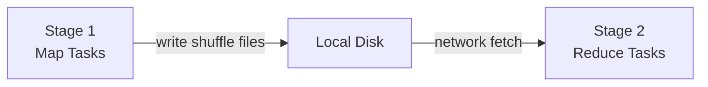

# Spark Architecture — Intermediate

## Memory Model Inside an Executor

Each executor JVM divides its heap into three regions:

```
Executor Heap (e.g. 8 GB total)
├── Reserved Memory       ~300 MB   (Spark system overhead — fixed)
├── Unified Memory Pool   ~6 GB     (spark.memory.fraction=0.6 of usable)
│   ├── Execution Memory  (dynamic)  Shuffle buffers, sort, aggregation
│   └── Storage Memory   (dynamic)  Cached DataFrames/RDDs
└── User Memory           ~2 GB     (UDF data structures, user objects)
```

```python
spark = SparkSession.builder \
    .config("spark.executor.memory", "8g") \
    .config("spark.memory.fraction", "0.6")          # unified pool = 60% of (heap - 300MB)
    .config("spark.memory.storageFraction", "0.5")   # storage gets at least 50% of unified
    .getOrCreate()
```

**Key insight:** Execution and Storage memory share the unified pool dynamically. If no cached data exists, execution borrows all storage memory. If caching is needed, it can evict execution memory data (causing spill to disk).

---

## Task Scheduling: FIFO vs FAIR

```python
# Default: FIFO — first submitted job gets all resources
spark.conf.set("spark.scheduler.mode", "FIFO")

# FAIR — interleaves tasks across concurrent jobs
# Essential for multi-user environments (notebooks, shared clusters)
spark.conf.set("spark.scheduler.mode", "FAIR")
```

FAIR scheduler uses **pools** — you can assign different weights to different users or job types:

```xml
<!-- fairscheduler.xml -->
<allocations>
  <pool name="high_priority">
    <schedulingMode>FIFO</schedulingMode>
    <weight>2</weight>
    <minShare>4</minShare>
  </pool>
  <pool name="batch">
    <schedulingMode>FIFO</schedulingMode>
    <weight>1</weight>
  </pool>
</allocations>
```

```python
spark.sparkContext.setLocalProperty("spark.scheduler.pool", "high_priority")
```

---

## Shuffle Deep Dive

A shuffle is the most expensive Spark operation — it involves:
1. **Map side:** each task writes sorted, partitioned shuffle files to local disk
2. **Network transfer:** executors fetch relevant partitions from all other executors
3. **Reduce side:** merge and process fetched data



```python
# Trigger a shuffle:
df.groupBy("country").sum("revenue")  # hash partition by country → shuffle
df.join(other, "key")                 # sort-merge join → shuffle
df.repartition(100)                   # explicit repartition → shuffle
df.orderBy("timestamp")               # sort → shuffle

# No shuffle:
df.filter(...)      # within partition
df.select(...)      # within partition
df.map(...)         # within partition
```

**Shuffle file management:**
```python
# Number of shuffle output partitions (default 200 — often wrong!)
spark.conf.set("spark.sql.shuffle.partitions", "400")  # tune to data size

# Adaptive Query Execution can auto-tune this (Spark 3.0+)
spark.conf.set("spark.sql.adaptive.enabled", "true")
spark.conf.set("spark.sql.adaptive.coalescePartitions.enabled", "true")
```

---

## Dynamic Allocation

Scale executors up/down based on workload:

```python
spark = SparkSession.builder \
    .config("spark.dynamicAllocation.enabled", "true") \
    .config("spark.dynamicAllocation.minExecutors", "2") \
    .config("spark.dynamicAllocation.maxExecutors", "50") \
    .config("spark.dynamicAllocation.initialExecutors", "5") \
    .config("spark.dynamicAllocation.executorIdleTimeout", "60s") \
    .getOrCreate()
```

When to disable dynamic allocation:
- **Streaming jobs** — need consistent latency, not elastic scaling
- **Tightly sized jobs** — you know exactly what resources are needed

---

## Speculative Execution

Spark detects "straggler" tasks (running much slower than the median) and launches duplicate copies on other executors — whichever finishes first wins:

```python
spark.conf.set("spark.speculation", "true")
spark.conf.set("spark.speculation.multiplier", "1.5")  # trigger if 1.5× median runtime
spark.conf.set("spark.speculation.quantile", "0.75")   # wait until 75% of tasks done
```

**Caution:** Speculative execution can cause **data duplication** with non-idempotent sinks (writing to databases, S3 without overwrite mode). Always use idempotent writes in production.

---

## Broadcast in Architecture Context

When one side of a join is small enough to fit in each executor's memory, Spark broadcasts it — no shuffle needed:

```python
from pyspark.sql import functions as F

# Explicit broadcast hint
result = large_df.join(F.broadcast(small_df), "key")

# Auto-broadcast threshold (default 10MB)
spark.conf.set("spark.sql.autoBroadcastJoinThreshold", "50mb")  # raise to 50MB
spark.conf.set("spark.sql.autoBroadcastJoinThreshold", "-1")    # disable auto-broadcast
```

```
Without broadcast:               With broadcast:
Executor 1: fetch key=A data     Executor 1: has full small_df in memory
Executor 2: fetch key=B data     Executor 2: has full small_df in memory
→ 2 network shuffles             → 0 shuffles — just a map-side join
```

---

## Spark UI: What to Look For

The Spark UI (port 4040) is your primary debugging tool:

| Tab | What to Check |
|-----|--------------|
| **Jobs** | Which jobs are slow? Which failed? |
| **Stages** | Which stages have long tail tasks (data skew)? |
| **Executors** | GC time > 5%? Spill to disk? |
| **SQL** | Physical plan, rows per operator, time per node |
| **Storage** | Cache hit rate, cached partition sizes |

```python
# Check Spark UI programmatically
sc = spark.sparkContext
print(sc.uiWebUrl)   # e.g. http://driver-host:4040
```

Red flags in the UI:
- **Long GC time:** executor memory too small, or too many objects
- **Spill (disk):** execution memory exhausted — increase executor memory or reduce parallelism
- **Skewed stage:** one task takes 10× longer than others — data skew
- **Shuffle read/write imbalance:** some tasks receive far more data

---

## Interview Tips

> **Tip 1:** "How does Spark memory work?" — Executor heap is divided into Reserved (~300MB), Unified Pool (execution + storage, 60% of heap by default), and User memory. Execution and storage borrow from each other dynamically — storage can evict execution data (causing spill) and vice versa. This is why large caches can degrade job performance: they steal from execution memory.

> **Tip 2:** "When does a shuffle happen?" — On any wide transformation: groupBy/agg, join (non-broadcast), repartition, orderBy, distinct. Spark writes shuffle data to local disk, then remote executors fetch it — two disk writes and one network transfer per shuffle. Minimizing shuffles is the most impactful Spark optimization.

> **Tip 3:** "What does speculative execution do and when is it dangerous?" — It re-launches straggler tasks on other executors. Dangerous with non-idempotent sinks: if two task copies both write to a database row or append to a Kafka topic, you get duplicates. Safe with Parquet/Delta overwrite mode since the last writer wins atomically.
