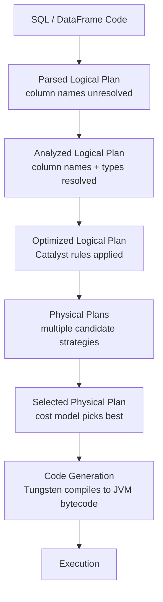

# Spark Internals — Fundamentals

## 🎯 Analogy

Catalyst is like a GPS's route planner — you say "get me from A to B" (your SQL), and it figures out the fastest route (optimized physical plan), considering traffic (data statistics), road types (available algorithms), and shortcuts (predicate pushdown). Tungsten is the car's engine — after the route is chosen, it executes it as efficiently as possible.

---

## The Four Phases: From SQL to Execution



---

## Phase 1 & 2: Parsing and Analysis

```python
# 1. Parser: SQL string → unresolved AST
spark.sql("SELECT name, age FROM users WHERE age > 30")
# → UnresolvedRelation("users"), UnresolvedAttribute("name"), ...

# 2. Analyzer: resolves names against catalog
# Looks up "users" table in catalog → gets schema {id: INT, name: STRING, age: INT}
# Resolves "name" → users.name (STRING), "age" → users.age (INT)
# Checks types: age > 30 — both INT, valid

# Common analysis errors:
# "Cannot resolve column 'nmae'" — typo in column name
# "Resolved attribute(s) age missing" — column dropped before use
```

---

## Phase 3: Logical Optimization (Catalyst Rule Engine)

Catalyst applies ~50 transformation rules in multiple passes:

```python
# Predicate pushdown:
# Your code: join first, then filter
df.join(other, "id").filter(F.col("region") == "US")
# Catalyst rewrites: filter BEFORE join (less data to join)

# Column pruning:
# Your code: select only 3 columns after a join of 100-column tables
df.join(other, "id").select("id", "name", "amount")
# Catalyst: read only id/name/amount + join key from both tables

# Constant folding:
F.lit(2) + F.lit(3)   # becomes F.lit(5)

# Boolean simplification:
(F.col("x") > 5) & F.lit(True)   # becomes (F.col("x") > 5)

# Subquery decorrelation: rewrite correlated subqueries as joins

# View: see all rules applied
df.queryExecution.optimizedPlan   # (Scala/internal API)
```

---

## Phase 4: Physical Planning

Catalyst generates multiple physical plan candidates and picks the best:

```python
df.explain(mode="extended")
# Shows:
# == Analyzed Logical Plan ==
# == Optimized Logical Plan ==
# == Physical Plan ==

# Reading the physical plan (bottom up):
# 1. FileScan — reading data
# 2. Filter — row filtering (pushed to scan if possible)
# 3. Project — column selection
# 4. Exchange — shuffle (stage boundary!)
# 5. HashAggregate — local pre-aggregation
# 6. Sort — sorting
# 7. BroadcastHashJoin — efficient join (no shuffle)
# 8. SortMergeJoin — join requiring both sides sorted (involves shuffle)
```

---

## Tungsten: Execution Engine

Tungsten (Spark 1.5+) rewrites Spark's execution for CPU efficiency:

**1. UnsafeRow binary format:**
```
Traditional: Row is a Java object with object headers, pointer chasing
  → 5-10 ns per field access, lots of GC pressure

UnsafeRow: Row is a contiguous byte array
  [null bitmap | fixed-width fields | variable-length offsets | variable-length data]
  → 1-2 ns per field access, no GC
```

**2. Whole-stage code generation:**
```python
# Generated code for: df.filter("amount > 100").select("region", "amount")
# Spark generates (simplified):
"""
for (int i = 0; i < batch.numRows(); i++) {
    double amount = batch.getDouble(i, amountIdx);
    if (!(amount > 100)) continue;   // filter inlined
    // project inlined — no separate method call
    result.append(batch.getUTF8String(i, regionIdx), amount);
}
"""
# vs Volcano model: 6+ virtual method calls per row
```

**3. Cache-friendly data layout:**
```
Columnar batches: [col1_val1, col1_val2, ..., col1_valN] [col2_val1, ...]
→ Sequential memory access → CPU cache prefetcher works efficiently
→ SIMD instructions process multiple values in one CPU cycle
```

---

## Reading explain() Output

```python
df = (spark.read.parquet("orders.parquet")
    .filter("amount > 100")
    .groupBy("region")
    .agg(F.sum("amount").alias("total"))
    .orderBy(F.desc("total")))

df.explain()
# == Physical Plan ==
# *(3) Sort [total#5 DESC NULLS LAST], true, 0
# +- Exchange rangepartitioning(total#5 DESC NULLS LAST, 200), ENSURE_REQUIREMENTS, ...
#    +- *(2) HashAggregate(keys=[region#1], functions=[sum(amount#2)])
#       +- Exchange hashpartitioning(region#1, 200), ENSURE_REQUIREMENTS, ...
#          +- *(1) HashAggregate(keys=[region#1], functions=[partial_sum(amount#2)])
#             +- *(1) Filter (isnotnull(amount#2) AND (amount#2 > 100.0))
#                +- *(1) FileScan parquet [region#1,amount#2]
#                     Pushed Filters: [IsNotNull(amount), GreaterThan(amount,100.0)]
#                     ReadSchema: struct<region:string,amount:double>
```

**Key observations in this plan:**
- `*(1)` marks Whole-Stage CodeGen stage 1 (stages 1, 2, 3 visible)
- `Exchange` = shuffle boundaries (2 shuffles here)
- `partial_sum` in stage 1 = map-side pre-aggregation (reduces shuffle data)
- `Pushed Filters` = predicate pushed to Parquet storage
- `ReadSchema` = only 2 columns read (column pruning working)

---

## ▶️ Try It Yourself

```python
from pyspark.sql import SparkSession, functions as F

spark = SparkSession.builder.master("local[*]").appName("internals").getOrCreate()
df = spark.range(10000).withColumn("region", (F.col("id") % 5).cast("string")) \
         .withColumn("amount", F.rand() * 1000)

# See all plan phases
df.filter("amount > 500") \
  .groupBy("region") \
  .sum("amount") \
  .explain(mode="extended")

# Count Exchange (shuffle) nodes
plan = df.filter("amount > 500").groupBy("region").sum("amount").explain()
```

> **Run it:** Works locally — compare plans with/without filter to see predicate pushdown.

---

## Interview Tips

> **Tip 1:** "What are the four phases of Spark SQL query execution?" — (1) Parse: SQL text → unresolved AST. (2) Analyze: resolve column names/types against catalog. (3) Optimize: Catalyst applies ~50 rule-based transformations (predicate pushdown, column pruning, constant folding). (4) Physical planning: generate multiple candidate physical plans, pick best by cost model, compile to JVM bytecode via Tungsten's code generation.

> **Tip 2:** "What is Tungsten?" — Tungsten is Spark's execution engine (Spark 1.5+). It provides three things: UnsafeRow — a compact binary row format that avoids JVM object overhead and GC pressure; whole-stage code generation — compile a fused loop for an entire processing stage eliminating virtual method calls; and cache-friendly columnar batch layout that enables CPU SIMD vectorization. Combined, these give Spark near-native code performance.

> **Tip 3:** "How do you read a Spark physical plan?" — Read bottom-up: the bottom shows data sources (FileScan), then filters, then projections, then shuffle boundaries (Exchange), then aggregations, then final operations. `*(N)` prefix means the operator is in whole-stage codegen stage N — operators in the same stage execute as a single compiled loop. `Exchange` nodes mark stage boundaries (shuffles). `Pushed Filters` and `ReadSchema` in FileScan show active optimizations.
