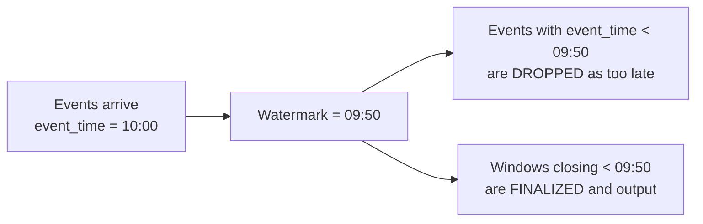

# Spark Streaming — Fundamentals

## 🎯 Analogy

Structured Streaming is like a continuously running batch job — imagine your nightly ETL job waking up every 30 seconds instead of every 24 hours. The same DataFrame transformations work; Spark just keeps reading new data and producing new results.

---

## Structured Streaming vs. Spark Streaming (Legacy)

| | Structured Streaming (modern) | DStream API (legacy) |
|--|-------------------------------|----------------------|
| **API** | DataFrame/SQL | RDD-based |
| **Semantics** | Exactly-once end-to-end | At-least-once by default |
| **State** | Managed checkpointing | Manual |
| **Available since** | Spark 2.0 | Spark 1.0 |
| **Status** | Actively developed | Maintenance only |

**Use Structured Streaming for all new work.**

---

## Reading a Stream

```python
from pyspark.sql import SparkSession, functions as F

spark = SparkSession.builder \
    .appName("StreamingDemo") \
    .config("spark.sql.shuffle.partitions", "4")  # keep small for streaming
    .getOrCreate()

# Read from Kafka
stream_df = spark.readStream \
    .format("kafka") \
    .option("kafka.bootstrap.servers", "broker:9092") \
    .option("subscribe", "orders") \
    .option("startingOffsets", "earliest") \   # or "latest"
    .load()

# Kafka schema: key, value, topic, partition, offset, timestamp, ...
# Value is binary — decode:
parsed = stream_df.select(
    F.from_json(
        F.col("value").cast("string"),
        schema="order_id STRING, amount DOUBLE, region STRING, event_time TIMESTAMP"
    ).alias("data"),
    F.col("timestamp").alias("kafka_ts")
).select("data.*", "kafka_ts")

# Read from files (auto-detect new files)
file_stream = spark.readStream \
    .format("parquet") \
    .schema(schema) \
    .option("path", "s3://bucket/incoming/") \
    .load()

# Rate source (for testing)
rate_df = spark.readStream \
    .format("rate") \
    .option("rowsPerSecond", "100") \
    .load()
```

---

## Transformations on Streams

```python
# Stateless transformations: same as batch
result = (parsed
    .filter(F.col("amount") > 100)
    .withColumn("amount_usd", F.col("amount") * 1.1)
    .select("order_id", "region", "amount_usd", "event_time")
)

# Stateful: aggregation requires watermark (see next section)
# Simple aggregation (without time window) — works but accumulates state
counts = parsed.groupBy("region").count()
```

---

## Triggers

Triggers control how often Spark processes new data:

```python
# Micro-batch: process every N seconds (default: as fast as possible)
query = result.writeStream \
    .trigger(processingTime="30 seconds") \
    .format("parquet") \
    .option("path", "output/") \
    .option("checkpointLocation", "checkpoint/") \
    .start()

# Once: process all available data, stop (like batch)
query = result.writeStream \
    .trigger(once=True) \
    .format("parquet") \
    .option("path", "output/") \
    .option("checkpointLocation", "checkpoint/") \
    .start()
query.awaitTermination()

# Available-now (Spark 3.3+): process all available data, stop
query = result.writeStream \
    .trigger(availableNow=True) \
    .start()

# Continuous processing (experimental): millisecond latency
query = result.writeStream \
    .trigger(continuous="1 second") \
    .start()
```

---

## Watermarks and Late Data

Watermarks tell Spark when to stop waiting for late-arriving events:

```python
# Without watermark: Spark must keep state for ALL possible event times
# (memory grows unboundedly)

# With watermark: Spark can safely drop state older than (max_event_time - threshold)
windowed = parsed \
    .withWatermark("event_time", "10 minutes") \   # wait up to 10 min for late data
    .groupBy(
        F.window(F.col("event_time"), "5 minutes"),  # 5-min tumbling window
        F.col("region")
    ) \
    .agg(F.sum("amount").alias("revenue"))
```



---

## Writing Streams

```python
# Console output (dev/test only)
query = result.writeStream \
    .format("console") \
    .outputMode("append") \
    .option("truncate", "false") \
    .start()

# Kafka output
query = result.select(
    F.col("order_id").alias("key"),
    F.to_json(F.struct("*")).alias("value")
).writeStream \
    .format("kafka") \
    .option("kafka.bootstrap.servers", "broker:9092") \
    .option("topic", "processed_orders") \
    .option("checkpointLocation", "hdfs:///checkpoints/orders/") \
    .start()

# Parquet/Delta files
query = result.writeStream \
    .format("delta") \
    .outputMode("append") \
    .option("path", "s3://bucket/delta/orders/") \
    .option("checkpointLocation", "s3://bucket/checkpoints/orders/") \
    .partitionBy("region") \
    .start()

# Custom sink: foreachBatch
def write_to_postgres(batch_df, batch_id):
    batch_df.write \
        .format("jdbc") \
        .option("url", "jdbc:postgresql://host/db") \
        .option("dbtable", "processed_orders") \
        .mode("append") \
        .save()

query = result.writeStream \
    .foreachBatch(write_to_postgres) \
    .option("checkpointLocation", "checkpoint/") \
    .start()
```

---

## Output Modes

| Mode | What it writes | When to use |
|------|----------------|-------------|
| `append` | Only new rows added since last trigger | Stateless transforms, watermarked windows |
| `complete` | Entire result table each trigger | Aggregations without watermark (small state) |
| `update` | Only rows that changed since last trigger | Aggregations — write only updates |

---

## Checkpointing

Checkpoints save query progress and state — required for exactly-once delivery:

```python
query = result.writeStream \
    .option("checkpointLocation", "hdfs:///checkpoints/my_query/") \
    .format("delta") \
    .start()

# Checkpoint stores:
# - Committed offsets (where we left off in Kafka)
# - State (aggregation accumulators)
# - Metadata (schema, sink config)

# On restart, query picks up exactly where it stopped
```

---

## ▶️ Try It Yourself

```python
from pyspark.sql import SparkSession, functions as F

spark = SparkSession.builder.master("local[*]").appName("streaming-demo").getOrCreate()
spark.sparkContext.setLogLevel("WARN")

# Rate source: generates (timestamp, value) rows
stream = spark.readStream.format("rate").option("rowsPerSecond", 10).load()

result = stream \
    .withColumn("bucket", F.col("value") % 5) \
    .groupBy("bucket") \
    .count()

query = result.writeStream \
    .format("console") \
    .outputMode("complete") \
    .trigger(processingTime="5 seconds") \
    .start()

query.awaitTermination(30)  # run for 30 seconds
```

> **Run it:** Works with `local[*]` — no external services needed.

---

## Interview Tips

> **Tip 1:** "What is a watermark in Structured Streaming?" — A watermark is a threshold that tells Spark how late event-time data can arrive. Spark tracks the maximum event_time seen so far, subtracts the watermark duration to get the current watermark, and drops any events older than the watermark. Without a watermark, Spark must keep state for all event times indefinitely (unbounded memory). With a watermark, state for windows older than the watermark can be safely discarded.

> **Tip 2:** "What is the difference between output modes: append vs complete vs update?" — Append: only new rows are written each batch — correct for stateless transforms and finalized windowed aggregations. Complete: the entire result set is rewritten each batch — only feasible for small aggregations (e.g., global counts). Update: only changed rows are written — efficient for aggregations but requires the sink to support upserts (Delta Lake, databases). Most streaming to data lakes uses append.

> **Tip 3:** "Why is checkpointing required for exactly-once semantics?" — The checkpoint stores committed source offsets (Kafka offsets, file positions) and aggregation state. On recovery from failure, Spark replays from the last committed offset — no duplicate processing, no data loss. Without checkpointing, Spark re-reads from `startingOffsets` (earliest/latest) on restart, potentially reprocessing or skipping data.
