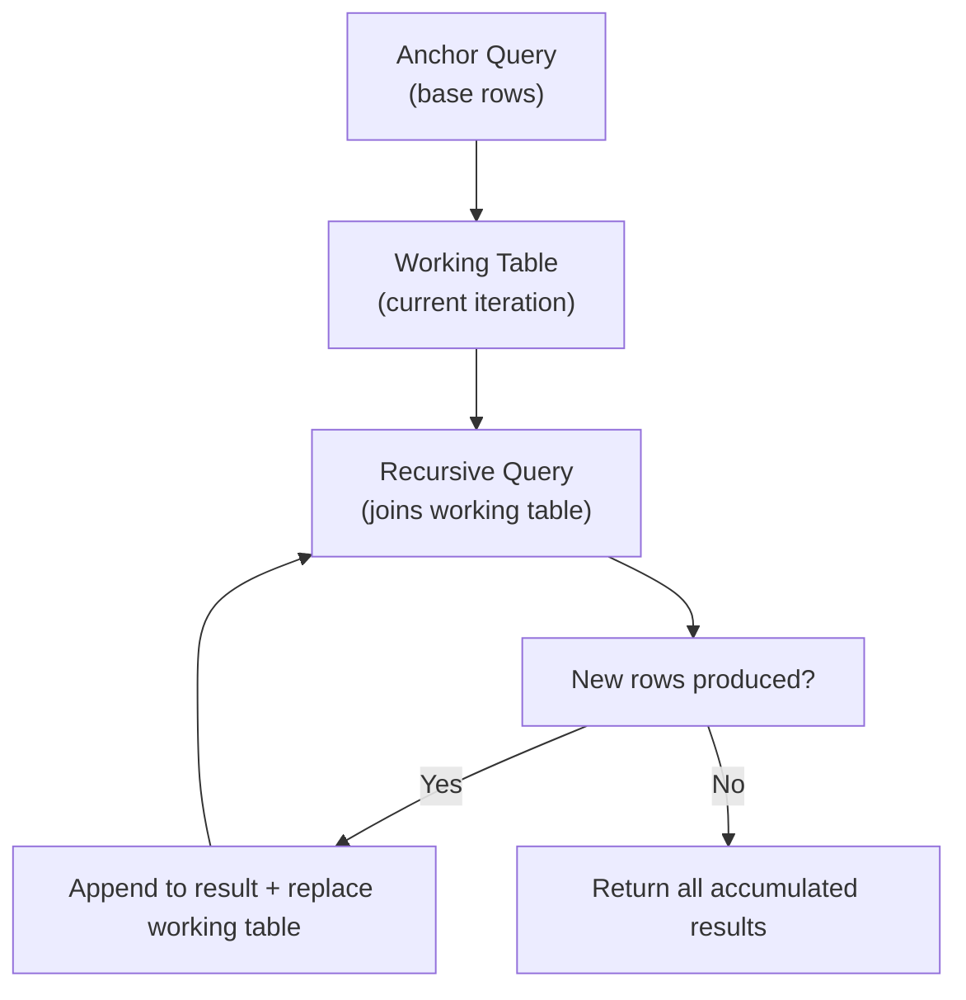

# SQL CTEs — Senior-Level Deep Dive

## How the Optimizer Handles CTEs

Different databases handle CTE execution differently. Understanding this prevents performance surprises.

### PostgreSQL (Pre-12 vs 12+)

```sql
-- Pre-12: CTEs are ALWAYS materialized (optimization barrier)
-- The optimizer cannot push predicates INTO the CTE
WITH big_cte AS (
    SELECT * FROM huge_table  -- Full scan happens regardless
)
SELECT * FROM big_cte WHERE id = 42;
-- PostgreSQL < 12: Scans ALL of huge_table, THEN filters for id=42

-- PostgreSQL 12+: NOT MATERIALIZED allows pushdown
WITH big_cte AS NOT MATERIALIZED (
    SELECT * FROM huge_table
)
SELECT * FROM big_cte WHERE id = 42;
-- Now equivalent to: SELECT * FROM huge_table WHERE id = 42 (uses index!)
```

### SQL Server

SQL Server always inlines CTEs (treats them as subqueries) — no materialization barrier. This means:
- Predicates push through automatically
- CTE referenced 3 times may be executed 3 times
- Use `#temp_table` if you need materialization

### Snowflake / BigQuery / Spark SQL

These generally inline CTEs and apply full optimization. However, complex recursive CTEs may force materialization internally.

---

## Recursive CTE Performance

### Execution Model



**What this shows:**
- Each iteration only processes the NEW rows from the previous step
- Results accumulate across all iterations
- Terminates when an iteration produces zero new rows

### Performance Traps

| Trap | Problem | Fix |
|------|---------|-----|
| No termination condition | Infinite loop on cycles | Add `WHERE level < 20` or cycle detection |
| Exponential growth | Each iteration doubles rows | Use DISTINCT or track visited nodes |
| Large working table | Memory pressure on deep recursion | Limit depth, use iterative approach for deep graphs |
| Missing index on join column | Slow recursive join per iteration | Index the parent/child columns |

### Cycle Detection (PostgreSQL 14+)

```sql
WITH RECURSIVE graph_walk AS (
    SELECT id, parent_id, ARRAY[id] AS path, false AS is_cycle
    FROM nodes WHERE id = 1
    
    UNION ALL
    
    SELECT n.id, n.parent_id, 
           gw.path || n.id,
           n.id = ANY(gw.path) AS is_cycle  -- Detect if we've visited this node
    FROM nodes n
    JOIN graph_walk gw ON n.parent_id = gw.id
    WHERE NOT gw.is_cycle  -- Stop exploring cyclic paths
)
SELECT * FROM graph_walk WHERE NOT is_cycle;

-- PostgreSQL 14+ native syntax:
WITH RECURSIVE graph_walk AS (
    SELECT id, parent_id FROM nodes WHERE id = 1
    UNION ALL
    SELECT n.id, n.parent_id FROM nodes n JOIN graph_walk gw ON n.parent_id = gw.id
)
CYCLE id SET is_cycle USING path  -- Built-in cycle detection
SELECT * FROM graph_walk WHERE NOT is_cycle;
```

---

## Advanced Recursive Patterns

### Shortest Path in a Graph

```sql
-- Find shortest path between two nodes in a weighted graph
WITH RECURSIVE paths AS (
    -- Start from source node
    SELECT 
        source_node AS current,
        target_node AS next_hop,
        weight AS total_cost,
        ARRAY[source_node, target_node] AS path,
        1 AS hops
    FROM edges
    WHERE source_node = 'A'
    
    UNION ALL
    
    -- Extend paths by one hop
    SELECT 
        p.next_hop AS current,
        e.target_node AS next_hop,
        p.total_cost + e.weight,
        p.path || e.target_node,
        p.hops + 1
    FROM paths p
    JOIN edges e ON p.next_hop = e.source_node
    WHERE NOT e.target_node = ANY(p.path)  -- No revisiting
      AND p.hops < 10                       -- Max depth
)
SELECT path, total_cost
FROM paths
WHERE next_hop = 'Z'  -- Destination
ORDER BY total_cost ASC
LIMIT 1;              -- Shortest path
```

### Fibonacci Sequence (Academic Exercise)

```sql
WITH RECURSIVE fib AS (
    SELECT 1 AS n, 0 AS fib_n, 1 AS fib_next
    UNION ALL
    SELECT n + 1, fib_next, fib_n + fib_next
    FROM fib
    WHERE n < 20
)
SELECT n, fib_n FROM fib;
```

### Running Balance with Conditions

```sql
-- Calculate running balance, resetting when it goes negative
WITH RECURSIVE running AS (
    SELECT 
        id, transaction_date, amount,
        amount AS balance,
        1 AS row_num
    FROM transactions WHERE id = (SELECT MIN(id) FROM transactions)
    
    UNION ALL
    
    SELECT 
        t.id, t.transaction_date, t.amount,
        CASE WHEN r.balance + t.amount < 0 THEN 0
             ELSE r.balance + t.amount END,
        r.row_num + 1
    FROM transactions t
    JOIN running r ON t.id = (
        SELECT MIN(id) FROM transactions WHERE id > r.id
    )
)
SELECT * FROM running ORDER BY transaction_date;
```

---

## CTE Performance Optimization

### When CTEs Hurt Performance

**Problem: CTE referenced multiple times gets executed multiple times**

```sql
-- In SQL Server / Spark: this CTE executes TWICE
WITH expensive AS (
    SELECT customer_id, SUM(amount) AS total
    FROM orders
    GROUP BY customer_id  -- Scans 100M rows
)
SELECT 'top' AS segment, * FROM expensive WHERE total > 10000
UNION ALL
SELECT 'bottom' AS segment, * FROM expensive WHERE total < 100;
-- Two full scans of 100M rows!
```

**Fix: Materialize explicitly**

```sql
-- Create a temp table for reuse
CREATE TEMP TABLE expensive_result AS
SELECT customer_id, SUM(amount) AS total
FROM orders
GROUP BY customer_id;

SELECT 'top', * FROM expensive_result WHERE total > 10000
UNION ALL
SELECT 'bottom', * FROM expensive_result WHERE total < 100;
-- Single scan, two cheap lookups from temp table
```

### When CTEs Help Performance

**Predicate pushdown works (PostgreSQL 12+, SQL Server, Snowflake):**

```sql
-- Optimizer pushes the WHERE filter INTO the CTE
WITH all_orders AS (
    SELECT * FROM orders  -- Looks like full table scan
)
SELECT * FROM all_orders WHERE customer_id = 42;
-- Optimizer rewrites as: SELECT * FROM orders WHERE customer_id = 42
-- Uses index on customer_id — fast!
```

---

## CTEs in ETL and Data Pipelines

### Pattern: Staging → Transform → Load in Single Statement

```sql
-- Used in dbt models, Snowflake Tasks, BigQuery scheduled queries
WITH 
source AS (
    SELECT * FROM raw_schema.events
    WHERE event_date = CURRENT_DATE - 1
),

cleaned AS (
    SELECT 
        event_id,
        user_id,
        LOWER(TRIM(event_type)) AS event_type,
        NULLIF(properties, '') AS properties,
        event_timestamp
    FROM source
    WHERE event_id IS NOT NULL
),

deduplicated AS (
    SELECT *, ROW_NUMBER() OVER (PARTITION BY event_id ORDER BY event_timestamp DESC) AS rn
    FROM cleaned
),

final AS (
    SELECT 
        event_id, user_id, event_type, properties, event_timestamp,
        CURRENT_TIMESTAMP AS loaded_at
    FROM deduplicated
    WHERE rn = 1
)

-- In dbt, this becomes the model output:
SELECT * FROM final;

-- In a direct INSERT:
-- INSERT INTO curated_schema.events SELECT * FROM final;
```

> **This is the standard dbt model pattern:** source → staging → intermediate → final. Each CTE is one transformation step. The model is the final SELECT.

---

## Platform-Specific Behaviors

| Platform | Materialization | Recursive Support | Predicate Pushdown |
|----------|----------------|-------------------|-------------------|
| PostgreSQL 12+ | Controllable (`MATERIALIZED` / `NOT MATERIALIZED`) | Full | Yes (when not materialized) |
| SQL Server | Always inlined | Full | Yes |
| MySQL 8+ | Always materialized | Full | No (optimization barrier) |
| Snowflake | Inlined by optimizer | Full | Yes |
| BigQuery | Inlined by optimizer | Yes (with RECURSIVE keyword) | Yes |
| Spark SQL | Inlined | Full | Yes |
| Redshift | Inlined | Full (since April 2021, `WITH RECURSIVE`) | Yes |

> **Note for Redshift users:** Redshift has supported recursive CTEs (`WITH RECURSIVE`) since April 2021. For very deep hierarchies, an iterative temp-table approach is still a viable alternative.

---

## Interview Tips

> **Tip 1:** "When would a CTE be slower than a subquery?" — "In databases that materialize CTEs (pre-PG12, MySQL), predicates can't push into the CTE, causing unnecessary full scans. In SQL Server and Snowflake this isn't an issue since they always inline."

> **Tip 2:** "How do you handle hierarchies in Redshift?" — "Redshift has supported recursive CTEs (`WITH RECURSIVE`) since 2021, so I'd use the standard anchor + recursive pattern. As an alternative for very deep hierarchies, I can iterate with temp tables: insert level 1, then repeatedly insert children by joining the temp table to the source, incrementing the level until no new rows are produced."

> **Tip 3:** "Explain the execution model of a recursive CTE" — "Anchor produces the initial set. The recursive step runs repeatedly, each time processing only the NEW rows from the previous iteration. Results accumulate. It stops when an iteration produces zero new rows. It's conceptually like a BFS traversal."
