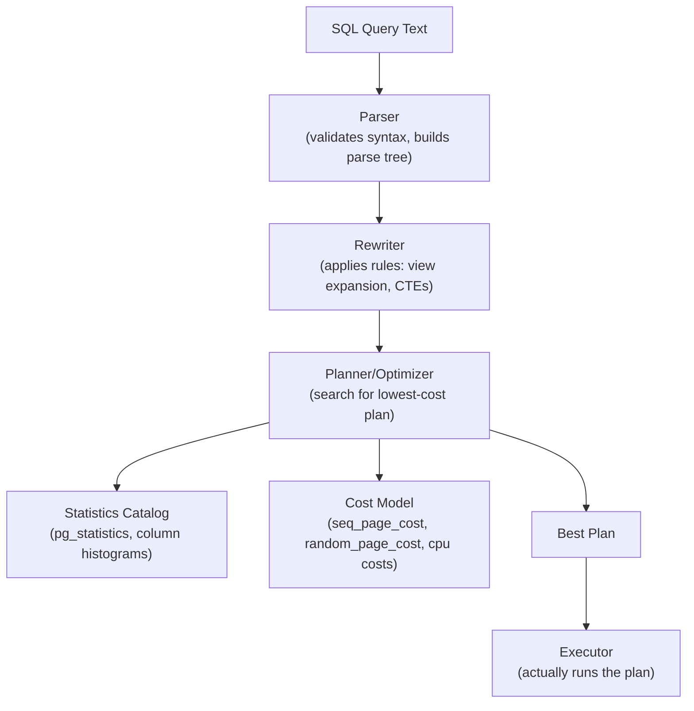

# SQL Execution Plans — Senior-Level Deep Dive

## The Query Optimizer Architecture

Understanding how the optimizer works explains why plans are sometimes wrong and how to fix them.



### Optimizer Strategy: Search Space Exploration

For a query joining N tables, there are N! possible join orders. PostgreSQL uses:
- **Dynamic programming** (GEQO threshold) for joins ≤ 8 tables: explores all join orders
- **Genetic algorithm (GEQO)** for joins > 8 tables: heuristic search (may miss optimal plan)

```sql
-- PostgreSQL GEQO threshold (default: 12 tables)
SHOW geqo_threshold;
-- For joins with > geqo_threshold tables: GEQO enabled
-- Symptom: complex multi-table queries occasionally get bad plans
-- Fix: restructure query to fewer tables, or use CTEs to force intermediate materialization
```

---

## Cardinality Estimation — The Core Challenge

Almost every bad query plan traces back to a bad cardinality estimate (wrong row count prediction).

### Column Statistics (pg_statistic)

```sql
-- View column statistics used by the optimizer:
SELECT 
    attname                                               AS column_name,
    n_distinct                                            AS distinct_count,
    array_to_string(most_common_vals, ', ')               AS common_values,
    array_to_string(most_common_freqs::TEXT[], ', ')      AS common_frequencies,
    correlation                                           AS physical_sort_correlation
FROM pg_stats
WHERE tablename = 'orders'
ORDER BY attname;

-- n_distinct > 0: exact count of distinct values
-- n_distinct < 0: fraction of total rows (e.g., -0.5 means 50% distinct)
-- most_common_vals: top N values and their frequencies
-- correlation: how well column order matches physical row order (1.0 = perfectly sorted)
```

### Statistics Target — Control Sample Size

```sql
-- Default statistics target: 100 (samples enough to estimate common cases)
-- For skewed columns (one value dominates): increase target for better histograms

-- Check current target:
SELECT attname, attstattarget FROM pg_attribute
WHERE attrelid = 'orders'::regclass AND attname = 'status';
-- -1 means "use default" (100)

-- Increase for a skewed column (e.g., status has 95% 'shipped', 4% 'pending', 1% other):
ALTER TABLE orders ALTER COLUMN status SET STATISTICS 500;
ANALYZE orders;

-- Verify histogram improved:
SELECT histogram_bounds FROM pg_stats WHERE tablename = 'orders' AND attname = 'amount';
-- More histogram bins → better estimation for range queries
```

### Multi-Column Correlation (Extended Statistics)

```sql
-- Problem: optimizer assumes column values are independent
-- If region='US' always coincides with currency='USD', optimizer misestimates joins

-- Create extended statistics to capture correlations:
CREATE STATISTICS orders_region_currency (dependencies) ON region, currency FROM orders;
ANALYZE orders;

-- Now: estimated rows for WHERE region='US' AND currency='USD' are accurate
-- Without extended stats: estimates would be multiplied independently (too low)

-- Types of extended statistics:
-- dependencies: capture functional dependencies (region → currency)
-- ndistinct: improve n_distinct estimates for column combinations
-- mcv: multi-column most-common-values

-- View created extended statistics:
SELECT * FROM pg_statistic_ext;
```

---

## Query Plan Stability and Hints

### The Problem with Unstable Plans

```sql
-- Plan that was fast last week is now slow
-- Cause: statistics updated, different data distribution, or plan cache invalidated

-- Diagnose: compare plans
EXPLAIN (FORMAT JSON) SELECT * FROM orders WHERE customer_id = 42;
-- Save the JSON; compare after a plan change

-- pg_hint_plan (PostgreSQL extension) for forcing specific plans:
-- Use when you KNOW what plan is correct and the optimizer keeps choosing wrong
LOAD 'pg_hint_plan';  -- Load the extension

/*+ SeqScan(o) HashJoin(o c) */
SELECT c.name, SUM(o.amount)
FROM customers c JOIN orders o ON c.customer_id = o.customer_id
WHERE c.country = 'US'
GROUP BY c.name;
-- Forces: SeqScan on orders, Hash Join for the c-o join
-- Use hints as a last resort — prefer fixing statistics or indexes
```

### SQL Server Query Hints

```sql
-- SQL Server: explicit optimizer hints
SELECT * FROM orders WITH (INDEX(idx_orders_customer_id))
WHERE customer_id = 1001;

-- Force join order:
SELECT * FROM orders o
JOIN customers c ON o.customer_id = c.customer_id
OPTION (FORCE ORDER);  -- Join in the FROM clause order

-- Recompile per call (fixes parameter sniffing):
SELECT * FROM orders WHERE status = @Status
OPTION (RECOMPILE);

-- Force specific join type:
SELECT * FROM orders o
JOIN customers c ON o.customer_id = c.customer_id
OPTION (HASH JOIN);  -- Force Hash Join even if optimizer prefers Nested Loop
```

---

## Analyzing Complex Plan Patterns

### The Anti-Join Pattern

```sql
EXPLAIN ANALYZE
SELECT c.customer_id FROM customers c
WHERE NOT EXISTS (SELECT 1 FROM orders o WHERE o.customer_id = c.customer_id);
```

```
Hash Anti Join  (cost=1500.00..2000.00 rows=2000) (actual rows=500 loops=1)
  Hash Cond: (c.customer_id = o.customer_id)
  -> Seq Scan on customers c  (rows=10000)
  -> Hash
       -> Seq Scan on orders o  (rows=50000)
```

**Reading:** Hash Anti Join returns rows from customers where NO matching row exists in orders. Efficient — single pass over both tables.

### CTE Materialization in Plans

```sql
EXPLAIN ANALYZE
WITH recent_orders AS (
    SELECT customer_id, SUM(amount) AS total FROM orders
    WHERE order_date >= '2024-01-01' GROUP BY customer_id
)
SELECT c.name, ro.total FROM customers c JOIN recent_orders ro ON c.customer_id = ro.customer_id;
```

```
Hash Join  (actual rows=5000 loops=1)
  -> Seq Scan on customers
  -> Hash
       -> CTE Scan on recent_orders  ← Materialized CTE
            -> HashAggregate
                 -> Seq Scan on orders
                      Filter: (order_date >= '2024-01-01')
```

**Key:** "CTE Scan on recent_orders" means the CTE was materialized (computed once, stored in memory). If the CTE is referenced twice, it's computed once.

**PostgreSQL 12+ control:**
```sql
-- Force materialization:
WITH recent_orders AS MATERIALIZED (...)

-- Force inlining (allow optimizer to optimize through the CTE):
WITH recent_orders AS NOT MATERIALIZED (...)
-- With NOT MATERIALIZED: optimizer may push predicates inside the CTE
```

---

## BigQuery Query Execution Plan Analysis

```sql
-- BigQuery: view execution plan from INFORMATION_SCHEMA
SELECT 
    job_id,
    query,
    total_bytes_processed,
    total_slot_ms,
    creation_time,
    end_time,
    TIMESTAMP_DIFF(end_time, creation_time, SECOND) AS duration_seconds
FROM `region-us.INFORMATION_SCHEMA.JOBS_BY_PROJECT`
WHERE job_type = 'QUERY'
  AND creation_time >= TIMESTAMP_SUB(CURRENT_TIMESTAMP(), INTERVAL 1 HOUR)
ORDER BY total_bytes_processed DESC;

-- BigQuery: the "Execution Details" tab in Cloud Console shows:
-- Stage-by-stage execution
-- Input/output rows per stage
-- Slot time per stage (compute cost)
-- Spill to disk indicators
```

**BigQuery execution stages:**
- Stage 1: Input reads (partition pruning happens here)
- Stage 2-N: Intermediate transformations (joins, aggregations)
-- Repartitioning between stages (network shuffle cost)
- Final stage: Output

**Optimization signals in BigQuery:**
```sql
-- High bytes processed despite small results → missing partition filter
-- High slot time in join stage → skewed data distribution (some keys have many more rows)
-- "Spilled to disk: TRUE" → insufficient slot memory; use APPROX_ functions or pre-aggregate
```

---

## Snowflake Query Profile

```sql
-- Snowflake: QUERY_HISTORY table for plan analysis
SELECT 
    query_id,
    query_text,
    execution_time,
    bytes_scanned,
    bytes_written,
    partitions_scanned,
    partitions_total,
    ROUND(partitions_scanned * 100.0 / partitions_total, 1) AS pct_scanned
FROM snowflake.account_usage.query_history
WHERE execution_time > 60000  -- Queries > 60 seconds
ORDER BY execution_time DESC;

-- Key Snowflake metrics:
-- partitions_scanned / partitions_total: pruning effectiveness (lower is better)
-- bytes_scanned: I/O cost
-- compilation_time: complex queries take longer to compile

-- Snowflake Query Profile (UI): shows operator-level breakdown
-- Look for: "Spillover" (memory exceeded, wrote to storage = slow)
--           "Pruning" (how many micro-partitions were skipped)
--           "Join" nodes with high "bytes_sent_over_network" (shuffle cost)
```

---

## Advanced Diagnostics: auto_explain and pg_stat_statements

```sql
-- PostgreSQL auto_explain: automatically log slow query plans
-- In postgresql.conf:
-- shared_preload_libraries = 'auto_explain'
-- auto_explain.log_min_duration = '1s'  -- Log plans for queries > 1 second
-- auto_explain.log_analyze = on         -- Include actual row counts

-- View logged plans in pg_log:
-- 2024-01-15 14:23:11 UTC LOG:  duration: 3421.456 ms  plan:
--   Query Text: SELECT SUM(amount) FROM orders WHERE customer_id = ...
--   Gather  (cost=...) (actual rows=...)
--     -> Parallel Seq Scan on orders

-- pg_stat_statements: aggregate statistics across all executions
SELECT 
    query,
    calls,
    ROUND(total_exec_time / calls, 2) AS avg_ms,
    ROUND(total_exec_time, 0) AS total_ms,
    ROUND(stddev_exec_time, 2) AS stddev_ms,  -- High stddev = variable plan
    rows / calls AS avg_rows
FROM pg_stat_statements
ORDER BY total_exec_time DESC
LIMIT 20;

-- Identify queries with high variance (stddev >> avg_ms) → parameter sniffing / plan instability
SELECT query, avg_ms, stddev_ms, stddev_ms / avg_ms AS cv
FROM (
    SELECT query, 
           ROUND(total_exec_time / calls, 2) AS avg_ms,
           ROUND(stddev_exec_time, 2) AS stddev_ms
    FROM pg_stat_statements
) s
WHERE calls > 100 AND stddev_ms / avg_ms > 2  -- CV > 2 = highly variable
ORDER BY stddev_ms DESC;
```

---

## Interview Tips

> **Tip 1:** "Why does the optimizer sometimes choose a bad query plan and how do you fix it?" — "Bad plans almost always come from bad cardinality estimates — the optimizer predicted 100 rows but got 100,000, so it chose Nested Loop (good for 100 rows) which was terrible for 100K. Root causes: stale statistics (run ANALYZE), skewed distributions the histogram can't capture (increase statistics target with SET STATISTICS), or multi-column correlations the optimizer assumes are independent (CREATE STATISTICS with dependencies). After fixing stats, re-run EXPLAIN ANALYZE to confirm the plan changed."

> **Tip 2:** "When would you use query hints to override the optimizer?" — "Hints are a last resort — when you've verified via EXPLAIN ANALYZE that the optimizer's chosen plan is wrong, you understand WHY (bad statistics, unusual data distribution), and you can't easily fix it through better statistics or indexes. In SQL Server, I'd use OPTION(RECOMPILE) for parameter sniffing or WITH(FORCESEEK) to force an index. In PostgreSQL, I'd use pg_hint_plan or restructure the query (CTEs with MATERIALIZED, JOIN order tricks). Hints are fragile — they break when schema changes. I document them with comments explaining why and track them for periodic review."

> **Tip 3:** "How do you monitor query plan stability in production?" — "I use pg_stat_statements to track queries with high standard deviation in execution time — that's a sign of plan instability (sometimes fast, sometimes slow). I set up auto_explain to automatically log plans for queries exceeding my SLA threshold. For SQL Server, I monitor sys.dm_exec_query_stats for plan_generation_num > 1. When I see instability, I compare the fast and slow plans to identify what changed — it's usually statistics, a new index, or parameter sniffing. I also periodically run EXPLAIN on critical production queries from a test environment to catch plan changes before they cause incidents."

## ⚡ Cheat Sheet

**Bad Plan Root Causes (in order of likelihood)**
- Stale statistics → run `ANALYZE` / `UPDATE STATISTICS`
- Skewed column histogram → raise `SET STATISTICS 500` for that column
- Multi-column correlations → `CREATE STATISTICS ... (dependencies)`
- Parameter sniffing (SQL Server) → `OPTION(OPTIMIZE FOR UNKNOWN)` or `OPTION(RECOMPILE)`
- GEQO threshold hit (PG, >12 tables) → restructure query or lower join count

**Key EXPLAIN Metrics**
- `Rows Estimated` vs `Actual Rows` — gap > 10× = bad estimate → fix stats
- `Sort Method: external merge Disk: XXkB` → spilling; raise `work_mem`
- `CTE Scan` → materialized; `Nested Loops` on large table → missing index
- `Hash (Spill)` → build table too large for memory → filter earlier or upsize WH

**Snowflake Query Profile Signals**
- `partitions_scanned / partitions_total` > 10% → add clustering key
- `bytes_spilled_to_remote_storage` > 0 → seriously undersized warehouse
- `compilation_time` dominant → very complex query; split into CTEs/temp tables

**BigQuery Execution Signals**
- High bytes despite small result → missing partition filter
- High slot time in join stage → data skew on join key
- `Spilled to disk: TRUE` → use APPROX_ functions or pre-aggregate

**Plan Stability Tools**
- `pg_stat_statements`: find queries with `stddev_exec_time / avg_exec_time > 2` (CV > 2 = unstable plan)
- `auto_explain.log_min_duration = '1s'` → auto-log slow plans to pg_log
- SQL Server: `sys.dm_exec_query_stats` — `plan_generation_num > 1` = plan recompile

**Hints — Last Resort Only**
- PG: `pg_hint_plan` extension; `/*+ SeqScan(t) HashJoin(t c) */`
- SQL Server: `WITH(INDEX(...))`, `OPTION(HASH JOIN)`, `OPTION(FORCE ORDER)`, `OPTION(RECOMPILE)`
- Document every hint with a comment explaining why; review quarterly
