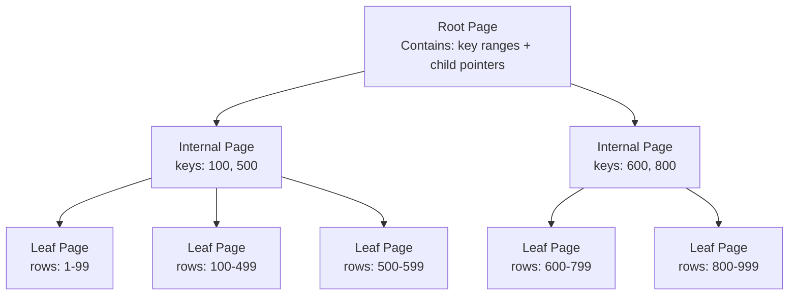

# SQL Indexing Strategies — Senior-Level Deep Dive

## B-Tree Index Internals

Understanding how B-Trees are structured on disk explains why some queries are fast and others aren't.



**Key properties:**
- **Leaf pages** store the actual indexed values + either the row pointer (CTID in PostgreSQL, RID in SQL Server) or — for clustered indexes — the full row
- **Leaf pages are doubly linked** — range scans traverse leaf pages without going back to the root
- **Page size** is typically 8KB (PostgreSQL) or 8KB–64KB (SQL Server) — each read fetches one page
- **Tree height** = log₁₆(number of rows) typically — a 1 billion row index is only 5–6 levels deep

**Why range queries are efficient:** After finding the starting point via tree traversal, the database follows the leaf page linked list — no more tree traversal needed. This is why `ORDER BY indexed_col LIMIT 10` is so fast.

---

## Fill Factor and Page Bloat

**Fill factor** controls what percentage of each B-Tree page is filled when building or rebuilding the index. The remainder is reserved for future inserts.

```sql
-- PostgreSQL: create index with 70% fill factor
-- 30% of each page is reserved for updates
CREATE INDEX idx_orders_date ON orders(order_date) WITH (fillfactor = 70);

-- MySQL: similar concept via innodb_fill_factor
-- Default is 100 for non-leaf pages, 15/16 for leaf pages

-- Why fill factor matters:
-- When a leaf page is 100% full and a new key must go in the middle:
-- → The database splits the page into two (page split)
-- → Page splits cause index fragmentation
-- → Fragmented indexes require more I/O per range scan

-- For write-heavy tables that cause many updates to indexed columns:
-- → Lower fill factor (70-80%) prevents splits, keeping the index compact
-- → For append-only tables (timestamps): fill factor 100 is fine (inserts go to the end)
```

### Detecting and Fixing Bloat

```sql
-- PostgreSQL: check index bloat (requires pgstattuple extension)
SELECT 
    indexname,
    pg_size_pretty(pg_relation_size(indexrelid)) AS current_size,
    round(100 * avg_leaf_density) AS fill_pct,
    round(100 * (1 - avg_leaf_density / 100.0) * pg_relation_size(indexrelid)) AS wasted_bytes
FROM pgstattuple_approx('idx_orders_date');

-- Fix bloat: rebuild index online (PostgreSQL 12+)
REINDEX INDEX CONCURRENTLY idx_orders_date;

-- SQL Server: check fragmentation
SELECT 
    object_name(object_id) AS table_name,
    name AS index_name,
    avg_fragmentation_in_percent
FROM sys.dm_db_index_physical_stats(DB_ID(), NULL, NULL, NULL, 'LIMITED')
JOIN sys.indexes USING (object_id, index_id)
WHERE avg_fragmentation_in_percent > 10;

-- Fix: < 30% fragmentation → REORGANIZE (online, safe)
ALTER INDEX idx_orders_date ON orders REORGANIZE;
-- > 30% fragmentation → REBUILD (locks table unless ONLINE = ON)
ALTER INDEX idx_orders_date ON orders REBUILD WITH (ONLINE = ON);
```

---

## MVCC and Index Visibility

In PostgreSQL (and similar MVCC databases), deleted/updated rows aren't immediately removed — they're marked as invisible to newer transactions. This has important implications for indexes:

```sql
-- When you DELETE or UPDATE a row:
-- 1. The old row tuple is marked with a dead transaction ID (xmax)
-- 2. The INDEX still contains a pointer to the dead tuple
-- 3. When an index scan finds that pointer, it fetches the heap row to check visibility
-- → This makes index scans slower on heavily-updated tables

-- VACUUM reclaims dead tuples:
VACUUM orders;  -- Removes dead tuples, allows index cleanup
VACUUM ANALYZE orders;  -- Also updates statistics for the optimizer

-- Autovacuum kicks in automatically, but aggressive writes may need manual vacuuming:
ALTER TABLE orders SET (autovacuum_vacuum_scale_factor = 0.01);  -- Vacuum when 1% of rows are dead
ALTER TABLE orders SET (autovacuum_vacuum_cost_delay = 2);  -- Less throttling for hot tables

-- HOT (Heap-Only Tuple) updates — PostgreSQL optimization:
-- If you UPDATE only non-indexed columns, PostgreSQL can do a HOT update:
-- → New row version points back to old tuple in the same page
-- → NO index update needed (index still points to the old heap location, which chains to new)
-- This significantly reduces index maintenance for updates that don't change indexed columns
```

---

## Index Skip Scan (Loose Index Scan)

A standard B-tree index on `(a, b)` can't be used for queries filtering only on `b`. **Index skip scan** works around this by jumping between distinct values of `a`:

```sql
-- Index: (status, customer_id)
-- Query: filter only on customer_id (skip status)
SELECT * FROM orders WHERE customer_id = 1001;

-- Without skip scan: full table scan (status is the leading column)
-- With skip scan: the optimizer internally generates:
--   SELECT * FROM orders WHERE status = 'pending' AND customer_id = 1001
--   UNION ALL
--   SELECT * FROM orders WHERE status = 'shipped' AND customer_id = 1001
--   ... (one probe per distinct status value)

-- MySQL 8.0+: supports skip scan automatically
-- Oracle: calls this "Index Skip Scan"
-- PostgreSQL: does NOT support skip scan natively (as of PG16)
--   → Use a separate index on customer_id instead

-- Check if MySQL is using skip scan:
EXPLAIN FORMAT=JSON SELECT * FROM orders WHERE customer_id = 1001;
-- Look for: "using_index_for_skip_scan": true
```

**When skip scan helps:** When the leading column has very few distinct values (e.g., 3–10 statuses) and the second column is highly selective. The optimizer makes 3–10 index probes instead of a full table scan.

---

## Index-Organized Tables and Clustered Indexes

### SQL Server / MySQL InnoDB: Clustered Index

The primary key IS the table — rows are stored in B-tree order by primary key:

```sql
-- MySQL InnoDB: every table has exactly one clustered index
-- If you define a PRIMARY KEY, that's the clustered index
-- The table rows are stored in B-tree leaf pages, sorted by primary key

-- Secondary indexes in InnoDB store the primary key value (not a row pointer)
-- → Secondary index lookup: traverse secondary B-tree → get PK → traverse clustered B-tree
-- → This "double traversal" is called a "clustered index lookup" or "bookmark lookup"

-- Implication: use a compact primary key (INT vs UUID)
-- UUID primary keys cause random inserts → page splits → index fragmentation

-- UUID vs sequential ID performance:
CREATE TABLE orders_uuid (id UUID PRIMARY KEY DEFAULT gen_random_uuid(), ...);
-- Every insert goes to a "random" position in the B-tree → page splits everywhere

CREATE TABLE orders_seq (id BIGSERIAL PRIMARY KEY, ...);
-- Every insert goes to the end → no splits → perfect fill factor
```

### PostgreSQL: CLUSTER Command

PostgreSQL doesn't have true clustered indexes, but you can physically reorder the table:

```sql
-- Physically reorder the table by an index (one-time operation):
CLUSTER orders USING idx_orders_date;
-- Rows are now physically sorted by order_date
-- Range scans on order_date are now much faster (sequential I/O)
-- BUT: new inserts are not ordered → table becomes unordered over time

-- Verify with EXPLAIN:
EXPLAIN SELECT * FROM orders WHERE order_date BETWEEN '2024-01-01' AND '2024-03-31';
-- With CLUSTER: Seq Scan (sequential read of sorted rows) may be chosen over Index Scan
```

---

## Columnstore Indexes (Analytics Workloads)

For analytics queries that scan millions of rows and aggregate on a few columns, **columnstore indexes** are dramatically faster than row-based B-tree indexes:

```sql
-- SQL Server: create a columnstore index for analytics
CREATE COLUMNSTORE INDEX cs_idx_orders ON orders(order_date, customer_id, amount, status);

-- Now this aggregation query can run entirely from the columnstore:
SELECT 
    YEAR(order_date) AS yr,
    status,
    SUM(amount) AS total
FROM orders
GROUP BY YEAR(order_date), status;

-- Columnstore performance:
-- Stores data by COLUMN (all amount values together, all dates together)
-- → Excellent compression (similar values compress well)
-- → Only reads the columns needed by the query
-- → Vectorized execution processes thousands of values per CPU instruction

-- Redshift: uses columnar storage by default — no index needed for aggregations
-- BigQuery: also columnar; sort keys serve a similar purpose to indexes
-- Snowflake: micro-partitions with column pruning serve the same role
```

### Sort Keys and Zone Maps (Snowflake/Redshift)

```sql
-- Snowflake: cluster key (replaces traditional indexes for large tables)
ALTER TABLE orders CLUSTER BY (TO_DATE(order_date), status);
-- Snowflake maintains micro-partition ordering by cluster key
-- Queries filtering on order_date or status can skip entire micro-partitions

-- Redshift: sort key determines row storage order (similar to clustered index)
CREATE TABLE orders (
    order_id BIGINT,
    customer_id BIGINT,
    order_date DATE,
    amount DECIMAL(10,2)
) SORTKEY(order_date);  -- SORTKEY controls physical order for range scan efficiency

-- Redshift: DISTKEY controls how data is distributed across nodes for JOINs
CREATE TABLE orders (
    order_id BIGINT,
    customer_id BIGINT DISTKEY,  -- Rows with same customer_id on same node = faster JOINs
    order_date DATE,
    amount DECIMAL(10,2)
) SORTKEY(order_date);
```

---

## Query Optimizer Statistics

Indexes are only useful if the optimizer knows to use them. Statistics tell the optimizer what's in the table:

```sql
-- PostgreSQL: update statistics (done automatically by autovacuum/ANALYZE)
ANALYZE orders;

-- View current statistics:
SELECT attname, n_distinct, correlation
FROM pg_stats
WHERE tablename = 'orders' AND attname = 'customer_id';
-- n_distinct: estimated number of distinct values
-- correlation: how sorted the column is (1.0 = perfectly sorted, 0 = random)
-- High correlation → sequential scan may be preferred; index scans cause random I/O

-- Adjust statistics target for better estimates on skewed columns:
ALTER TABLE orders ALTER COLUMN status SET STATISTICS 500;  -- Default is 100 (samples more rows)
ANALYZE orders;

-- MySQL: update statistics
ANALYZE TABLE orders;

-- SQL Server: update statistics
UPDATE STATISTICS orders;
-- Or: automatic with AUTO_UPDATE_STATISTICS = ON (default)
```

---

## Production Index Management

### Index Creation Without Downtime

```sql
-- PostgreSQL: non-blocking index build
CREATE INDEX CONCURRENTLY idx_orders_new ON orders(customer_id, order_date, amount);
-- Takes 2-3x longer but doesn't lock the table
-- Warning: fails if the table is modified in a way that violates uniqueness during the build
-- On failure: the invalid index exists — check with \d orders or pg_indexes, then DROP it

-- MySQL 5.6+: online DDL for index operations
ALTER TABLE orders ADD INDEX idx_orders_new (customer_id, order_date), ALGORITHM=INPLACE, LOCK=NONE;

-- SQL Server: online index build
CREATE INDEX idx_orders_new ON orders(customer_id, order_date) WITH (ONLINE = ON);
```

### Index Monitoring Dashboard Query

```sql
-- PostgreSQL: comprehensive index health report
SELECT 
    t.tablename,
    i.indexname,
    pg_size_pretty(pg_relation_size(i.indexrelid))                    AS index_size,
    s.idx_scan                                                         AS scans,
    s.idx_tup_read                                                     AS tuples_read,
    ROUND(s.idx_tup_read::NUMERIC / NULLIF(s.idx_scan, 0), 1)         AS avg_tuples_per_scan,
    CASE WHEN s.idx_scan = 0 THEN 'UNUSED'
         WHEN s.idx_scan < 100 THEN 'RARELY USED'
         ELSE 'ACTIVE' END                                             AS usage_status
FROM pg_indexes i
JOIN pg_stat_user_indexes s ON i.indexname = s.indexrelname
JOIN pg_tables t ON i.tablename = t.tablename
WHERE t.schemaname = 'public'
ORDER BY pg_relation_size(i.indexrelid) DESC;
```

---

## Interview Tips

> **Tip 1:** "Why can UUIDs as primary keys cause performance problems in MySQL?" — "MySQL InnoDB's clustered index stores rows physically sorted by the primary key. UUIDs are random, so every INSERT goes to a random position in the B-tree, causing constant page splits and high index fragmentation. This leads to more disk I/O per read and bloated index size. The fix is to use sequential UUIDs (`UUID_v7`, `ULID`) or a BIGINT surrogate key, and use UUID as an alternate unique key only."

> **Tip 2:** "What is index bloat and how do you fix it?" — "Index bloat occurs when dead tuples (from MVCC updates/deletes) accumulate in index pages faster than VACUUM can clean them up, or when page splits create sparsely-filled pages. Symptoms include growing index size without growing data. Fix: run `VACUUM ANALYZE` (routine), or `REINDEX INDEX CONCURRENTLY` to fully rebuild the index online. For SQL Server, use `ALTER INDEX REORGANIZE` for light fragmentation or `REBUILD WITH (ONLINE = ON)` for heavy fragmentation."

> **Tip 3:** "When would you choose a columnstore index over a B-tree index?" — "Columnstore indexes are optimal for analytics queries that: scan large portions of the table, aggregate on a few numeric columns, and filter on a small number of columns. They're terrible for OLTP-style point lookups (`WHERE id = 42`) or small range scans. For a mixed workload in SQL Server, you can have both — a clustered B-tree for OLTP and a non-clustered columnstore for analytics, though DML performance suffers with both present."

## ⚡ Cheat Sheet

**B-Tree Key Numbers**
- Page size: 8 KB (PG/SQL Server); tree height ≈ log₁₆(rows) — 1B rows ≈ 5–6 levels deep
- Leaf pages doubly linked → range scans traverse without re-traversing tree
- Fill factor default: 100% — reduce to 70–80% for update-heavy tables to prevent page splits

**Index Bloat Detection & Fix**
- PG: `pgstattuple_approx` → `avg_leaf_density < 70%` = bloated → `REINDEX INDEX CONCURRENTLY`
- SQL Server: `avg_fragmentation_in_percent` < 30% → `REORGANIZE`; > 30% → `REBUILD WITH (ONLINE=ON)`
- Autovacuum tuning: `autovacuum_vacuum_scale_factor = 0.01` for hot tables

**UUID vs Sequential PK (InnoDB)**
- UUID primary keys → random inserts → constant page splits → index fragmentation + slower reads
- Fix: use `UUID_v7` / `ULID` (monotonic UUIDs) or BIGSERIAL; keep UUID as alternate unique key
- HOT updates (PG): updating non-indexed columns = no index update needed = much faster

**Index Skip Scan Rules**
- Supported: MySQL 8+, Oracle; NOT supported natively in PostgreSQL (as of PG16)
- Only useful when leading column has very few distinct values (< 10–20) and trailing column is selective
- PG workaround: create a separate index on the trailing column

**Columnstore vs B-Tree Decision**
- B-Tree: OLTP point lookups, small range scans, ORDER BY LIMIT patterns
- Columnstore: analytics aggregating millions of rows on few columns; terrible for `WHERE id = ?`
- SQL Server: can combine both on same table; DML performance degrades with non-clustered columnstore

**Production Index Commands**
```sql
-- Non-blocking build (PG)
CREATE INDEX CONCURRENTLY idx ON tbl(col);
-- MySQL online
ALTER TABLE t ADD INDEX idx(col), ALGORITHM=INPLACE, LOCK=NONE;
-- SQL Server online
CREATE INDEX idx ON t(col) WITH (ONLINE=ON);
-- Snowflake/Redshift equivalent
ALTER TABLE orders CLUSTER BY (order_date);
```
