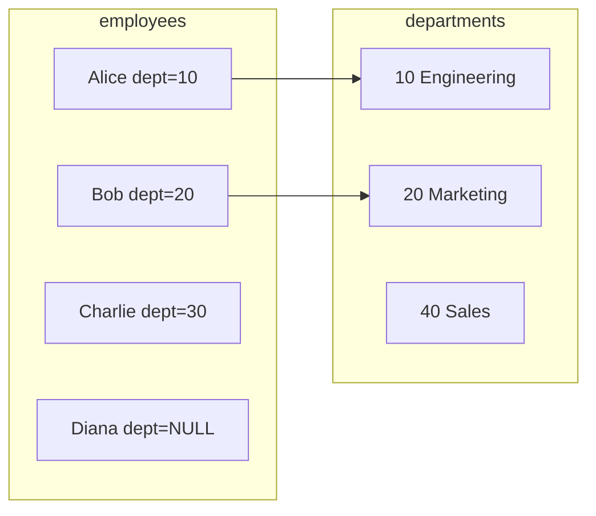

# SQL Joins — Fundamentals


## 🎯 Analogy

Think of SQL joins like combining two guest lists for a party. INNER JOIN keeps only people on both lists. LEFT JOIN keeps everyone from the left list (with NULLs for unmatched right entries). CROSS JOIN invites every possible combination.

---
## What Are Joins?

Imagine you have two spreadsheets — one has employee names with department IDs, the other has department IDs with department names. To create a complete report with both name AND department name, you need to "look up" across tables. That's a JOIN.

> **Key Insight:** Joins exist because relational databases split data across normalized tables. Joins reassemble the pieces using a shared key column.

---

## Sample Data

We use these tables for all examples below:

**employees**

| emp_id | name | dept_id | salary |
|--------|------|---------|--------|
| 1 | Alice | 10 | 95000 |
| 2 | Bob | 20 | 72000 |
| 3 | Charlie | 30 | 110000 |
| 4 | Diana | NULL | 68000 |

**departments**

| dept_id | dept_name | location |
|---------|-----------|----------|
| 10 | Engineering | NYC |
| 20 | Marketing | London |
| 40 | Sales | Tokyo |

> **Notice these mismatches (intentional):**
> - Charlie's dept_id=30 has no matching department
> - Diana's dept_id is NULL
> - Sales (dept 40) has no employees
>
> Each join type handles these differently.

---

## Visual Overview — How Matching Works



**What this diagram shows:**
- Alice (dept 10) matches Engineering — connected with a solid line
- Bob (dept 20) matches Marketing — connected with a solid line
- Charlie (dept 30) has NO match — department 30 doesn't exist
- Diana (NULL) has NO match — NULL never equals anything
- Sales (dept 40) has NO match — no employee has dept_id=40

**How each join type responds to non-matches is what makes them different.**

---

## 1. INNER JOIN — Only Matching Rows

**Plain English:** "Give me only rows where BOTH tables have a match."

- Alice (dept 10 exists) — INCLUDED
- Bob (dept 20 exists) — INCLUDED
- Charlie (dept 30 missing) — EXCLUDED
- Diana (NULL) — EXCLUDED
- Sales (no employees) — EXCLUDED

```sql
SELECT e.name, e.salary, d.dept_name, d.location
FROM employees e
INNER JOIN departments d ON e.dept_id = d.dept_id;
```

**Result:**

| name | salary | dept_name | location |
|------|--------|-----------|----------|
| Alice | 95000 | Engineering | NYC |
| Bob | 72000 | Marketing | London |

> **When to use:** You only want complete, fully-matched data. This is the default — writing just `JOIN` means INNER JOIN.

---

## 2. LEFT JOIN — All Left + Matching Right

**Plain English:** "Give me ALL employees. Attach department info where available. Fill NULL otherwise."

- Alice — included with department info
- Bob — included with department info
- Charlie — included with NULL department (no match)
- Diana — included with NULL department (NULL key)

```sql
SELECT e.name, e.salary, d.dept_name, d.location
FROM employees e
LEFT JOIN departments d ON e.dept_id = d.dept_id;
```

**Result:**

| name | salary | dept_name | location |
|------|--------|-----------|----------|
| Alice | 95000 | Engineering | NYC |
| Bob | 72000 | Marketing | London |
| Charlie | 110000 | NULL | NULL |
| Diana | 68000 | NULL | NULL |

> **When to use:** "Show all customers, even those with no orders." You never lose rows from the left table.

---

## 3. RIGHT JOIN — All Right + Matching Left

**Plain English:** "Give me ALL departments, even ones with no employees."

```sql
SELECT e.name, e.salary, d.dept_name, d.location
FROM employees e
RIGHT JOIN departments d ON e.dept_id = d.dept_id;
```

**Result:**

| name | salary | dept_name | location |
|------|--------|-----------|----------|
| Alice | 95000 | Engineering | NYC |
| Bob | 72000 | Marketing | London |
| NULL | NULL | Sales | Tokyo |

> **Pro Tip:** RIGHT JOIN is rarely used. You can rewrite any RIGHT JOIN as a LEFT JOIN by swapping table order. Most teams standardize on LEFT JOIN.

---

## 4. FULL OUTER JOIN — Everything from Both

**Plain English:** "Give me ALL rows from BOTH tables. Fill NULL wherever there's no match."

```sql
SELECT e.name, e.salary, d.dept_name, d.location
FROM employees e
FULL OUTER JOIN departments d ON e.dept_id = d.dept_id;
```

**Result:**

| name | salary | dept_name | location |
|------|--------|-----------|----------|
| Alice | 95000 | Engineering | NYC |
| Bob | 72000 | Marketing | London |
| Charlie | 110000 | NULL | NULL |
| Diana | 68000 | NULL | NULL |
| NULL | NULL | Sales | Tokyo |

> **When to use:** Data reconciliation — "Find what's in System A but not in System B, and vice versa."

---

## 5. CROSS JOIN — Every Combination

**Plain English:** "Combine every row from left with every row from right." No join condition.

```sql
SELECT e.name, d.dept_name
FROM employees e
CROSS JOIN departments d;
```

**Result: 4 employees x 3 departments = 12 rows**

| name | dept_name |
|------|-----------|
| Alice | Engineering |
| Alice | Marketing |
| Alice | Sales |
| Bob | Engineering |
| Bob | Marketing |
| Bob | Sales |
| Charlie | Engineering |
| Charlie | Marketing |
| Charlie | Sales |
| Diana | Engineering |
| Diana | Marketing |
| Diana | Sales |

> **WARNING:** CROSS JOIN on large tables is dangerous! 1M x 1M = 1 TRILLION rows. Only use intentionally for small tables.

**Legitimate uses:**
- Date scaffolding: all dates x all stores (to fill zero-sales days)
- Test data generation
- Creating all possible pair combinations

```sql
-- Example: create a row for every store + date combination
SELECT s.store_id, d.calendar_date
FROM stores s              -- 50 stores
CROSS JOIN calendar_dates d -- 365 dates
-- Result: 18,250 rows (intentional and manageable)
```

---

## Quick Comparison

| Join Type | Left rows | Right rows | NULLs? | Use Case |
|-----------|-----------|------------|--------|----------|
| INNER | Only matches | Only matches | No | Standard lookups |
| LEFT | ALL | Only matches | Right NULLs | All customers + orders |
| RIGHT | Only matches | ALL | Left NULLs | Rarely used |
| FULL OUTER | ALL | ALL | Both NULLs | Reconciliation |
| CROSS | ALL | ALL | No | Generate combinations |

---

## The #1 LEFT JOIN Mistake

**WRONG — converts LEFT JOIN to INNER JOIN accidentally:**

```sql
SELECT e.name, o.amount
FROM employees e
LEFT JOIN orders o ON e.id = o.employee_id
WHERE o.amount > 100;
-- BUG: employees with NO orders have o.amount = NULL
-- NULL > 100 = FALSE, so they're filtered out!
```

**CORRECT — put the condition in ON, not WHERE:**

```sql
SELECT e.name, o.amount
FROM employees e
LEFT JOIN orders o 
    ON e.id = o.employee_id 
    AND o.amount > 100;
-- Now employees with no matching orders still appear (with NULLs)
```

> **Rule:** For LEFT JOINs, filter conditions on the right table go in the ON clause, not WHERE.

---

## Row Multiplication Warning

Joins can multiply your rows when the relationship is 1:many:

```sql
-- 3 customers, each has 5 orders = 15 result rows (not 3!)
SELECT c.name, o.order_id
FROM customers c
JOIN orders o ON c.id = o.customer_id;
```

> **Always ask:** "Will this join multiply rows?" If yes, aggregate first or use DISTINCT.

---


## ▶️ Try It Yourself

```sql
-- Setup
CREATE TABLE orders (id INT, cust_id INT, amt DECIMAL);
CREATE TABLE customers (id INT, name VARCHAR(50));
INSERT INTO orders VALUES (1,1,100),(2,2,200),(3,99,50);
INSERT INTO customers VALUES (1,'Alice'),(2,'Bob'),(3,'Carol');

-- INNER: only orders with matching customers
SELECT o.id, c.name, o.amt FROM orders o JOIN customers c ON o.cust_id = c.id;
-- Result: order 1 (Alice), order 2 (Bob) -- order 3 excluded (no cust 99)

-- LEFT: all orders, NULL name if no customer match
SELECT o.id, c.name, o.amt FROM orders o LEFT JOIN customers c ON o.cust_id = c.id;
-- Result: order 3 → name=NULL
```

> **Run it:** Copy the snippet into a REPL or file and run it — no external services needed for the basic example.

---
## Interview Tips

> **Tip 1:** For "find records in A but not B" — use LEFT JOIN + WHERE right.col IS NULL (anti-join pattern).

> **Tip 2:** Always clarify cardinality: "Is this 1:1 or 1:many?" It determines if you need dedup.

> **Tip 3:** NULL never equals NULL in a join condition. Two NULL dept_ids won't match each other.
