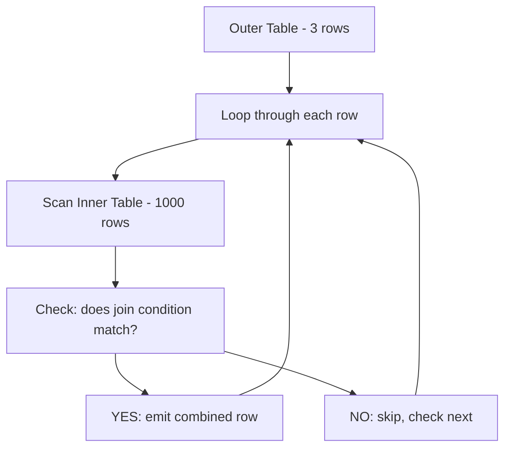
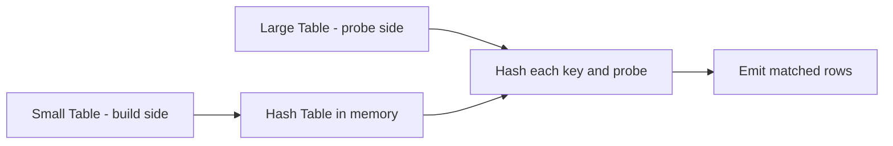
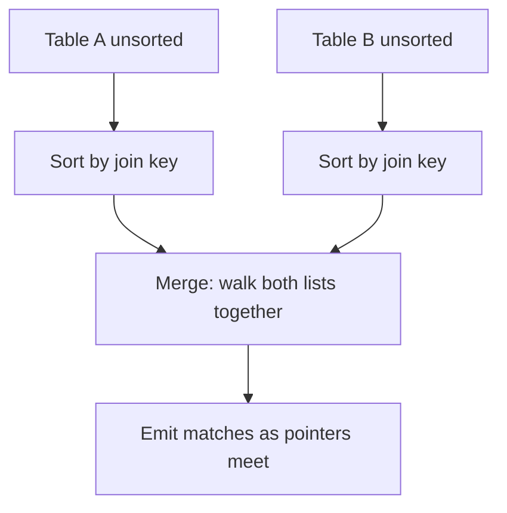
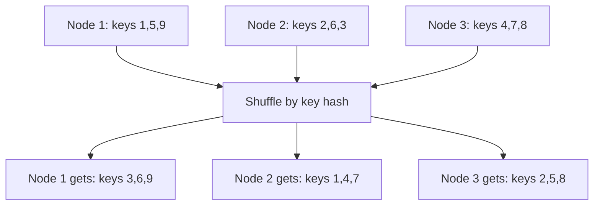

# SQL Joins — Senior-Level Deep Dive

## Physical Join Algorithms

The query optimizer chooses between three physical join strategies. Understanding when each is used helps you diagnose slow queries.

---

### 1. Nested Loop Join

**How it works:**

```
For each row in the OUTER (driving) table:
    For each row in the INNER table:
        If the join condition matches:
            Emit the combined row
```

**Visual representation:**



**Performance characteristics:**

| Aspect | Detail |
|--------|--------|
| Complexity | O(n x m) — scans inner table for EACH outer row |
| Memory | Low — no hash table needed |
| Best for | Small outer + indexed inner table |
| Also used for | Inequality joins (>, <, BETWEEN) |
| Watch for | "Nested Loops" in execution plan |

> **When you see it:** The optimizer picks nested loops when one table is very small (under 100 rows) OR when it can use an index on the inner table to avoid full scans. With an index, it becomes O(n x log m) which is fast.

---

### 2. Hash Join

**How it works:**

```
BUILD PHASE:
    Take the smaller table
    Hash every row's join key into a hash table (in memory)

PROBE PHASE:
    For each row in the larger table:
        Hash its join key
        Look up in the hash table
        If found: emit the match
```

**Visual representation:**



**Performance characteristics:**

| Aspect | Detail |
|--------|--------|
| Complexity | O(n + m) — linear! Very fast |
| Memory | High — entire build table must fit in memory |
| Best for | Large equi-joins without useful indexes |
| Limitation | Only works for equality conditions (=) |
| Watch for | "Hash Match" in execution plan |

> **Memory pressure:** If the build table exceeds available memory, the optimizer spills to disk (grace hash join). This is MUCH slower. Watch for "tempdb spill" or "spill to disk" warnings in your execution plans.

---

### 3. Sort-Merge Join

**How it works:**

```
SORT PHASE:
    Sort Table A by the join key
    Sort Table B by the join key

MERGE PHASE:
    Walk through both sorted lists simultaneously
    When keys match: emit the row
    Advance the pointer on whichever side has the smaller key
```

**Visual representation:**



**Performance characteristics:**

| Aspect | Detail |
|--------|--------|
| Complexity | O(n log n + m log m) sort + O(n + m) merge |
| Memory | Moderate — sorting may spill to disk |
| Best for | Both tables already sorted (clustered index) |
| Also for | FULL OUTER JOINs on large tables |
| Watch for | "Merge Join" in execution plan |

> **Best case:** If both tables are already sorted on the join key (e.g., clustered index), the sort phase is skipped entirely and it becomes O(n + m) — same as hash join.

---

### Algorithm Selection Guide

| Scenario | Optimizer Picks | Why |
|----------|----------------|-----|
| Small left, large right, index on right | Nested Loop (Index) | Index avoids full scan |
| Large x Large, equality join | Hash Join | Linear complexity |
| Both already sorted by key | Sort-Merge | Skips expensive sort |
| Inequality join (>, <, BETWEEN) | Nested Loop | Only algorithm that works |
| One side fits in memory | Hash Join | Fast probe after build |
| FULL OUTER on large tables | Sort-Merge | Hash can't do full outer |

---

## Distributed Join Strategies

In distributed engines (Spark, Snowflake, Redshift, BigQuery), data lives on multiple nodes. Joins require moving data so matching keys land on the same node.

---

### Shuffle Join (Repartition Join)

**Both tables are redistributed by join key.** Matching keys end up on the same node.



**Cost:** Full network transfer of BOTH tables. Expensive for large datasets.

**When it happens:** Default behavior when both tables are large and not co-partitioned.

---

### Broadcast Join (Map-Side Join)

The **smaller table is copied to every node.** Each node joins its local partition of the large table with the full small table locally — no shuffle of the large table needed.

```sql
-- Spark hint to force broadcast
SELECT /*+ BROADCAST(dim_product) */
    f.*, d.product_name
FROM fact_sales f
JOIN dim_product d ON f.product_id = d.product_id;
```

**Cost:** Network transfer of small table x number of nodes. But eliminates the expensive shuffle of the large table.

**Rule of thumb:** Broadcast when one table is under 10MB (configurable in Spark via `spark.sql.autoBroadcastJoinThreshold`).

---

### Collocated Join (Partition-Wise Join)

If both tables are **already partitioned on the join key**, no data movement needed at all.

```sql
-- Redshift: both tables distributed on customer_id
CREATE TABLE orders (order_id INT, customer_id INT, amount DECIMAL)
DISTSTYLE KEY DISTKEY(customer_id);

CREATE TABLE customers (customer_id INT, name VARCHAR)
DISTSTYLE KEY DISTKEY(customer_id);

-- This join requires ZERO network transfer!
SELECT c.name, o.amount
FROM orders o JOIN customers c ON o.customer_id = c.customer_id;
```

> **Key takeaway:** Choose your distribution/partition keys based on your most frequent join patterns. This is the #1 performance tuning lever in distributed SQL.

---

## Data Skew

Data skew occurs when one join key has far more rows than others. Example: NULL values, or a "catch-all" category like "Unknown."

**Detection:**

```sql
-- Find the hot keys
SELECT customer_id, COUNT(*) AS row_count
FROM orders
GROUP BY customer_id
ORDER BY row_count DESC
LIMIT 10;
-- If top key has 500M rows and average is 10K, you have skew
```

**Mitigation — Salting technique:**

```sql
-- 1. Add random salt to the hot key in the large table
-- 2. Replicate the dimension row for each salt value
-- 3. Join on salted key — spreads hot key across many partitions

-- Large table: add random suffix to hot keys
SELECT *,
    CASE WHEN customer_id = 'HOT_KEY' 
         THEN customer_id || '_' || FLOOR(RANDOM() * 10)::TEXT
         ELSE customer_id 
    END AS salted_key
FROM orders;

-- Small table: replicate hot key rows with all salt values
SELECT *, customer_id || '_' || salt::TEXT AS salted_key
FROM customers
CROSS JOIN (SELECT generate_series(0, 9) AS salt) s
WHERE customer_id = 'HOT_KEY'
UNION ALL
SELECT *, customer_id AS salted_key
FROM customers
WHERE customer_id != 'HOT_KEY';
```

---

## NULL Handling in Joins

NULLs never match anything — including other NULLs:

```sql
-- This will NOT match rows where both sides are NULL
SELECT * FROM a JOIN b ON a.key = b.key;
-- NULL = NULL evaluates to UNKNOWN (not TRUE)

-- To treat NULLs as equal, use one of these:
-- Option 1: COALESCE with sentinel value
SELECT * FROM a JOIN b 
    ON COALESCE(a.key, '__NULL__') = COALESCE(b.key, '__NULL__');

-- Option 2: IS NOT DISTINCT FROM (PostgreSQL/Spark)
SELECT * FROM a JOIN b 
    ON a.key IS NOT DISTINCT FROM b.key;
```

---

## Reading Execution Plans

When diagnosing slow joins, look for these patterns:

| What You See | What It Means | Action |
|--------------|---------------|--------|
| "Hash Match (Spill)" | Build table too large for memory | Reduce build side, add filter |
| "Nested Loops" on large table | Missing index on inner table | Add index on join column |
| "Sort" before "Merge Join" | Tables not pre-sorted | Consider clustered index |
| "Exchange" / "Shuffle" | Full data redistribution | Can you broadcast the small side? |
| "Scan" instead of "Seek" | No useful index | Add covering index |

---

## Interview Tips

> **Tip 1:** At senior level, always mention physical execution: "This would use a hash join because both tables are large and the condition is equality. I'd ensure the smaller dimension is on the build side."

> **Tip 2:** For distributed SQL, mention: "I'd broadcast the dimension table since it's under 10MB, eliminating the shuffle of the billion-row fact table."

> **Tip 3:** When asked about slow joins, check: (1) Is there skew? (2) Is there spill to disk? (3) Are we shuffling when we could broadcast? (4) Could we co-partition the tables?

## ⚡ Cheat Sheet

**Physical Join Algorithm Selection**
| Scenario | Algorithm | Complexity |
|---|---|---|
| Small outer + indexed inner | Nested Loop (Index) | O(n × log m) |
| Large × large, equality | Hash Join | O(n + m) |
| Both pre-sorted on key | Sort-Merge | O(n + m) skip sort |
| Inequality (`>`, `<`, `BETWEEN`) | Nested Loop only | O(n × m) worst case |
| FULL OUTER on large tables | Sort-Merge | Hash can't do full outer |

**Hash Join Memory Rule**
- Build side must fit in `work_mem` (PG) / memory grant (SQL Server)
- Spill to disk → "tempdb spill" / "external merge" in plan → huge slowdown
- Fix: filter build side earlier, or increase memory for that session/query

**Distributed Join Strategy**
- Broadcast join: dimension < 10 MB → copy to every node; no shuffle of large table
  - Spark: `/*+ BROADCAST(dim) */` or `spark.sql.autoBroadcastJoinThreshold=10485760`
- Shuffle join: both tables large → repartition both by join key (expensive)
- Collocated join: pre-partitioned on same key → zero network transfer (Redshift DISTKEY, Spark bucketing)

**Data Skew Mitigation**
- Detect: `SELECT key, COUNT(*) FROM t GROUP BY key ORDER BY 2 DESC LIMIT 10`
- Salt large table: `key || '_' || FLOOR(RANDOM()*10)` for hot keys
- Replicate small table: cross join with salt values (0–9) for hot keys only
- Spark: `spark.sql.adaptive.skewJoin.enabled=true` (AQE auto-skew handling)

**NULL Handling in Joins**
- `NULL = NULL` → UNKNOWN (never matches in JOIN ON)
- Safe NULL-equal join: `a.key IS NOT DISTINCT FROM b.key` (PG/Spark)
- Or: `COALESCE(a.key, '__NULL__') = COALESCE(b.key, '__NULL__')`

**Plan Red Flags**
- `Nested Loops` on millions of rows without index → add index on inner join column
- `Hash (Spill)` → reduce build side or increase work_mem
- `Exchange (Shuffle)` on large table → can you broadcast the other side?
- `CartesianJoin` in Snowflake profile → accidental cross join (missing ON clause)
