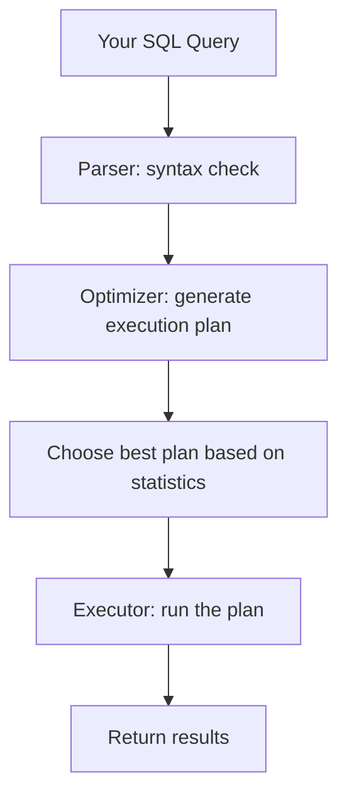

# SQL Query Optimization — Fundamentals


## 🎯 Analogy

Think of query optimization like GPS route planning: the query planner evaluates multiple paths (full scan vs index scan, hash join vs merge join) and picks the cheapest one based on table statistics.

---
## Why Queries Are Slow

A query can be slow for three main reasons:

1. **Reading too much data** — scanning millions of rows when you only need a few
2. **Doing too much work** — sorting, joining, or aggregating unnecessarily
3. **Waiting for resources** — locks, network, insufficient memory

> **Key Insight:** 90% of query optimization is about reducing the amount of data the database has to read. The less data touched, the faster the query.

---

## How a Query Executes



**What this shows:**
- The optimizer considers multiple strategies (full scan, index scan, join order)
- It picks the cheapest plan based on table statistics (row counts, data distribution)
- If statistics are stale/wrong, the optimizer picks a bad plan → slow query

---

## Reading Execution Plans

The execution plan shows exactly HOW the database will run your query.

```sql
-- PostgreSQL / Snowflake
EXPLAIN ANALYZE SELECT * FROM orders WHERE customer_id = 42;

-- SQL Server
SET STATISTICS IO ON;
SELECT * FROM orders WHERE customer_id = 42;

-- Spark
df.filter("customer_id = 42").explain(True)
```

**Key things to look for in a plan:**

| Operator | Meaning | Concern |
|----------|---------|---------|
| **Seq Scan / Full Table Scan** | Reading every row in the table | Slow on large tables |
| **Index Scan / Index Seek** | Using an index to find rows quickly | Good — means index is helping |
| **Sort** | Sorting data in memory or on disk | Expensive for large datasets |
| **Hash Join** | Building hash table for join | Good for large equi-joins |
| **Nested Loop** | Scanning inner table per outer row | Bad if inner table is large and unindexed |
| **Spill to Disk** | Ran out of memory, using disk | Slow — need more memory or smaller dataset |

---

## The Big Five Optimization Techniques

### 1. Add Missing Indexes

An index is like a book's table of contents — it lets the database jump directly to relevant rows instead of reading every page.

```sql
-- Without index: full table scan (reads ALL 100M rows)
SELECT * FROM orders WHERE customer_id = 42;
-- Plan: Seq Scan on orders (cost=0..2500000)

-- Create an index on the filter column
CREATE INDEX idx_orders_customer ON orders(customer_id);

-- With index: index seek (reads only matching rows)
SELECT * FROM orders WHERE customer_id = 42;
-- Plan: Index Scan using idx_orders_customer (cost=0..8)
```

**When to create an index:**
- Column appears in WHERE clauses frequently
- Column is used in JOIN conditions
- Column is used in ORDER BY (avoids sort operation)

**When NOT to index:**
- Table is very small (<1000 rows) — full scan is fine
- Column has very few distinct values (boolean, status flag) — index won't help much
- Table has heavy INSERT/UPDATE load — indexes slow down writes

---

### 2. Filter Early (Reduce Data Volume)

The earlier you filter, the less data flows through the rest of the query.

```sql
-- SLOW: Joins 100M orders to 50M customers, THEN filters
SELECT c.name, o.amount
FROM orders o
JOIN customers c ON o.customer_id = c.id
WHERE o.order_date = '2024-01-15';

-- FASTER: Filter orders FIRST (using index on order_date), then join the smaller result
SELECT c.name, o.amount
FROM (SELECT customer_id, amount FROM orders WHERE order_date = '2024-01-15') o
JOIN customers c ON o.customer_id = c.id;
```

> **In practice:** Modern optimizers usually push filters down automatically (predicate pushdown). But complex queries with views, UDFs, or nested subqueries can prevent this.

---

### 3. Select Only Needed Columns

```sql
-- SLOW: Reads ALL columns from disk (including large text/blob columns)
SELECT * FROM events WHERE event_date = '2024-01-15';

-- FAST: Only reads the 3 columns you need
SELECT event_id, user_id, event_type FROM events WHERE event_date = '2024-01-15';
```

**Why it matters:**
- Columnar databases (Snowflake, Redshift, Parquet) only read requested columns
- Less data transferred from storage to compute
- Less memory used for processing

> **Rule:** Never use `SELECT *` in production queries. Always specify the columns you need.

---

### 4. Avoid Functions on Indexed Columns

Applying a function to an indexed column prevents the index from being used:

```sql
-- BAD: Function on column → can't use index on order_date
SELECT * FROM orders WHERE YEAR(order_date) = 2024;
-- Plan: Full Table Scan (index ignored)

-- GOOD: Range condition → uses index on order_date
SELECT * FROM orders WHERE order_date >= '2024-01-01' AND order_date < '2025-01-01';
-- Plan: Index Range Scan (fast!)

-- BAD: LOWER() prevents index usage
SELECT * FROM users WHERE LOWER(email) = 'alice@example.com';

-- GOOD: Store pre-lowered values, or use a functional index
CREATE INDEX idx_users_email_lower ON users(LOWER(email));
```

---

### 5. Use LIMIT for Exploration (Not Production)

```sql
-- For quick exploration: LIMIT prevents reading entire result
SELECT * FROM huge_table LIMIT 100;

-- But note: LIMIT doesn't make the WHERE faster
-- This still scans all rows matching the condition, then returns 100:
SELECT * FROM orders WHERE amount > 100 ORDER BY order_date DESC LIMIT 100;
-- Optimization: index on (amount, order_date) would help
```

---

## Common Performance Anti-Patterns

| Anti-Pattern | Why It's Slow | Fix |
|-------------|---------------|-----|
| `SELECT *` | Reads unnecessary columns | List only needed columns |
| `WHERE YEAR(date_col) = 2024` | Function prevents index use | Use range: `BETWEEN '2024-01-01' AND '2024-12-31'` |
| `WHERE col LIKE '%search%'` | Leading wildcard = full scan | Use full-text search index |
| `ORDER BY` on unindexed column | Full sort in memory | Add index on sort column |
| Joining without index on join key | Nested loop full scan | Index the FK column |
| `SELECT DISTINCT` on large results | Expensive dedup operation | Fix the root cause (bad join?) |
| `NOT IN (subquery)` with NULLs | Returns empty results + slow | Use `NOT EXISTS` instead |
| Correlated subquery in SELECT | Runs subquery per row | Convert to JOIN |

---

## Understanding Row Estimates

The optimizer estimates how many rows each step will produce. Wrong estimates → bad plans.

```sql
-- If optimizer thinks this returns 10 rows (chooses nested loop)
-- but actually returns 1,000,000 rows → terrible performance
SELECT * FROM orders WHERE status = 'pending';
-- Fix: UPDATE STATISTICS on the table (refresh row count estimates)
```

```sql
-- PostgreSQL: refresh statistics
ANALYZE orders;

-- SQL Server: update statistics
UPDATE STATISTICS orders;

-- Snowflake: automatic (no action needed)
-- Spark: ANALYZE TABLE orders COMPUTE STATISTICS;
```

> **When statistics go stale:** After large data loads, deletes, or schema changes. Always refresh stats after major ETL operations.

---

## Quick Win Checklist

Before diving into complex optimization:

| Check | Action |
|-------|--------|
| Is there a full table scan? | Add index on WHERE/JOIN columns |
| Are statistics current? | Run ANALYZE/UPDATE STATISTICS |
| Using `SELECT *`? | List specific columns |
| Function on indexed column? | Rewrite as range condition |
| Missing WHERE clause? | Always filter — never scan everything |
| Large result set sorted? | Add index on ORDER BY column |
| Joining large tables? | Ensure join columns are indexed |

---


## ▶️ Try It Yourself

```sql
-- See the execution plan (Postgres)
EXPLAIN ANALYZE
SELECT c.name, SUM(o.amount) AS total
FROM orders o
JOIN customers c ON o.customer_id = c.id
WHERE o.order_date >= '2024-01-01'
GROUP BY c.name;

-- Common optimizations:
-- 1. Add index on the filter column
CREATE INDEX idx_orders_date ON orders(order_date);

-- 2. Add index on join column
CREATE INDEX idx_orders_cust ON orders(customer_id);

-- 3. Avoid function on indexed column (prevents index use):
-- BAD:  WHERE YEAR(order_date) = 2024
-- GOOD: WHERE order_date >= '2024-01-01' AND order_date < '2025-01-01'
```

> **Run it:** Copy the snippet into a REPL or file and run it — no external services needed for the basic example.

---
## Interview Tips

> **Tip 1:** "How do you optimize a slow query?" — "First, I read the execution plan. I look for full table scans (add index), sorts on large data (add index on ORDER BY), and row estimate mismatches (refresh statistics). Then I check if I'm reading more data than needed (filter earlier, select fewer columns)."

> **Tip 2:** "When should you NOT add an index?" — "When the table is very small, when the column has low cardinality (like a boolean), when the table has heavy write workload (indexes slow inserts), or when the query returns a large percentage of the table (index scan is slower than full scan for >10-20% of rows)."

> **Tip 3:** "What's the most common optimization mistake?" — "Using functions on indexed columns in WHERE clauses. `WHERE YEAR(date) = 2024` ignores the index. `WHERE date >= '2024-01-01' AND date < '2025-01-01'` uses the index. This one fix can turn a 30-second query into a 100ms query."
