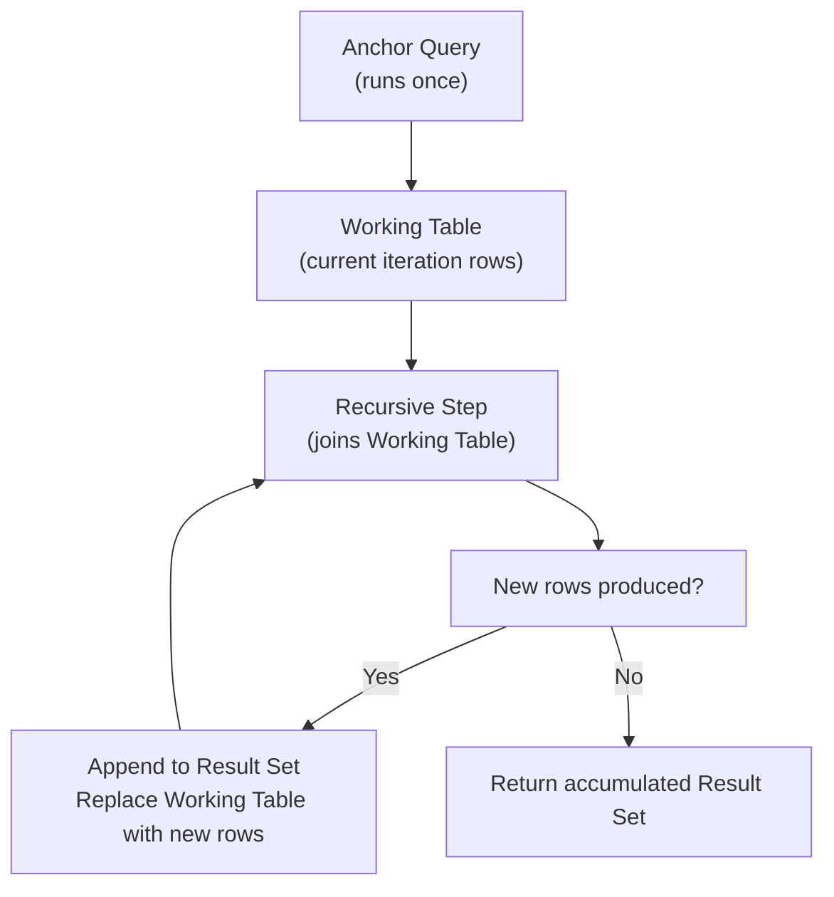

# Recursive Queries — Intermediate Concepts

## Execution Model In Depth

Understanding exactly how the database executes recursive CTEs prevents subtle bugs and performance surprises.



**Key mechanics:**
- The **Working Table** at each iteration contains ONLY the rows produced by the PREVIOUS iteration — not all accumulated rows
- `UNION ALL` accumulates everything; `UNION` (without ALL) would deduplicate across iterations — almost always wrong for recursion
- The recursion terminates when the recursive step produces **zero new rows**

This BFS (breadth-first search) behavior is why you must include a termination guard.

---

## Advanced Pattern 1: Multi-Root Hierarchies

Real org charts often have multiple root nodes (multiple CEOs, multiple product lines):

```sql
WITH RECURSIVE full_hierarchy AS (
    -- Anchor: ALL root nodes (not just one)
    SELECT 
        employee_id,
        name,
        manager_id,
        department,
        0           AS depth,
        name        AS reporting_chain,
        employee_id AS root_id
    FROM employees
    WHERE manager_id IS NULL  -- All roots

    UNION ALL

    -- Recursive: direct reports of each level
    SELECT 
        e.employee_id,
        e.name,
        e.manager_id,
        e.department,
        fh.depth + 1,
        fh.reporting_chain || ' > ' || e.name,
        fh.root_id
    FROM employees e
    JOIN full_hierarchy fh ON e.manager_id = fh.employee_id
    WHERE fh.depth < 20
)
SELECT 
    depth,
    REPEAT('  ', depth) || name AS indented_name,
    reporting_chain,
    department,
    root_id
FROM full_hierarchy
ORDER BY root_id, reporting_chain;
```

**Key additions over the basic pattern:**
- `root_id` tracks which tree a node belongs to — useful for partitioned hierarchies
- `REPEAT('  ', depth)` indents names for visual tree representation
- No `WHERE` filter on the anchor — all roots are seeds

---

## Advanced Pattern 2: Graph Traversal (Not Just Trees)

Trees have exactly one parent per node. Graphs can have many parents. Recursive CTEs handle both, but graphs need cycle detection:

```sql
-- Product recommendation graph: each product can recommend many others
-- connections(from_product, to_product, weight)

WITH RECURSIVE recommendations AS (
    -- Anchor: products the user already viewed
    SELECT 
        to_product                           AS product_id,
        weight                               AS cumulative_score,
        ARRAY[from_product, to_product]      AS path,
        1                                    AS hops
    FROM connections
    WHERE from_product IN (101, 205)  -- Seed products

    UNION ALL

    -- Recursive: follow recommendations
    SELECT 
        c.to_product,
        r.cumulative_score * c.weight,
        r.path || c.to_product,
        r.hops + 1
    FROM connections c
    JOIN recommendations r ON c.from_product = r.product_id
    WHERE NOT c.to_product = ANY(r.path)   -- No revisits
      AND r.hops < 4                        -- Max 4 hops
      AND r.cumulative_score * c.weight > 0.01  -- Prune low-score paths
)
SELECT 
    product_id,
    MAX(cumulative_score) AS best_score,
    MIN(hops)             AS min_hops
FROM recommendations
GROUP BY product_id
ORDER BY best_score DESC
LIMIT 20;
```

**Why this matters for DE interviews:** Product recommendation, network analysis, and lineage traversal all use this same pattern.

---

## Advanced Pattern 3: Iterative Computation (Running Totals That Depend on Prior Row)

Standard window functions can't handle computations where each row's value depends on the calculated (not raw) value of the prior row. Recursive CTEs can:

```sql
-- Loan amortization: each month's balance depends on prior month's calculated balance
WITH RECURSIVE amortization AS (
    -- Anchor: initial state
    SELECT 
        1            AS month_num,
        100000.00    AS principal,   -- Starting loan balance
        100000.00 * 0.005 AS interest_payment,  -- Monthly rate = 6% / 12
        2000.00 - 100000.00 * 0.005 AS principal_payment,
        100000.00 - (2000.00 - 100000.00 * 0.005) AS remaining_balance

    UNION ALL

    -- Recursive: each month uses prior month's remaining balance
    SELECT 
        month_num + 1,
        remaining_balance                                              AS principal,
        ROUND(remaining_balance * 0.005, 2)                           AS interest_payment,
        ROUND(2000.00 - remaining_balance * 0.005, 2)                 AS principal_payment,
        ROUND(remaining_balance - (2000.00 - remaining_balance * 0.005), 2) AS remaining_balance
    FROM amortization
    WHERE remaining_balance > 0
      AND month_num < 360  -- 30 year max
)
SELECT 
    month_num,
    ROUND(interest_payment, 2)   AS interest,
    ROUND(principal_payment, 2)  AS principal,
    ROUND(remaining_balance, 2)  AS balance
FROM amortization
ORDER BY month_num;
```

**Result (first 3 rows):**

| month_num | interest | principal | balance |
|-----------|---------|-----------|---------|
| 1 | 500.00 | 1500.00 | 98500.00 |
| 2 | 492.50 | 1507.50 | 96992.50 |
| 3 | 484.96 | 1515.04 | 95477.46 |

> **This is impossible with standard window functions** because each row's `remaining_balance` feeds the NEXT row's interest calculation. The recursive CTE simulates a loop.

---

## Cycle Detection Techniques

### Technique 1: Array Path (PostgreSQL / BigQuery / Snowflake)

```sql
WITH RECURSIVE traversal AS (
    SELECT 
        id,
        parent_id,
        ARRAY[id] AS visited_path,
        false      AS cycle_detected
    FROM nodes
    WHERE id = 1  -- Start node

    UNION ALL

    SELECT 
        n.id,
        n.parent_id,
        t.visited_path || n.id,
        n.id = ANY(t.visited_path)
    FROM nodes n
    JOIN traversal t ON n.parent_id = t.id
    WHERE NOT cycle_detected              -- Stop if cycle detected
      AND NOT n.id = ANY(t.visited_path) -- Or prevent visiting
)
SELECT * FROM traversal;
```

### Technique 2: PostgreSQL 14+ Native CYCLE Clause

```sql
WITH RECURSIVE traversal AS (
    SELECT id, parent_id FROM nodes WHERE id = 1
    UNION ALL
    SELECT n.id, n.parent_id FROM nodes n
    JOIN traversal t ON n.parent_id = t.id
)
CYCLE id SET is_cycle USING cycle_path
SELECT * FROM traversal WHERE NOT is_cycle;
```

### Technique 3: Depth Limit (Universal, Simpler)

```sql
-- Works in all databases — simplest approach
WITH RECURSIVE traversal AS (
    SELECT id, parent_id, 1 AS depth FROM nodes WHERE id = 1
    UNION ALL
    SELECT n.id, n.parent_id, t.depth + 1
    FROM nodes n
    JOIN traversal t ON n.parent_id = t.id
    WHERE t.depth < 50  -- If real trees are never deeper than 50, cycles are implicitly caught
)
SELECT * FROM traversal;
```

| Technique | Pros | Cons |
|-----------|------|------|
| Array path | Precise cycle detection; returns cycle nodes | Array type not in all databases |
| Native CYCLE clause | Clean syntax; built-in | PostgreSQL 14+ only |
| Depth limit | Universal; simple | May miss cycles in shallow positions; arbitrary limit |

---

## Cross-Dialect Differences

| Feature | PostgreSQL | SQL Server | MySQL 8+ | Snowflake | BigQuery |
|---------|-----------|-----------|----------|-----------|---------|
| Keyword | `WITH RECURSIVE` | `WITH` (implicit) | `WITH RECURSIVE` | `WITH RECURSIVE` | `WITH RECURSIVE` |
| Cycle detection | Array + PG14 `CYCLE` | Manual array or `MAXRECURSION` | Manual | Array | Array |
| Max recursion depth | Unlimited (memory bound) | Default 100 (`MAXRECURSION`) | Default 1000 | Unlimited | Default 500 |
| `UNION` vs `UNION ALL` | Both work | Both work | `UNION ALL` only | Both work | Both work |

**SQL Server — override recursion limit:**
```sql
WITH org AS (
    SELECT employee_id, manager_id, 0 AS level
    FROM employees WHERE manager_id IS NULL
    UNION ALL
    SELECT e.employee_id, e.manager_id, o.level + 1
    FROM employees e JOIN org o ON e.manager_id = o.employee_id
)
SELECT * FROM org
OPTION (MAXRECURSION 500);  -- Override default 100
```

**Snowflake — no UNION-only recursive CTEs (must use UNION ALL):**
```sql
-- Snowflake requires UNION ALL in recursive CTEs
WITH RECURSIVE hierarchy AS (
    SELECT id, parent_id, 0 AS depth FROM tree WHERE parent_id IS NULL
    UNION ALL  -- NOT UNION
    SELECT t.id, t.parent_id, h.depth + 1
    FROM tree t JOIN hierarchy h ON t.parent_id = h.id
    WHERE h.depth < 20
)
SELECT * FROM hierarchy;
```

---

## Performance Optimization

### Index the Join Column

Every recursive iteration joins back on the parent/child column. Without an index this is a full scan per iteration:

```sql
-- Make sure this index exists before running deep recursions
CREATE INDEX idx_employees_manager_id ON employees(manager_id);

-- Verify the planner uses it
EXPLAIN ANALYZE
WITH RECURSIVE org AS (...)
SELECT * FROM org;
```

### Use Anchored Start Points

Don't anchor on a full table scan if you can start from a specific root:

```sql
-- Bad: starts from ALL root nodes, then filters later
WITH RECURSIVE all_trees AS (
    SELECT * FROM nodes WHERE parent_id IS NULL
    UNION ALL
    ...
)
SELECT * FROM all_trees WHERE root_id = 42;

-- Better: anchor only from the specific root you need
WITH RECURSIVE single_tree AS (
    SELECT * FROM nodes WHERE id = 42  -- Single root
    UNION ALL
    ...
)
SELECT * FROM single_tree;
```

### Prune Early

Add pruning conditions in the recursive step — don't wait for the final SELECT:

```sql
WITH RECURSIVE pruned AS (
    SELECT id, category, score FROM products WHERE id = 1
    UNION ALL
    SELECT p.id, p.category, p.score
    FROM products p
    JOIN pruned r ON p.parent_id = r.id
    WHERE p.score > 0.5     -- Prune early — don't explore low-score branches
      AND p.category != 'excluded'  -- Skip entire subtrees
)
SELECT * FROM pruned;
```

---

## Generating Series — Cross-Dialect

Recursive CTEs are commonly used to generate number or date series in databases without built-in generators:

```sql
-- Number series (all databases)
WITH RECURSIVE nums AS (
    SELECT 1 AS n
    UNION ALL
    SELECT n + 1 FROM nums WHERE n < 100
)
SELECT n FROM nums;

-- Date series (PostgreSQL)
WITH RECURSIVE dates AS (
    SELECT DATE '2024-01-01' AS dt
    UNION ALL
    SELECT dt + INTERVAL '1 day' FROM dates WHERE dt < DATE '2024-12-31'
)
SELECT dt FROM dates;
```

**Better alternatives where available:**
```sql
-- PostgreSQL: generate_series (much faster, no recursion overhead)
SELECT generate_series('2024-01-01'::date, '2024-12-31'::date, '1 day'::interval) AS dt;

-- BigQuery: GENERATE_DATE_ARRAY
SELECT dt FROM UNNEST(GENERATE_DATE_ARRAY('2024-01-01', '2024-12-31')) AS dt;

-- Snowflake: GENERATOR + DATEADD
SELECT DATEADD(day, SEQ4(), '2024-01-01'::date) AS dt
FROM TABLE(GENERATOR(ROWCOUNT => 366));
```

> **Interview tip:** "For date series, I use `generate_series()` in PostgreSQL and `GENERATE_DATE_ARRAY` in BigQuery — they're more efficient than recursive CTEs. I fall back to recursive CTEs for databases that don't have built-in generators, or when I need more complex iteration logic."

---

## Interview Tips

> **Tip 1:** "What's the difference between UNION and UNION ALL in a recursive CTE?" — "UNION ALL is almost always what you want. UNION would deduplicate across all accumulated rows, including across iterations — this is very expensive and semantically incorrect for most traversals. Use UNION only if you explicitly need deduplication and understand the cost."

> **Tip 2:** "How does the database handle memory for deep recursions?" — "Each iteration's working table is only the NEW rows from that iteration, not all accumulated rows. So memory per iteration scales with the width of the tree at that level, not total rows. Very deep recursions with wide levels (e.g., flat org charts 5 levels deep with 10,000 employees per level) can hit memory limits."

> **Tip 3:** "When would you NOT use a recursive CTE?" — "For very wide, shallow graphs (e.g., a social network with millions of direct connections), recursive CTEs are impractical — the working table per iteration is too large. I'd use a graph database (Neo4j) or a specialized graph processing framework (Apache Spark GraphX). For static hierarchies that are read frequently, a materialized path or nested set model avoids recursion at query time entirely."
