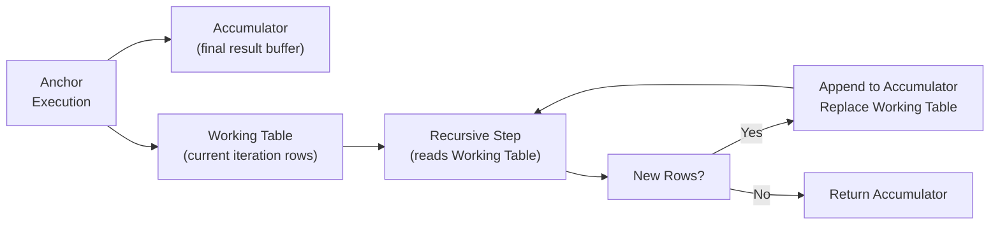

# Recursive Queries — Senior-Level Deep Dive

## Internal Execution: Working Table vs. Accumulator

The database uses two internal data structures during recursive CTE execution:



**Critical distinction:**
- **Working Table** = only the rows produced in the LATEST iteration
- **Accumulator** = all rows produced across ALL iterations
- The recursive step reads the Working Table, NOT the accumulator — this is why each iteration only sees new rows, enabling BFS-style traversal

**Implication:** You cannot reference a recursive CTE's accumulated results within the recursive step itself. This prevents DFS (depth-first search) — standard SQL recursion is always BFS.

---

## Optimizer Behavior and Materialization

### PostgreSQL

Recursive CTEs in PostgreSQL are **always materialized** — they are an optimization barrier regardless of the `MATERIALIZED` / `NOT MATERIALIZED` hints that apply to non-recursive CTEs:

```sql
-- This ALWAYS materializes — the NOT MATERIALIZED hint has no effect on recursive CTEs
WITH RECURSIVE org AS (
    SELECT employee_id, name, manager_id, 0 AS depth
    FROM employees WHERE manager_id IS NULL
    UNION ALL
    SELECT e.employee_id, e.name, e.manager_id, o.depth + 1
    FROM employees e JOIN org o ON e.manager_id = o.employee_id
)
SELECT * FROM org WHERE department = 'Engineering';
-- The WHERE filter cannot be pushed INTO the recursive CTE
-- All nodes are computed first, then filtered
```

**Implication:** If you only need a subtree, filter INSIDE the recursive step, not in the outer WHERE:

```sql
-- Better: prune early inside the recursion
WITH RECURSIVE org AS (
    SELECT employee_id, name, department, manager_id, 0 AS depth
    FROM employees WHERE manager_id IS NULL
    UNION ALL
    SELECT e.employee_id, e.name, e.department, e.manager_id, o.depth + 1
    FROM employees e JOIN org o ON e.manager_id = o.employee_id
    WHERE e.department = 'Engineering'  -- Prune non-Engineering subtrees early
)
SELECT * FROM org;
```

### SQL Server

SQL Server materializes each iteration's working table as a spool but can apply some filter pushdown to the anchor:

```sql
-- SQL Server: the WHERE on the final SELECT can sometimes push to the anchor
-- but NOT to recursive iterations
WITH org AS (
    SELECT EmployeeID, ManagerID, 0 AS Level
    FROM Employees WHERE ManagerID IS NULL
    UNION ALL
    SELECT e.EmployeeID, e.ManagerID, o.Level + 1
    FROM Employees e JOIN org o ON e.ManagerID = o.EmployeeID
)
SELECT * FROM org WHERE Level <= 3;
-- SQL Server may limit iterations to Level <= 3 — but don't rely on this
-- Use explicit WHERE in the recursive step for guaranteed pruning
```

### Snowflake / BigQuery

These cloud platforms handle recursive CTE execution differently — they may compile recursion into iterative plans using working-set operators:

```sql
-- BigQuery: recursive CTEs are compiled to repeated table reads internally
-- Performance scales with: (number of iterations) × (rows per iteration)
-- For very deep graphs (1000+ levels), consider alternative data models
WITH RECURSIVE tree AS (
    SELECT id, parent_id, 0 AS depth FROM nodes WHERE parent_id IS NULL
    UNION ALL
    SELECT n.id, n.parent_id, t.depth + 1
    FROM nodes n JOIN tree t ON n.parent_id = t.id
    WHERE t.depth < 50
)
SELECT * FROM tree;
```

---

## Alternative Data Models for Hierarchies

Recursive CTEs are powerful but have limits. Senior engineers know the trade-offs between hierarchy representations:

### Model 1: Adjacency List (Standard — requires recursion)

```sql
-- What we've been using all along
CREATE TABLE categories (
    id        INT PRIMARY KEY,
    name      VARCHAR(100),
    parent_id INT REFERENCES categories(id)
);
```

| Pros | Cons |
|------|------|
| Simple, natural model | Requires recursive CTE for subtree queries |
| Easy inserts and updates | Slow for deep trees without indexing |
| Standard across all databases | Hard to get subtree size without full traversal |

### Model 2: Materialized Path

```sql
CREATE TABLE categories (
    id   INT PRIMARY KEY,
    name VARCHAR(100),
    path VARCHAR(500)  -- e.g., '/1/3/7/15/'
);

-- Insert a child of node 15 (which is at /1/3/7/15/):
INSERT INTO categories VALUES (22, 'Smartphones', '/1/3/7/15/22/');

-- Get all descendants of node 7 (/1/3/7/):
SELECT * FROM categories WHERE path LIKE '/1/3/7/%';

-- Get all ancestors of node 22:
SELECT * FROM categories
WHERE '/1/3/7/15/22/' LIKE path || '%'
  AND path != '/1/3/7/15/22/';
```

| Pros | Cons |
|------|------|
| O(1) subtree queries (LIKE prefix) | Path must be maintained on every insert/move |
| O(depth) ancestor queries | Moving a subtree requires updating all descendant paths |
| No recursion needed | Path string can get long for deep trees |

### Model 3: Nested Sets

```sql
CREATE TABLE categories (
    id    INT PRIMARY KEY,
    name  VARCHAR(100),
    lft   INT,  -- Left boundary
    rgt   INT   -- Right boundary
    -- Children of node N have lft/rgt BETWEEN N.lft and N.rgt
);

-- All descendants of a node:
SELECT child.*
FROM categories parent
JOIN categories child ON child.lft BETWEEN parent.lft AND parent.rgt
WHERE parent.id = 3 AND child.id != 3;

-- Count children:
SELECT (rgt - lft - 1) / 2 AS child_count FROM categories WHERE id = 3;
```

| Pros | Cons |
|------|------|
| Subtree queries are very fast (range scan) | Inserts/moves require updating many rows |
| Aggregate over subtree with single JOIN | Complex to understand and maintain |
| Depth without recursion: `(rgt-lft-1)/2` | Rarely supported natively |

### Model 4: Closure Table

```sql
CREATE TABLE category_closure (
    ancestor_id   INT,
    descendant_id INT,
    depth         INT
);
-- One row per ancestor-descendant pair (including self-reference at depth 0)

-- All descendants of node 3:
SELECT descendant_id FROM category_closure WHERE ancestor_id = 3 AND depth > 0;

-- Depth between any two nodes:
SELECT depth FROM category_closure WHERE ancestor_id = 3 AND descendant_id = 15;
```

| Pros | Cons |
|------|------|
| O(1) subtree and ancestor queries | O(depth) rows per insert |
| Supports all hierarchy operations efficiently | More storage; complex maintenance |
| Easy to query at specific depth | Less common knowledge |

---

## Graph Algorithms in SQL

### Dijkstra's Shortest Path (Approximate in SQL)

Standard SQL recursion implements BFS, not Dijkstra. For weighted shortest paths, you need a workaround:

```sql
-- Greedy approximation: expand cheapest frontier first
-- (True Dijkstra requires a priority queue — not native in SQL)
WITH RECURSIVE weighted_paths AS (
    -- Anchor: paths of length 1 from source
    SELECT 
        source_node,
        target_node,
        edge_weight                        AS total_cost,
        ARRAY[source_node, target_node]   AS path
    FROM edges
    WHERE source_node = 'A'

    UNION ALL

    -- Expand: add one hop
    SELECT 
        wp.source_node,
        e.target_node,
        wp.total_cost + e.edge_weight,
        wp.path || e.target_node
    FROM weighted_paths wp
    JOIN edges e ON e.source_node = wp.target_node
    WHERE NOT e.target_node = ANY(wp.path)
      AND array_length(wp.path, 1) < 10
),
-- Keep only minimum cost path to each destination
best_paths AS (
    SELECT DISTINCT ON (target_node)
        target_node,
        total_cost,
        path
    FROM weighted_paths
    ORDER BY target_node, total_cost ASC
)
SELECT target_node, total_cost, array_to_string(path, ' → ') AS route
FROM best_paths
ORDER BY total_cost;
```

> **Production note:** For true Dijkstra's algorithm on large graphs, use Apache Spark's GraphX (`shortestPaths`), Neo4j, or Amazon Neptune. SQL recursion is a reasonable approximation for small graphs (<10,000 nodes).

### Transitive Closure

Find all nodes reachable from a given node (complete reachability set):

```sql
WITH RECURSIVE reachable AS (
    SELECT 'node_A' AS node_id, 0 AS hops

    UNION ALL

    SELECT e.to_node, r.hops + 1
    FROM edges e
    JOIN reachable r ON e.from_node = r.node_id
    WHERE NOT e.to_node = ANY(
        SELECT node_id FROM reachable  -- This won't work as written — see note
    )
)
SELECT DISTINCT node_id FROM reachable;
```

> **Note:** The subquery `SELECT node_id FROM reachable` inside the recursive step would reference the accumulator, which is not allowed in standard SQL. The correct approach is the path array technique shown earlier (`NOT n.id = ANY(path_array)`).

---

## Recursive CTEs in ETL / Data Engineering

### Data Lineage Traversal

```sql
-- Given a broken source table, find all downstream affected tables
WITH RECURSIVE lineage AS (
    -- Anchor: direct consumers of the broken table
    SELECT 
        target_table                                AS affected_table,
        source_table                                AS broken_source,
        1                                           AS distance,
        ARRAY[source_table, target_table]           AS lineage_path
    FROM table_lineage
    WHERE source_table = 'raw_orders'

    UNION ALL

    -- Recursive: find tables that depend on already-affected tables
    SELECT 
        tl.target_table,
        l.broken_source,
        l.distance + 1,
        l.lineage_path || tl.target_table
    FROM table_lineage tl
    JOIN lineage l ON tl.source_table = l.affected_table
    WHERE NOT tl.target_table = ANY(l.lineage_path)
      AND l.distance < 20
)
SELECT DISTINCT ON (affected_table)
    affected_table,
    distance                                       AS hops_from_source,
    array_to_string(lineage_path, ' → ')          AS impact_path
FROM lineage
ORDER BY affected_table, distance;
```

### DAG Dependency Resolution (Build Order)

```sql
-- Determine job execution order respecting dependencies
WITH RECURSIVE job_order AS (
    -- Anchor: jobs with no dependencies
    SELECT 
        job_id,
        job_name,
        ARRAY[job_id]   AS execution_path,
        0               AS schedule_level
    FROM jobs j
    WHERE NOT EXISTS (
        SELECT 1 FROM job_dependencies jd WHERE jd.dependent_job = j.job_id
    )

    UNION ALL

    -- Recursive: jobs whose ALL dependencies are already in the path
    SELECT 
        j.job_id,
        j.job_name,
        jo.execution_path || j.job_id,
        jo.schedule_level + 1
    FROM jobs j
    JOIN job_dependencies jd ON j.job_id = jd.dependent_job
    JOIN job_order jo ON jd.dependency_job = jo.job_id
    WHERE NOT j.job_id = ANY(jo.execution_path)
)
SELECT DISTINCT
    job_id,
    job_name,
    MIN(schedule_level) AS earliest_level
FROM job_order
GROUP BY job_id, job_name
ORDER BY earliest_level, job_name;
```

---

## Performance Benchmarking and Trade-offs

### Measuring Recursive CTE Cost

```sql
-- PostgreSQL: EXPLAIN ANALYZE shows iteration costs
EXPLAIN (ANALYZE, BUFFERS, FORMAT TEXT)
WITH RECURSIVE org AS (
    SELECT employee_id, manager_id, 0 AS depth
    FROM employees WHERE manager_id IS NULL
    UNION ALL
    SELECT e.employee_id, e.manager_id, o.depth + 1
    FROM employees e JOIN org o ON e.manager_id = o.employee_id
    WHERE o.depth < 10
)
SELECT COUNT(*) FROM org;

-- Look for:
-- "WorkTable Scan" — recursive working table reads
-- "CTE Scan" — materialized CTE being scanned
-- Number of loops on the recursive join = number of iterations
```

### When Recursive CTEs Break Down

| Scenario | Problem | Solution |
|----------|---------|----------|
| 1M+ node tree | Memory for working table at wide levels | Batch processing with temp tables |
| 1000+ depth | Many iterations; slow on some databases | Materialized path model |
| Frequent subtree queries | Per-query recursion overhead | Nested sets or closure table |
| Real-time graph queries | SQL recursion too slow | Graph database (Neo4j, Neptune) |
| Multiple recursive paths to same node | Exponential row growth | Deduplicate with `DISTINCT` in recursive step |

---

## Interview Tips

> **Tip 1:** "How would you implement Dijkstra's shortest path in SQL?" — "Pure Dijkstra requires a priority queue, which SQL doesn't natively support. I can implement a BFS-based approximation using a recursive CTE that expands all paths and keeps the minimum cost to each destination. For production use on large graphs, I'd use a graph database or Spark GraphX — SQL is suitable for graphs with thousands of nodes, not millions."

> **Tip 2:** "What's the performance difference between a recursive CTE and a closure table for hierarchy queries?" — "For read-heavy workloads with frequent subtree queries, a closure table is O(1) per query using a simple JOIN, versus O(n × depth) for recursive CTEs. The trade-off is write complexity: every insert into the hierarchy requires O(depth) rows added to the closure table. I'd choose closure table for reporting databases with mostly reads, and adjacency list with recursive CTEs for OLTP systems with frequent writes."

> **Tip 3:** "Our recursive CTE is causing timeouts on a 500,000-row hierarchy table. How would you fix it?" — "First, I'd check if the join column (`parent_id`) is indexed — this is the most common cause. Second, I'd add early pruning in the recursive step to limit the working table size. Third, if the hierarchy is queried frequently and doesn't change often, I'd pre-compute it into a closure table or materialized path and refresh on a schedule rather than recursing on every query."
