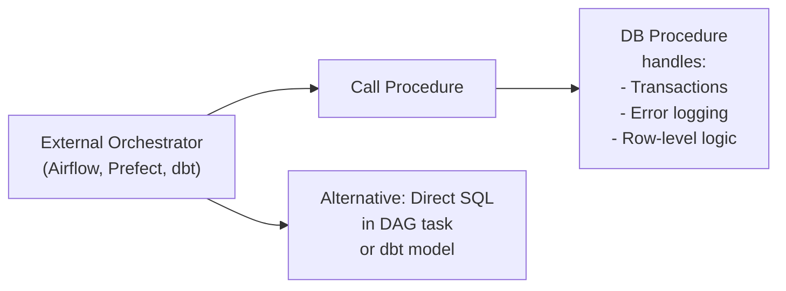

# SQL Stored Procedures — Senior-Level Deep Dive

## Plan Caching and Parameter Sniffing

### How SQL Server Caches Procedure Plans

SQL Server compiles and caches the execution plan the first time a stored procedure runs. Subsequent calls reuse this cached plan — a major performance benefit. But it introduces a dangerous problem: **parameter sniffing**.

```sql
-- The procedure:
CREATE OR ALTER PROCEDURE GetOrdersByStatus @Status NVARCHAR(20)
AS
BEGIN
    SELECT order_id, customer_id, amount FROM orders WHERE status = @Status;
END;

-- First call with 'pending' (1% of rows — optimizer chooses Index Seek):
EXEC GetOrdersByStatus 'pending';
-- Plan cached: Index Seek (efficient for small result set)

-- Second call with 'shipped' (99% of rows — should use Table Scan):
EXEC GetOrdersByStatus 'shipped';
-- Reuses cached Index Seek plan → TERRIBLE performance for large result set!
-- This is parameter sniffing causing a bad cached plan
```

**Fixing parameter sniffing:**

```sql
-- Fix 1: OPTIMIZE FOR UNKNOWN — force optimizer to use average statistics
CREATE OR ALTER PROCEDURE GetOrdersByStatus @Status NVARCHAR(20)
AS
BEGIN
    SELECT order_id, customer_id, amount FROM orders WHERE status = @Status
    OPTION (OPTIMIZE FOR (@Status UNKNOWN));
END;

-- Fix 2: Recompile every call (eliminates caching — use for highly variable queries)
CREATE OR ALTER PROCEDURE GetOrdersByStatus @Status NVARCHAR(20)
    WITH RECOMPILE  -- Recompile on every call
AS
BEGIN
    SELECT order_id, customer_id, amount FROM orders WHERE status = @Status;
END;

-- Fix 3: Local variable trick (breaks parameter sniffing)
CREATE OR ALTER PROCEDURE GetOrdersByStatus @Status NVARCHAR(20)
AS
BEGIN
    DECLARE @LocalStatus NVARCHAR(20) = @Status;  -- Copy to local variable
    SELECT order_id, customer_id, amount FROM orders WHERE status = @LocalStatus;
    -- Optimizer cannot see the actual value of @LocalStatus at compile time
END;

-- Fix 4: IF branching for known-different distributions
CREATE OR ALTER PROCEDURE GetOrdersByStatus @Status NVARCHAR(20)
AS
BEGIN
    IF @Status = 'pending'
        SELECT order_id, customer_id, amount FROM orders WHERE status = 'pending';
    ELSE
        SELECT order_id, customer_id, amount FROM orders WHERE status = @Status
        OPTION (RECOMPILE);  -- Statement-level recompile for the general case
END;
```

### PostgreSQL Plan Caching

PostgreSQL caches plans per session (not globally like SQL Server). After ~5 executions with a parameter, it switches to a "generic" plan that ignores parameter values:

```sql
-- PostgreSQL: force re-planning when parameters vary greatly
CREATE OR REPLACE FUNCTION get_orders_by_status(p_status TEXT)
RETURNS SETOF orders
LANGUAGE plpgsql AS $$
BEGIN
    RETURN QUERY EXECUTE format('SELECT * FROM orders WHERE status = %L', p_status);
    -- EXECUTE bypasses plan caching → always plans with actual parameter value
END;
$$;

-- Or use PL/pgSQL with explicit PLAN CACHE control:
-- Each EXECUTE statement is planned fresh; prepared statements use session cache
```

---

## Stored Procedures vs. Application-Layer Logic

Senior engineers must articulate when each is appropriate:

| Concern | Stored Procedure | Application Layer |
|---------|-----------------|-------------------|
| Version control | Harder (DDL scripts) | Native (code repo) |
| Unit testing | Harder (requires DB connection) | Easy (mock dependencies) |
| CI/CD integration | Requires DB migration tooling | Native |
| Multi-transaction logic | Natural (BEGIN/COMMIT) | Requires careful design |
| Business logic reuse | Shared across all callers | Duplicated across services |
| Performance (compute-heavy) | Runs in-database (no network) | Network round-trips |
| Horizontal scaling | DB-bound | App-layer scales freely |
| Language flexibility | Limited to DB language | Any language |

**Production decision framework:**
```
Use stored procedures when:
- Multi-statement transactions are required
- Security isolation (SECURITY DEFINER) is needed
- Batch operations would require N network round-trips otherwise
- The operation is purely data-manipulation with no external calls

Use application logic when:
- Unit testing is critical
- Logic calls external APIs or services
- Team needs full CI/CD and code review coverage
- Multiple microservices must share the logic
```

---

## Advanced Error Handling Patterns

### Error Classification and Routing

```sql
-- PostgreSQL: classify and route different error types
CREATE OR REPLACE PROCEDURE robust_data_load(p_batch_id INT)
LANGUAGE plpgsql AS $$
DECLARE
    v_rec RECORD;
    v_success INT := 0;
    v_constraint_errors INT := 0;
    v_other_errors INT := 0;
BEGIN
    FOR v_rec IN SELECT * FROM staging_data WHERE batch_id = p_batch_id LOOP
        BEGIN
            SAVEPOINT sp;
            
            INSERT INTO production_table (id, data, created_at)
            VALUES (v_rec.id, v_rec.data, NOW());
            
            v_success := v_success + 1;
            RELEASE SAVEPOINT sp;
            
        EXCEPTION
            WHEN unique_violation THEN
                -- Handle duplicate key: attempt upsert
                ROLLBACK TO SAVEPOINT sp;
                UPDATE production_table SET data = v_rec.data, updated_at = NOW()
                WHERE id = v_rec.id;
                v_constraint_errors := v_constraint_errors + 1;
                
            WHEN foreign_key_violation THEN
                -- Log and skip — related record doesn't exist
                ROLLBACK TO SAVEPOINT sp;
                INSERT INTO load_errors (batch_id, record_id, error_type, error_detail)
                VALUES (p_batch_id, v_rec.id, 'FK_VIOLATION', SQLERRM);
                v_other_errors := v_other_errors + 1;
                
            WHEN OTHERS THEN
                ROLLBACK TO SAVEPOINT sp;
                INSERT INTO load_errors (batch_id, record_id, error_type, error_detail)
                VALUES (p_batch_id, v_rec.id, SQLSTATE, SQLERRM);
                v_other_errors := v_other_errors + 1;
        END;
    END LOOP;
    
    -- Update batch status
    UPDATE batch_runs SET 
        status = CASE WHEN v_other_errors > 0 THEN 'PARTIAL' ELSE 'SUCCESS' END,
        rows_success = v_success,
        rows_constraint_errors = v_constraint_errors,
        rows_other_errors = v_other_errors,
        completed_at = NOW()
    WHERE batch_id = p_batch_id;
    
    COMMIT;
    RAISE NOTICE 'Batch %: success=%, constraint_errors=%, other_errors=%',
        p_batch_id, v_success, v_constraint_errors, v_other_errors;
END;
$$;
```

---

## Versioning and Deployment

Stored procedures are code that lives in the database — they need version control and deployment strategies:

### Migration-Based Deployment (Flyway / Liquibase)

```sql
-- V20240115_001__create_process_orders_procedure.sql
-- Flyway versioned migration file

CREATE OR REPLACE PROCEDURE process_orders_v1(p_batch_date DATE)
LANGUAGE plpgsql AS $$
BEGIN
    -- Initial version
    INSERT INTO processed_orders SELECT * FROM raw_orders WHERE order_date = p_batch_date;
    COMMIT;
END;
$$;

-- V20240120_001__update_process_orders_add_dedup.sql
-- Upgrade: add deduplication logic
CREATE OR REPLACE PROCEDURE process_orders_v1(p_batch_date DATE)
LANGUAGE plpgsql AS $$
DECLARE
    v_inserted INT;
BEGIN
    INSERT INTO processed_orders 
    SELECT DISTINCT ON (order_id) * FROM raw_orders WHERE order_date = p_batch_date
    ORDER BY order_id, updated_at DESC;
    
    GET DIAGNOSTICS v_inserted = ROW_COUNT;
    COMMIT;
    RAISE NOTICE 'Processed % orders for %', v_inserted, p_batch_date;
END;
$$;
```

### Blue-Green Procedure Deployment

```sql
-- Create the new version without dropping the old one
CREATE OR REPLACE PROCEDURE process_orders_v2(p_batch_date DATE)
LANGUAGE plpgsql AS $$
BEGIN
    -- New implementation
END;
$$;

-- Test v2 in staging
CALL process_orders_v2('2024-01-15');

-- When confident, reroute callers to v2
-- In Airflow DAG: change `CALL process_orders_v1()` to `CALL process_orders_v2()`
-- After cutover: drop v1
DROP PROCEDURE process_orders_v1(DATE);
```

---

## Procedure Monitoring and Observability

```sql
-- PostgreSQL: log procedure execution to an audit table
CREATE OR REPLACE PROCEDURE monitored_procedure(p_param TEXT)
LANGUAGE plpgsql AS $$
DECLARE
    v_start_time TIMESTAMPTZ := clock_timestamp();
    v_rows_affected INT;
    v_run_id BIGINT;
BEGIN
    -- Log start
    INSERT INTO procedure_runs (proc_name, params, started_at, status)
    VALUES ('monitored_procedure', jsonb_build_object('param', p_param), v_start_time, 'running')
    RETURNING run_id INTO v_run_id;
    
    -- Main logic
    UPDATE some_table SET column = p_param WHERE condition = TRUE;
    GET DIAGNOSTICS v_rows_affected = ROW_COUNT;
    
    COMMIT;
    
    -- Log completion
    UPDATE procedure_runs SET
        status = 'success',
        rows_affected = v_rows_affected,
        completed_at = clock_timestamp(),
        duration_ms = EXTRACT(MILLISECONDS FROM (clock_timestamp() - v_start_time))
    WHERE run_id = v_run_id;
    
EXCEPTION
    WHEN OTHERS THEN
        -- Log failure
        UPDATE procedure_runs SET
            status = 'failed',
            error_message = SQLERRM,
            completed_at = clock_timestamp()
        WHERE run_id = v_run_id;
        RAISE;
END;
$$;

-- SQL Server: sys.dm_exec_procedure_stats for monitoring
SELECT 
    OBJECT_NAME(object_id) AS procedure_name,
    execution_count,
    total_elapsed_time / 1000.0 AS total_ms,
    total_elapsed_time / execution_count / 1000.0 AS avg_ms,
    total_worker_time / 1000.0 AS total_cpu_ms,
    last_execution_time
FROM sys.dm_exec_procedure_stats
ORDER BY total_elapsed_time DESC;
```

---

## Orchestration: Procedures vs. Airflow/dbt

For modern data engineering, the choice is nuanced:



**When procedures beat dbt models:**
- You need explicit transaction control (BEGIN/COMMIT/ROLLBACK within a single unit)
- The logic depends on row-by-row processing that can't be set-based
- You need to call the same logic from multiple orchestration paths (Airflow, API, scheduled job)

**When dbt beats procedures:**
- Declarative transformations without complex control flow
- You need lineage tracking, data contracts, and test assertions
- Team needs SQL only (no PL/pgSQL expertise required)
- Version control and PR review workflow for all changes

---

## Interview Tips

> **Tip 1:** "What is parameter sniffing and how do you fix it in SQL Server?" — "Parameter sniffing is when SQL Server caches the execution plan from the first call with specific parameter values, then reuses that plan for all subsequent calls regardless of their parameters. If the first call was for 1% of rows (Index Seek plan) but later calls need 90% of rows (Table Scan would be better), the cached plan is wrong. Fixes include: OPTION(OPTIMIZE FOR UNKNOWN) to use average statistics, OPTION(RECOMPILE) at the statement or procedure level, local variable trick to hide the parameter value from the optimizer, or explicit IF branching for known extreme cases."

> **Tip 2:** "How do you deploy changes to a stored procedure without breaking running processes?" — "In SQL Server I use `CREATE OR ALTER PROCEDURE` which is atomic. For PostgreSQL, `CREATE OR REPLACE PROCEDURE` replaces the definition atomically while existing sessions can finish with the old plan. For breaking changes, I use a blue-green approach: create the new version with a different name (v2), test thoroughly, then redirect callers to v2, then drop v1. All changes go through Flyway/Liquibase migrations in the CI/CD pipeline so they're version controlled."

> **Tip 3:** "When would you move business logic from stored procedures back into application code?" — "When the team struggles to test the procedures (no unit tests), when the procedure language limits what we can do (no external HTTP calls, no ML inference), when we need to share the logic across multiple services rather than coupling everything to one database, or when horizontal scaling of compute is needed but the database is the bottleneck. Modern systems often use procedures for purely transactional data operations and keep complex business logic in application services."

## ⚡ Cheat Sheet

**Parameter Sniffing — 4 Fixes (SQL Server)**
| Fix | When to Use |
|---|---|
| `OPTION(OPTIMIZE FOR (@p UNKNOWN))` | Variable distribution, most cases |
| `WITH RECOMPILE` | Highly variable distribution; accepts recompile cost |
| Local variable trick `DECLARE @local = @param` | Hides value from optimizer |
| IF branching for known extremes | Status = 'pending' vs 'shipped' (very different plans) |

**PostgreSQL Plan Caching**
- Plans cached per session; after ~5 executions → generic plan ignoring parameter values
- Force re-plan: use `EXECUTE format('SELECT ... WHERE col = %L', p_val)` in PL/pgSQL
- `EXECUTE` inside PL/pgSQL always plans fresh

**SP vs Application Logic Decision**
- Use SP: multi-statement transaction, SECURITY DEFINER isolation, batch with zero network roundtrips, pure data manipulation
- Use App: unit testing, external API calls, multi-service reuse, full CI/CD coverage needed, horizontal scaling

**Error Handling Pattern (PostgreSQL)**
```sql
SAVEPOINT sp;
-- DML attempt
EXCEPTION
  WHEN unique_violation   THEN ROLLBACK TO sp; -- upsert
  WHEN foreign_key_violation THEN ROLLBACK TO sp; INSERT INTO error_log...
  WHEN OTHERS             THEN ROLLBACK TO sp; INSERT INTO error_log...; RAISE;
```

**Deployment Best Practices**
- `CREATE OR REPLACE PROCEDURE` (PG) / `CREATE OR ALTER PROCEDURE` (SQL Server) — atomic swap
- Blue-green: deploy `proc_v2`, test, redirect callers, drop `proc_v1`
- All changes through Flyway/Liquibase migrations — versioned like code

**Monitoring**
- SQL Server: `sys.dm_exec_procedure_stats` → `total_elapsed_time / execution_count` for avg_ms
- PG: log start/end + `GET DIAGNOSTICS rows = ROW_COUNT` + `EXTRACT(MILLISECONDS FROM clock_timestamp()-start)` to audit table
