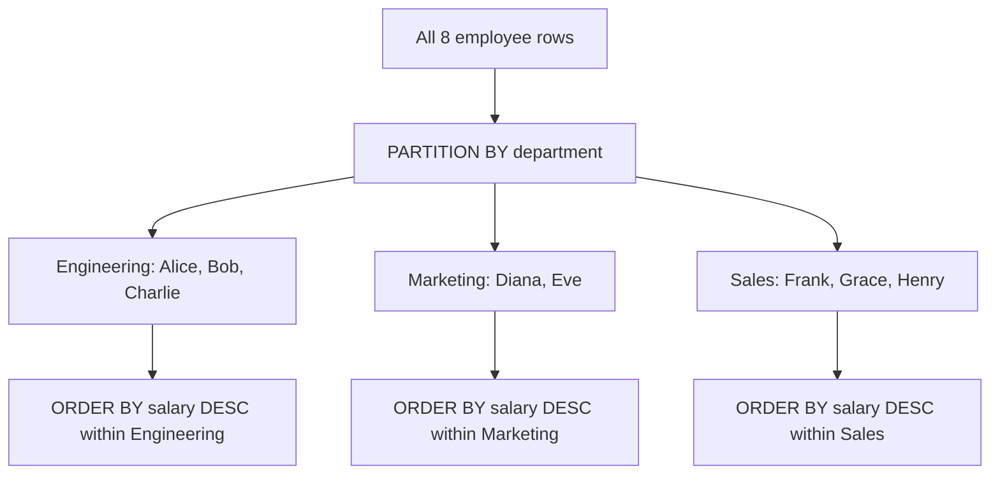

# SQL Window Functions — Fundamentals

## What Are Window Functions?

Window functions perform calculations **across a set of rows related to the current row** — without collapsing rows into a single output like GROUP BY does.

Think of it like this: GROUP BY gives you one summary row per group. A window function keeps every individual row but ADDS a calculated column that "looks through a window" at related rows.

```sql
-- GROUP BY: collapses rows (1 output row per department)
SELECT department, AVG(salary) AS avg_sal
FROM employees GROUP BY department;
-- Result: 3 rows (one per department)

-- Window function: keeps ALL rows, adds department average alongside each
SELECT 
    name, 
    department, 
    salary,
    AVG(salary) OVER (PARTITION BY department) AS dept_avg_salary
FROM employees;
-- Result: still all 8 rows, but each now shows its department's average
```

> **Key Insight:** Window functions let you compare each row to its group without losing row-level detail. This is why they're essential for analytics.

---

## Sample Data

We use this `employees` table throughout:

| emp_id | name | department | salary | hire_date |
|--------|------|-----------|--------|-----------|
| 1 | Alice | Engineering | 120000 | 2020-01-15 |
| 2 | Bob | Engineering | 95000 | 2021-03-01 |
| 3 | Charlie | Engineering | 110000 | 2019-06-10 |
| 4 | Diana | Marketing | 85000 | 2020-09-01 |
| 5 | Eve | Marketing | 92000 | 2018-04-20 |
| 6 | Frank | Sales | 78000 | 2022-01-10 |
| 7 | Grace | Sales | 82000 | 2021-07-15 |
| 8 | Henry | Sales | 78000 | 2023-02-01 |

---

## The OVER() Clause — Anatomy

Every window function has this structure:

```sql
function_name(...) OVER (
    PARTITION BY columns    -- Divides rows into groups (optional)
    ORDER BY columns        -- Sorts rows within each group (optional)
    frame_clause            -- Defines which rows to include (optional)
)
```

**What each part does:**
- **PARTITION BY** = creates independent groups (like GROUP BY, but keeps all rows)
- **ORDER BY** = determines the sequence within each group (required for ranking/running totals)
- **Frame clause** = fine-tunes exactly which rows in the window to consider

---

## Category 1: Ranking Functions

These assign a position number to each row within its partition.

| Function | How it handles ties | Example: Salaries 100, 100, 90 |
|----------|-------------------|-------------------------------|
| `ROW_NUMBER()` | Unique number (arbitrary tiebreak) | 1, 2, 3 |
| `RANK()` | Same rank for ties, gap after | 1, 1, 3 |
| `DENSE_RANK()` | Same rank for ties, no gap | 1, 1, 2 |
| `NTILE(n)` | Divides into n equal buckets | NTILE(2) → 1, 1, 2 |

```sql
SELECT 
    name,
    department,
    salary,
    ROW_NUMBER() OVER (ORDER BY salary DESC) AS row_num,
    RANK()       OVER (ORDER BY salary DESC) AS rank_val,
    DENSE_RANK() OVER (ORDER BY salary DESC) AS dense_rank_val
FROM employees;
```

**Result:**

| name | department | salary | row_num | rank_val | dense_rank_val |
|------|-----------|--------|---------|----------|----------------|
| Alice | Engineering | 120000 | 1 | 1 | 1 |
| Charlie | Engineering | 110000 | 2 | 2 | 2 |
| Bob | Engineering | 95000 | 3 | 3 | 3 |
| Eve | Marketing | 92000 | 4 | 4 | 4 |
| Diana | Marketing | 85000 | 5 | 5 | 5 |
| Grace | Sales | 82000 | 6 | 6 | 6 |
| Frank | Sales | 78000 | 7 | 7 | 7 |
| Henry | Sales | 78000 | 8 | 7 | 7 |

> **Notice:** Frank and Henry both earn 78000. ROW_NUMBER gives them different numbers (arbitrary). RANK gives both 7 and skips 8. DENSE_RANK gives both 7 and the next unique value would be 8 (no gap).

---

### Top N Per Group (Most Common Interview Pattern)

"Find the top 2 earners in each department:"

```sql
WITH ranked AS (
    SELECT 
        name,
        department,
        salary,
        ROW_NUMBER() OVER (
            PARTITION BY department 
            ORDER BY salary DESC
        ) AS rn
    FROM employees
)
SELECT name, department, salary
FROM ranked
WHERE rn <= 2;
```

**Result:**

| name | department | salary |
|------|-----------|--------|
| Alice | Engineering | 120000 |
| Charlie | Engineering | 110000 |
| Eve | Marketing | 92000 |
| Diana | Marketing | 85000 |
| Grace | Sales | 82000 |
| Frank | Sales | 78000 |

> **Why CTE is needed:** You CANNOT use window functions in WHERE directly. The window function runs AFTER WHERE. So you wrap it in a CTE or subquery first, then filter.

---

## Category 2: Aggregate Window Functions

Standard aggregates (SUM, AVG, COUNT, MIN, MAX) work as window functions too:

```sql
SELECT 
    name,
    department,
    salary,
    SUM(salary) OVER (PARTITION BY department) AS dept_total,
    COUNT(*)    OVER (PARTITION BY department) AS dept_headcount,
    AVG(salary) OVER (PARTITION BY department) AS dept_avg,
    salary - AVG(salary) OVER (PARTITION BY department) AS vs_dept_avg
FROM employees;
```

**Result (Engineering rows only):**

| name | department | salary | dept_total | dept_headcount | dept_avg | vs_dept_avg |
|------|-----------|--------|-----------|---------------|---------|------------|
| Alice | Engineering | 120000 | 325000 | 3 | 108333 | +11667 |
| Bob | Engineering | 95000 | 325000 | 3 | 108333 | -13333 |
| Charlie | Engineering | 110000 | 325000 | 3 | 108333 | +1667 |

> **Key difference from GROUP BY:** Every row is preserved. The aggregate value is repeated for each row in the same partition.

---

## Category 3: Value Functions (LAG, LEAD, FIRST_VALUE, LAST_VALUE)

These access values from other rows in the window without self-joining.

| Function | What it does |
|----------|-------------|
| `LAG(col, n)` | Value from n rows BEFORE current |
| `LEAD(col, n)` | Value from n rows AFTER current |
| `FIRST_VALUE(col)` | First value in the window frame |
| `LAST_VALUE(col)` | Last value in the window frame |

```sql
SELECT 
    name,
    hire_date,
    salary,
    LAG(salary, 1) OVER (ORDER BY hire_date) AS prev_hire_salary,
    LEAD(salary, 1) OVER (ORDER BY hire_date) AS next_hire_salary,
    salary - LAG(salary, 1) OVER (ORDER BY hire_date) AS change_from_prev
FROM employees
ORDER BY hire_date;
```

**Result:**

| name | hire_date | salary | prev_hire_salary | next_hire_salary | change_from_prev |
|------|-----------|--------|-----------------|-----------------|-----------------|
| Eve | 2018-04-20 | 92000 | NULL | 110000 | NULL |
| Charlie | 2019-06-10 | 110000 | 92000 | 120000 | +18000 |
| Alice | 2020-01-15 | 120000 | 110000 | 85000 | +10000 |
| Diana | 2020-09-01 | 85000 | 120000 | 95000 | -35000 |
| ... | ... | ... | ... | ... | ... |

> **NULL for first/last row:** LAG returns NULL for the first row (no previous row exists). LEAD returns NULL for the last row. Use `LAG(salary, 1, 0)` to provide a default value.

---

## How PARTITION BY and ORDER BY Interact



**What this shows:**
- PARTITION BY splits the data into independent groups (3 departments)
- ORDER BY sorts within each group independently
- Each partition is processed in isolation — Engineering rankings don't affect Marketing rankings

**Without PARTITION BY:** The entire table is one big partition. Rankings/aggregates apply globally.

**Without ORDER BY:** No sequence within the partition. Ranking functions require ORDER BY. Aggregates without ORDER BY compute over the entire partition.

---

## Key Rules

1. Window functions execute AFTER WHERE, GROUP BY, and HAVING
2. You CANNOT use window functions in WHERE or HAVING (use CTE/subquery)
3. Multiple window functions can appear in the same SELECT
4. ORDER BY in OVER() is independent of ORDER BY at the end of the query

```sql
-- This is valid: different ordering inside OVER vs final output
SELECT 
    name,
    salary,
    RANK() OVER (ORDER BY salary DESC) AS salary_rank
FROM employees
ORDER BY name;  -- Final output sorted alphabetically, rank by salary
```

---

## Running Totals (Preview)

When you add ORDER BY to an aggregate window function, it becomes a running total:

```sql
SELECT 
    hire_date,
    name,
    salary,
    SUM(salary) OVER (ORDER BY hire_date) AS running_total
FROM employees
ORDER BY hire_date;
```

**Result:**

| hire_date | name | salary | running_total |
|-----------|------|--------|--------------|
| 2018-04-20 | Eve | 92000 | 92000 |
| 2019-06-10 | Charlie | 110000 | 202000 |
| 2020-01-15 | Alice | 120000 | 322000 |
| 2020-09-01 | Diana | 85000 | 407000 |
| ... | ... | ... | ... |

> **Why this happens:** With ORDER BY, the default frame is `RANGE BETWEEN UNBOUNDED PRECEDING AND CURRENT ROW` — meaning the SUM accumulates from the first row through the current row (plus any rows tied with it on the ORDER BY value). When there are no ties in the ORDER BY column, this produces the same result as `ROWS BETWEEN UNBOUNDED PRECEDING AND CURRENT ROW`.

---

## Interview Tips

> **Tip 1:** "Find top N per group" = ROW_NUMBER() + PARTITION BY + CTE with WHERE rn <= N. This is the #1 most asked SQL pattern in DE interviews.

> **Tip 2:** Know the difference between RANK and DENSE_RANK. If asked "top 3 products by revenue per category" — clarify: do ties both count as one slot (DENSE_RANK) or should exactly 3 rows return (ROW_NUMBER)?

> **Tip 3:** LAG/LEAD are powerful for "compare to previous period" questions without self-joins.
