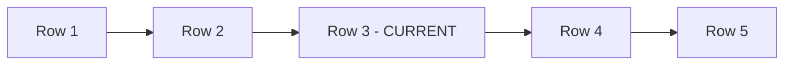

# SQL Window Functions — Intermediate Concepts

## Window Frames — Controlling Which Rows to Include

The **frame clause** defines exactly which rows within a partition the window function considers. This is where most candidates get confused.

```sql
function() OVER (
    PARTITION BY col
    ORDER BY col
    ROWS BETWEEN <start> AND <end>
)
```

---

### Frame Boundaries

| Boundary | Meaning |
|----------|---------|
| `UNBOUNDED PRECEDING` | First row of the partition |
| `n PRECEDING` | n rows before current row |
| `CURRENT ROW` | The current row itself |
| `n FOLLOWING` | n rows after current row |
| `UNBOUNDED FOLLOWING` | Last row of the partition |

**Visual — how a frame slides across rows:**



**If the frame is `ROWS BETWEEN 1 PRECEDING AND 1 FOLLOWING`:**
- When current row = Row 3, the frame includes: Row 2, Row 3, Row 4
- The function computes over those 3 rows only
- The frame slides forward as "current row" moves to Row 4, then Row 5

---

### ROWS vs RANGE vs GROUPS

| Type | Counts by | Behavior with ties |
|------|-----------|-------------------|
| `ROWS` | Physical row position | Exact N rows, ties treated separately |
| `RANGE` | Logical value | All rows with same ORDER BY value grouped as peers |
| `GROUPS` | Peer groups | Each set of tied values counts as one unit |

```sql
-- ROWS: exactly 2 physical rows before current
SUM(amount) OVER (ORDER BY date ROWS BETWEEN 2 PRECEDING AND CURRENT ROW)

-- RANGE: all rows within 7 days before current date value
SUM(amount) OVER (ORDER BY date RANGE BETWEEN INTERVAL '7' DAY PRECEDING AND CURRENT ROW)

-- GROUPS: the 1 peer-group before current group
SUM(amount) OVER (ORDER BY date GROUPS BETWEEN 1 PRECEDING AND CURRENT ROW)
```

> **Critical gotcha:** The DEFAULT frame (when ORDER BY is present) is `RANGE BETWEEN UNBOUNDED PRECEDING AND CURRENT ROW` — NOT `ROWS`. This means tied values get the same running sum. Always specify `ROWS` explicitly for predictable behavior.

---

## Running Totals

```sql
SELECT 
    sale_date,
    daily_amount,
    SUM(daily_amount) OVER (
        ORDER BY sale_date 
        ROWS BETWEEN UNBOUNDED PRECEDING AND CURRENT ROW
    ) AS running_total
FROM daily_sales;
```

**Result:**

| sale_date | daily_amount | running_total |
|-----------|-------------|---------------|
| 2024-01-01 | 100 | 100 |
| 2024-01-02 | 150 | 250 |
| 2024-01-03 | 200 | 450 |
| 2024-01-04 | 80 | 530 |

> **How it works:** For each row, SUM adds up all daily_amounts from the first row up to and including the current row.

---

## Moving Averages

```sql
-- 7-day moving average
SELECT 
    trade_date,
    close_price,
    ROUND(AVG(close_price) OVER (
        ORDER BY trade_date
        ROWS BETWEEN 6 PRECEDING AND CURRENT ROW
    ), 2) AS moving_avg_7d
FROM stock_prices;
```

**Result:**

| trade_date | close_price | moving_avg_7d |
|-----------|-------------|---------------|
| 2024-01-01 | 150.00 | 150.00 |
| 2024-01-02 | 152.50 | 151.25 |
| 2024-01-03 | 148.00 | 150.17 |
| ... | ... | ... |
| 2024-01-08 | 155.00 | 151.43 |

> **Note:** The first 6 rows have fewer than 7 data points, so the average is computed over whatever rows are available. This is standard behavior.

---

## Practical Patterns

### Pattern 1: Year-over-Year Comparison

```sql
SELECT 
    year,
    quarter,
    revenue,
    LAG(revenue, 4) OVER (ORDER BY year, quarter) AS same_quarter_last_year,
    ROUND(
        (revenue - LAG(revenue, 4) OVER (ORDER BY year, quarter)) * 100.0 
        / NULLIF(LAG(revenue, 4) OVER (ORDER BY year, quarter), 0), 2
    ) AS yoy_growth_pct
FROM quarterly_revenue;
```

**Result:**

| year | quarter | revenue | same_quarter_last_year | yoy_growth_pct |
|------|---------|---------|----------------------|---------------|
| 2023 | Q1 | 1000000 | NULL | NULL |
| 2023 | Q2 | 1200000 | NULL | NULL |
| 2023 | Q3 | 900000 | NULL | NULL |
| 2023 | Q4 | 1500000 | NULL | NULL |
| 2024 | Q1 | 1100000 | 1000000 | 10.00 |
| 2024 | Q2 | 1350000 | 1200000 | 12.50 |

> **Why LAG(revenue, 4)?** With quarterly data, "same quarter last year" is exactly 4 rows back. The `NULLIF(..., 0)` prevents division by zero.

---

### Pattern 2: Percent of Total

```sql
SELECT 
    product_category,
    revenue,
    ROUND(revenue * 100.0 / SUM(revenue) OVER (), 2) AS pct_of_total,
    ROUND(revenue * 100.0 / SUM(revenue) OVER (PARTITION BY region), 2) AS pct_of_region
FROM sales;
```

**Result:**

| product_category | revenue | pct_of_total | pct_of_region |
|-----------------|---------|-------------|--------------|
| Electronics | 500000 | 33.33 | 50.00 |
| Clothing | 300000 | 20.00 | 30.00 |
| Electronics | 400000 | 26.67 | 57.14 |

> **`SUM() OVER ()`** with empty OVER = sum across the ENTIRE table. With PARTITION BY = sum within that group.

---

### Pattern 3: Gap Detection (Islands and Gaps)

Find consecutive sequences in data:

```sql
-- Find islands of consecutive order IDs
WITH numbered AS (
    SELECT 
        id,
        id - ROW_NUMBER() OVER (ORDER BY id) AS grp
    FROM orders
)
SELECT 
    MIN(id) AS island_start,
    MAX(id) AS island_end,
    COUNT(*) AS island_size
FROM numbered
GROUP BY grp
ORDER BY island_start;
```

**How it works:**
- For consecutive IDs (1,2,3): `id - row_number` gives the same value (0,0,0)
- For non-consecutive (1,2,5): `id - row_number` changes at the gap
- This creates a "group identifier" for each island

**Result (with IDs 1,2,3,7,8,12):**

| island_start | island_end | island_size |
|-------------|-----------|------------|
| 1 | 3 | 3 |
| 7 | 8 | 2 |
| 12 | 12 | 1 |

---

### Pattern 4: Deduplication with ROW_NUMBER

```sql
-- Keep only the most recent record per customer
WITH deduped AS (
    SELECT 
        *,
        ROW_NUMBER() OVER (
            PARTITION BY customer_id 
            ORDER BY updated_at DESC
        ) AS rn
    FROM customer_events
)
SELECT * FROM deduped WHERE rn = 1;
```

> **When to use:** Your source table has multiple versions of each entity (e.g., CDC events). ROW_NUMBER with ORDER BY timestamp DESC gives the latest, and WHERE rn = 1 keeps only that.

---

### Pattern 5: Named Windows (WINDOW clause)

When reusing the same window spec multiple times:

```sql
SELECT 
    name,
    department,
    salary,
    ROW_NUMBER() OVER w AS row_num,
    RANK() OVER w AS rank_val,
    SUM(salary) OVER w AS running_salary
FROM employees
WINDOW w AS (PARTITION BY department ORDER BY salary DESC);
```

> **Benefit:** Cleaner code, single point of change. Supported in PostgreSQL, MySQL 8+, Snowflake, BigQuery.

---

## The Default Frame Gotcha

This is a common interview trap:

```sql
-- These look similar but produce DIFFERENT results when there are ties:

-- Version A: Explicit ROWS (predictable)
SUM(salary) OVER (ORDER BY hire_date ROWS BETWEEN UNBOUNDED PRECEDING AND CURRENT ROW)

-- Version B: Default frame (RANGE — peers get same value)
SUM(salary) OVER (ORDER BY hire_date)
```

**If two employees share the same hire_date:**
- Version A (ROWS): processes them one at a time, running sum increments with each
- Version B (RANGE): treats them as peers, BOTH get the same running sum (sum through both)

> **Rule:** Always specify `ROWS BETWEEN ...` explicitly for running totals. Don't rely on the default.

---

## Interview Tips

> **Tip 1:** When asked about running totals or moving averages, always state the frame explicitly: "I'd use ROWS BETWEEN 6 PRECEDING AND CURRENT ROW for a 7-day moving average." Mentioning the ROWS vs RANGE distinction shows deep understanding.

> **Tip 2:** The islands-and-gaps problem (Pattern 3) is a classic — know it cold. It appears in "find consecutive login days," "detect gaps in time series," and "identify session boundaries."

> **Tip 3:** For deduplication (Pattern 4), interviewers often follow up: "What if there are ties in updated_at?" Answer: add a secondary ORDER BY column (like id DESC) to ensure deterministic results.
