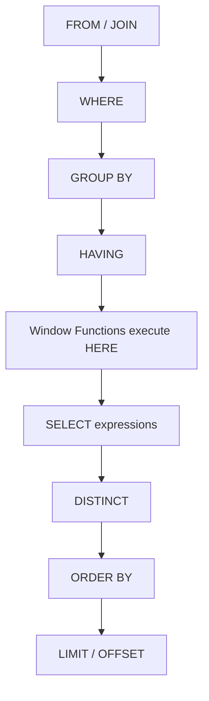

# SQL Window Functions — Senior-Level Deep Dive

## How Window Functions Execute Internally

Understanding the **query execution order** is critical for senior-level discussions:



**What this means:** Window functions evaluate AFTER aggregation (GROUP BY/HAVING) but BEFORE final SELECT projection and DISTINCT. This has two important implications:
- You can use window functions on aggregated results
- You cannot filter on window function output without a subquery/CTE

## Performance Optimization

### Sort Operations and Memory

Each `OVER(ORDER BY ...)` clause may trigger a **sort operation**. Multiple window functions with different `ORDER BY` clauses = multiple sorts.

```sql
-- BAD: 3 different sort operations
SELECT 
    ROW_NUMBER() OVER (ORDER BY salary DESC),      -- Sort 1
    ROW_NUMBER() OVER (ORDER BY hire_date ASC),    -- Sort 2  
    SUM(salary) OVER (PARTITION BY dept ORDER BY hire_date)  -- Sort 3
FROM employees;

-- BETTER: Consolidate to shared window specs where possible
SELECT 
    ROW_NUMBER() OVER w1,
    SUM(salary) OVER w1,
    RANK() OVER w1
FROM employees
WINDOW w1 AS (PARTITION BY dept ORDER BY hire_date);
```

### Index Strategies for Window Functions

```sql
-- For: ROW_NUMBER() OVER (PARTITION BY customer_id ORDER BY order_date DESC)
-- Create a covering index:
CREATE INDEX idx_orders_customer_date 
ON orders (customer_id, order_date DESC) 
INCLUDE (amount, status);

-- The optimizer can avoid sorting if the index matches PARTITION BY + ORDER BY
```

**Key principle:** If your index columns match the `PARTITION BY` + `ORDER BY` columns in that exact order, the database can scan the index without an explicit sort (eliminating the most expensive operation).

### Spill to Disk

When window function sort operations exceed `work_mem` (PostgreSQL) or `sort_area_size` (Oracle), they spill to temp disk — dramatically slowing queries on large datasets.

```sql
-- PostgreSQL: Check if sorts are spilling
EXPLAIN (ANALYZE, BUFFERS) 
SELECT *, ROW_NUMBER() OVER (PARTITION BY dept ORDER BY salary DESC)
FROM employees;

-- Look for "Sort Method: external merge Disk: XXkB" in the plan
-- If found, increase work_mem for the session:
SET work_mem = '256MB';
```

## Advanced Patterns

### Session/Sessionization (Gap-and-Islands Advanced)

Assign session IDs based on inactivity gaps (>30 min between events):

```sql
WITH events_with_gaps AS (
    SELECT 
        user_id,
        event_time,
        CASE 
            WHEN event_time - LAG(event_time) OVER (
                PARTITION BY user_id ORDER BY event_time
            ) > INTERVAL '30 minutes'
            THEN 1 
            ELSE 0 
        END AS new_session_flag
    FROM user_events
),
sessions AS (
    SELECT 
        user_id,
        event_time,
        SUM(new_session_flag) OVER (
            PARTITION BY user_id 
            ORDER BY event_time
            ROWS BETWEEN UNBOUNDED PRECEDING AND CURRENT ROW
        ) AS session_id
    FROM events_with_gaps
)
SELECT 
    user_id,
    session_id,
    MIN(event_time) AS session_start,
    MAX(event_time) AS session_end,
    COUNT(*) AS events_in_session,
    MAX(event_time) - MIN(event_time) AS session_duration
FROM sessions
GROUP BY user_id, session_id;
```

### Funnel Analysis with Window Functions

```sql
-- Track conversion funnel: view → cart → purchase
WITH funnel AS (
    SELECT 
        user_id,
        event_type,
        event_time,
        LEAD(event_type) OVER (
            PARTITION BY user_id ORDER BY event_time
        ) AS next_event,
        LEAD(event_time) OVER (
            PARTITION BY user_id ORDER BY event_time
        ) AS next_event_time
    FROM events
    WHERE event_type IN ('page_view', 'add_to_cart', 'purchase')
)
SELECT 
    event_type AS step,
    COUNT(DISTINCT user_id) AS users,
    COUNT(DISTINCT CASE 
        WHEN next_event IS NOT NULL 
        AND next_event_time - event_time < INTERVAL '1 hour'
        THEN user_id 
    END) AS converted_within_1hr
FROM funnel
GROUP BY event_type;
```

### Median Calculation (PERCENTILE_CONT)

```sql
-- Exact median per department
SELECT DISTINCT
    department,
    PERCENTILE_CONT(0.5) WITHIN GROUP (ORDER BY salary) 
        OVER (PARTITION BY department) AS median_salary,
    PERCENTILE_CONT(0.25) WITHIN GROUP (ORDER BY salary) 
        OVER (PARTITION BY department) AS p25_salary,
    PERCENTILE_CONT(0.75) WITHIN GROUP (ORDER BY salary) 
        OVER (PARTITION BY department) AS p75_salary
FROM employees;
```

### Conditional Running Totals (FILTER clause — PostgreSQL)

```sql
-- Running count of successful vs failed transactions
SELECT 
    transaction_date,
    status,
    COUNT(*) FILTER (WHERE status = 'success') OVER (
        ORDER BY transaction_date
        ROWS BETWEEN UNBOUNDED PRECEDING AND CURRENT ROW
    ) AS cumulative_success,
    COUNT(*) FILTER (WHERE status = 'failed') OVER (
        ORDER BY transaction_date
        ROWS BETWEEN UNBOUNDED PRECEDING AND CURRENT ROW
    ) AS cumulative_failures
FROM transactions;
```

## Window Functions vs Alternatives

| Approach | When to Use | Performance |
|----------|-------------|-------------|
| Window Function | Need row-level detail + aggregate | Single pass, but requires sort |
| Self-Join | Simple lookups (prev/next row) | Can be expensive on large tables |
| Correlated Subquery | One-off calculation | Usually worse than window function |
| CTE + GROUP BY | Complex multi-step logic | Materializes intermediate results |
| Lateral Join | When window frame isn't sufficient | Flexible but can be slower |

## Engine-Specific Behaviors

### PostgreSQL
- Supports `FILTER (WHERE ...)` clause with window aggregates
- `GROUPS` frame type available since PG 11
- Window functions can use parallel query plans (PG 11+)

### Snowflake
- Window functions are highly optimized (micro-partitioned execution)
- Supports `QUALIFY` clause for filtering window results directly:
```sql
SELECT * FROM employees
QUALIFY ROW_NUMBER() OVER (PARTITION BY dept ORDER BY salary DESC) <= 3;
```

### Spark SQL
- Window functions trigger a **shuffle** on the PARTITION BY columns
- Use `DISTRIBUTE BY` + `SORT BY` hints to optimize partitioning
- Bounded frames are more efficient than unbounded (less data scanning)

## Interview Tip 💡

> At the senior level, interviewers want to hear about **trade-offs**. Mention that window functions with `PARTITION BY` cause data redistribution (shuffle) in distributed systems, and that matching indexes to the PARTITION BY + ORDER BY columns eliminates sort operations. Discuss when a self-join might actually be faster than a window function (hint: when you only need one comparison and the table is properly indexed).
