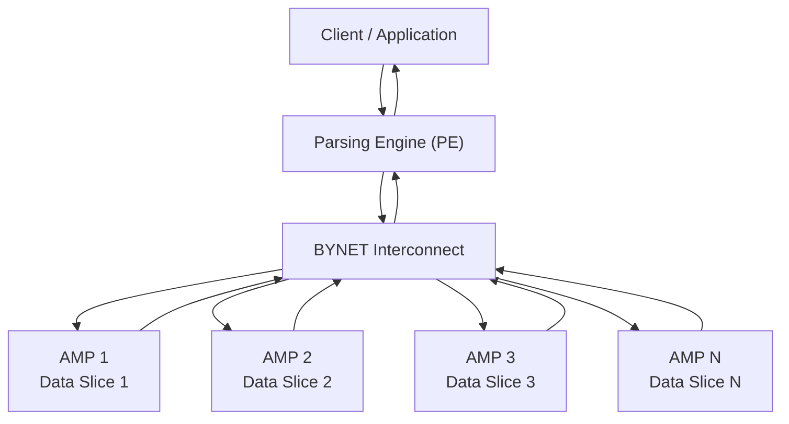
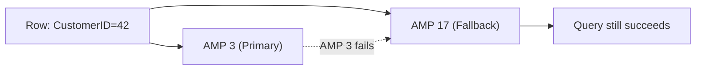

# Teradata Architecture — Fundamentals

## What Is Teradata?

Teradata is a **massively parallel processing (MPP) relational database** designed for large-scale analytical workloads. Unlike traditional SMP (Symmetric Multi-Processing) databases where all CPUs share a single memory pool, Teradata uses a **shared-nothing architecture** where each processing unit has its own CPU, memory, and disk.

This design lets Teradata scale linearly — doubling the nodes roughly doubles the throughput.

---

## Core Architectural Components

### 1. Parsing Engine (PE)
The Parsing Engine is the entry point for every SQL request. It:
- Parses and validates SQL syntax
- Checks user privileges
- Creates an **execution plan** (via the optimizer)
- Dispatches work to AMPs
- Collects and returns results to the client

Each PE manages multiple **sessions** (client connections). A typical system has multiple PEs.

### 2. AMP — Access Module Processor
AMPs are the workhorses of Teradata. Each AMP:
- Owns a **slice of the total data** (rows are distributed across AMPs)
- Has its own CPU, memory, and disk (or disk group in modern deployments)
- Executes its portion of a query independently
- Returns partial results to the PE

In a 100-AMP system, each AMP stores roughly 1/100th of each table's rows.

### 3. BYNET — The Interconnect
BYNET (Banyan Network) is Teradata's high-speed internal network that:
- Connects PEs and AMPs
- Handles **row redistribution** during joins
- Provides fault tolerance (dual BYNET paths)
- Enables broadcast and multicast operations

### 4. Message Passing Layer (MPL)
Software layer managing communication between components over BYNET.

---

## How Data Is Distributed

When a row is inserted:
1. Teradata hashes the **Primary Index (PI)** column(s)
2. The hash value maps to a specific AMP
3. The row is stored on that AMP's disk

This means **all rows with the same PI value always go to the same AMP**.

---

## Shared-Nothing vs Shared-Everything

| Feature | Shared-Nothing (Teradata) | Shared-Everything (Traditional SMP) |
|---|---|---|
| Memory | Each node has its own | All CPUs share memory |
| Disk | Each node has its own disk | Shared storage |
| Scalability | Near-linear scale-out | Limited by shared resources |
| Bottleneck | BYNET cross-traffic | Memory bus, storage I/O |
| Fault tolerance | Node failure = partial data loss (mitigated by Fallback) | Single point of failure |

---

## Virtual Processors (vprocs)

Modern Teradata systems use **virtual processors** — software-defined AMPs and PEs running on physical nodes. This enables:
- Multiple AMPs per physical CPU core
- Flexible resource allocation
- Cloud deployments (Teradata Vantage on AWS/Azure/GCP)

A single physical node might host 4 AMPs and 1 PE as vprocs.

---

## Fallback — Teradata's Redundancy Mechanism

**Fallback** is Teradata's native row-level redundancy:
- Each row has a **primary AMP** and a **fallback AMP**
- The fallback copy is stored on a *different* AMP (in a different clique)
- If an AMP fails, queries still run using fallback copies
- Write performance ~doubles (two writes per row) but reads are unaffected

**Fallback vs RAID:** Fallback protects against AMP failure; RAID protects against disk failure. Production systems use both.

---

## The Clique Concept

A **clique** is a subset of nodes that share a common disk array (in SAN-based deployments):
- All AMPs in a clique can access all disks in that clique
- Fallback rows are placed in a **different clique** to survive clique-level failures
- Modern Teradata uses "intelligent" clique assignment

---

## Teradata System Types

| Type | Description |
|---|---|
| **Teradata Database** | On-premise MPP warehouse |
| **Teradata Vantage** | Cloud/hybrid platform (AWS, Azure, GCP) |
| **Teradata Express** | Developer/evaluation version |
| **Intelliflex** | Modern hardware platform with disaggregated storage |

---

## Interview Tips

> **Tip 1:** "What makes Teradata different from other databases?" — "Teradata uses a shared-nothing MPP architecture where each AMP independently owns its data slice, enabling near-linear scalability. The Primary Index determines which AMP stores each row via row hashing."

> **Tip 2:** "What is an AMP?" — "An Access Module Processor is an independent processing unit with its own CPU, memory, and disk. Each AMP processes its own data slice in parallel. A query touching all rows runs simultaneously across all AMPs."

> **Tip 3:** "What is BYNET?" — "BYNET is Teradata's internal interconnect network that routes data between PEs and AMPs. It handles row redistribution during joins and result aggregation. It's dual-pathed for fault tolerance."

> **Tip 4:** "How does Teradata protect against node failures?" — "Through Fallback — each row is stored twice on two different AMPs in different cliques. If one AMP fails, the other copy serves queries transparently."
