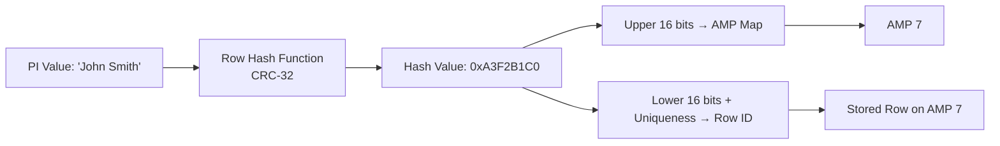
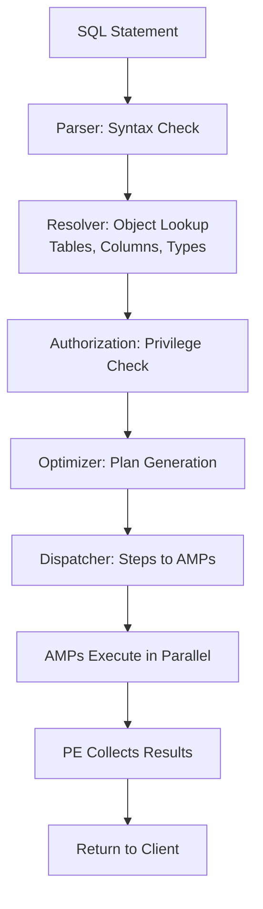

# Teradata Architecture — Intermediate

## Session Management and PEs

Each client connection to Teradata establishes a **session** with a Parsing Engine. Key session behaviors:

- A single PE can manage hundreds of sessions concurrently
- Each session gets a **transaction context** — BEGIN/COMMIT/ROLLBACK scope
- Sessions are load-balanced across PEs at login time
- The **max sessions per user** is configurable via profiles

```sql
-- Check active sessions
SELECT SessionNo, UserName, LogonTime, State
FROM DBC.SessionInfoV
ORDER BY LogonTime DESC;
```

---

## Row Hashing in Detail

When a row is inserted, Teradata applies a **two-level hash**:

1. **Row Hash** — MD5/CRC hash of the Primary Index column value(s), producing a 32-bit hash
2. **AMP selection** — the upper bits of the row hash map to a specific AMP via a hash map table
3. **Row ID** — combined with a uniqueness value to form the full row identifier



**Hash synonyms:** Two different PI values that produce the same hash are stored on the same AMP but are distinguishable by their full Row ID.

---

## AMP-Local vs All-AMP Operations

Understanding which operations are AMP-local is critical for performance:

| Operation | Type | Description |
|---|---|---|
| Single-row lookup by PI | AMP-local | Hash routes directly to one AMP |
| Table scan (no PI filter) | All-AMP | Every AMP scans its slice |
| JOIN on PI columns (both tables) | AMP-local merge | No redistribution needed |
| JOIN on non-PI columns | Redistribution or duplication | Data moved across BYNET |
| GROUP BY PI column | AMP-local aggregation | Each AMP aggregates its rows |
| ORDER BY non-PI | Global sort | Requires cross-AMP coordination |

**Goal:** Design schemas so common queries are AMP-local.

---

## Spool Space

**Spool** is temporary disk space on each AMP used during query execution:
- Intermediate result sets (JOIN outputs, sort buffers)
- Final result sets before delivery to the client
- Each user/profile has a **spool space limit**

```sql
-- Check spool allocation per user
SELECT UserName, SpoolSpace
FROM DBC.UsersV
ORDER BY SpoolSpace DESC;
```

**Spool errors** (`No more spool space`) occur when:
- A query produces massive intermediate results
- A Cartesian product / product join is accidentally triggered
- Too many concurrent sessions consume spool simultaneously

**Mitigation:** Reduce result set size early (filters, projections), use SAMPLE for testing, collect statistics so the optimizer avoids product joins.

---

## Permanent Space vs Spool vs Temp Space

| Space Type | Purpose | Scope |
|---|---|---|
| **Permanent Space** | User data (tables, indexes) | Persistent |
| **Spool Space** | Intermediate query results | Session-scoped, auto-released |
| **Temp Space** | Global Temporary Tables (GTTs) | Session-scoped, survives transaction |

---

## PE Internal Steps

When a PE receives a SQL request, it goes through:



---

## Node Architecture (Physical)

A modern Teradata node (e.g., Teradata Intelliflex):
- Multiple Intel Xeon CPUs
- 512 GB–2 TB RAM per node
- Local NVMe + network-attached storage (shared disk in some configs)
- Redundant BYNET connections (active-active)

Each node runs multiple **vproc** instances:
- **AMP vprocs:** data storage and processing
- **PE vprocs:** session and parsing
- **GTW vprocs:** gateway for external connectivity (JDBC, ODBC)

---

## Comparing MPP Systems

| Feature | Teradata | Amazon Redshift | Google BigQuery | Snowflake |
|---|---|---|---|---|
| Architecture | Shared-nothing MPP | Shared-nothing | Serverless / colossus | Virtual warehouses |
| Storage | Columnar + row | Columnar | Columnar (serverless) | Columnar (S3) |
| Primary Index | Yes (explicit) | Distribution key | Automatic | Automatic |
| Scaling | Add nodes | Resize cluster | Automatic | Scale compute separately |
| SQL compliance | ANSI + extensions | PostgreSQL-based | Standard SQL | ANSI SQL |
| Temporal tables | Native ANSI temporal | No | No | Limited |
| Target workload | Enterprise DW | Cloud DW | Ad-hoc analytics | Cloud DW |

---

## Hot Standby Nodes

Teradata supports **hot standby nodes** — spare nodes that take over AMP vprocs from a failed node:
- The hash map is updated to route to the standby
- Fallback rows on surviving AMPs serve requests until recovery
- The standby node joins the cluster seamlessly

---

## Interview Tips

> **Tip 1:** "What happens when an AMP fails in Teradata?" — "Fallback copies on other AMPs serve queries transparently. A hot standby node can absorb the failed AMP's vprocs. The hash map is updated to route new requests accordingly."

> **Tip 2:** "What is spool space and why do spool errors occur?" — "Spool is temporary per-AMP disk space for intermediate query results. Errors occur when intermediate sets explode — often due to missing statistics causing the optimizer to choose product joins, or Cartesian products from missing join conditions."

> **Tip 3:** "What's the difference between permanent space and spool space?" — "Permanent space holds user tables persistently. Spool space is temporary, session-scoped scratch space for query execution. Both are limited per user/profile and consume physical disk on AMPs."

> **Tip 4:** "How is Teradata different from Redshift?" — "Both are shared-nothing MPP, but Teradata uses an explicit Primary Index for data distribution and supports native ANSI temporal tables. Redshift uses distribution keys and sort keys. Teradata targets enterprise on-premise/hybrid; Redshift is cloud-native."
