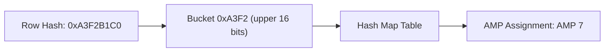
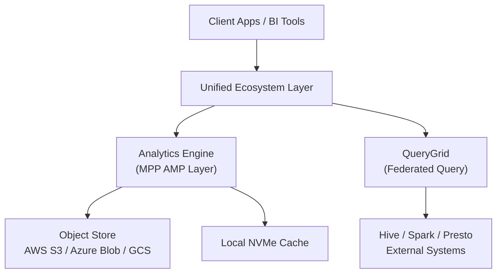
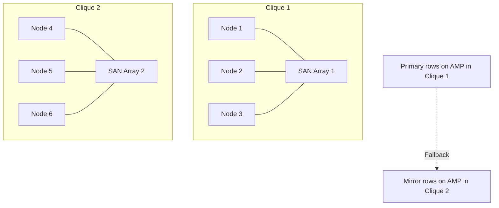

# Teradata Architecture — Senior Deep Dive

## The Hash Map: Routing Engine

Teradata maintains a **hash map** — a lookup table mapping row hash values to AMP numbers. This map:
- Is stored in memory on every PE
- Contains 65,536 buckets (2^16) by default
- Each bucket maps to an AMP number
- When AMPs are added/removed, the hash map is **redistributed** (rehashing)



**Implication:** Adding nodes to a Teradata system requires rehashing — redistributing rows across the new AMP count. This is a significant operation on large tables and is done during maintenance windows.

---

## BYNET Internals

BYNET is a **dual-bus switch fabric** providing:
- **Full bisectional bandwidth** — any AMP can communicate with any other at line speed simultaneously
- **Hardware multicast** — a single message can be delivered to all AMPs simultaneously (used for broadcast joins)
- **Dual paths** — BYNET A and BYNET B for redundancy; traffic load-balances across both

**BYNET bandwidth** is a key scaling bottleneck. Heavy redistribution queries (joins on non-PI columns) saturate BYNET, so minimizing cross-AMP data movement is a core tuning objective.

---

## vproc Architecture Deep Dive

In modern Teradata (Intelliflex, Vantage), physical hardware is decoupled from vproc counts:

- A system might have 10 physical nodes but 200 AMP vprocs (20 per node)
- vprocs are software threads pinned to CPU cores
- Adding nodes allows adding more vprocs without full rehashing (Teradata uses incremental hash redistribution in newer versions)
- **PE vprocs** are stateless — they can be restarted independently
- **AMP vprocs** are stateful — they own data on disk

**vproc failure recovery:**
1. Hot standby absorbs vproc
2. Hash map updated in memory across all PEs
3. Fallback data serves reads
4. System logs the failure in DBC.AMPUsage tables
5. Node replacement triggers a full AMP reclaim (background)

---

## Teradata Vantage Architecture

Teradata Vantage decouples compute from storage (similar to Snowflake) in its cloud form:



**Key Vantage features:**
- **Separated storage:** data lives in object store, compute scales independently
- **QueryGrid:** federated queries across Teradata, Hive, Presto, Spark without data movement
- **Advanced Analytics:** native in-database ML (using Python, R via UDFs)
- **ClearScape Analytics:** Teradata's ML/AI function library running inside the engine

---

## Transaction Management Internals

Teradata uses **multi-statement transactions** with **BTEQ mode (TERA mode)** vs **ANSI mode**:

| Mode | Auto-commit | Error behavior | Rollback scope |
|---|---|---|---|
| **TERA mode** | Each statement auto-commits | Error rolls back only that statement | Statement-level |
| **ANSI mode** | Explicit COMMIT required | Error rolls back entire transaction | Transaction-level |

**Lock types:**
- **Access lock** — allows dirty reads; rarely used
- **Read lock** — shared lock; other reads allowed, no writes
- **Write lock** — exclusive; blocks reads and writes
- **Exclusive lock** — DDL operations; blocks everything

Teradata uses **table-level, partition-level, and row-hash-level locks** depending on the operation.

---

## Clique Design for Maximum Availability



**Clique sizing rules:**
- Keep cliques small (3–5 nodes) so a SAN failure only impacts a minority of AMPs
- Ensure fallback copies always land in a different clique
- Hotstandby nodes should be one per clique

---

## Performance Pathways: Where Bottlenecks Live

| Bottleneck | Cause | Solution |
|---|---|---|
| AMP CPU skew | Uneven PI distribution (hot AMPs) | Change PI, use NUPI + partitioning |
| BYNET saturation | Heavy redistribution joins | Add statistics, join on PI columns |
| Disk I/O | Full table scans on large tables | PPI, secondary indexes, block-level compression |
| Spool exhaustion | Product joins, large sorts | Collect stats, filter early, increase spool quota |
| Lock contention | Long-running write transactions | Optimize ETL batches, use multiload for bulk ops |

---

## Architecture Decisions: Trade-offs

### UPI vs NUPI at System Level
- UPI enforces uniqueness via global hash collision check — adds overhead on every insert
- NUPI skips uniqueness check — faster inserts, but allows duplicates
- For very high insert throughput, NUPI (with application-enforced uniqueness) is preferred

### Fallback vs RAID-only
- Fallback costs 2x storage but protects against AMP-level failure
- RAID protects disk, not AMP
- Production systems: use both
- Dev/test: fallback often disabled to save storage

### Number of AMPs per Node
- More AMPs = more parallelism, smaller data slices per AMP
- More AMPs = more overhead for small queries (each AMP spins up even for single-row lookups)
- Typical: 4–16 AMPs per physical node

---

## Interview Tips

> **Tip 1:** "How does adding a node affect a Teradata system?" — "Adding nodes requires updating the hash map and redistributing data. In older systems this required a full rehash (significant downtime/maintenance window). Newer Vantage supports incremental redistribution. The new AMPs take over a portion of hash buckets."

> **Tip 2:** "What's the difference between TERA mode and ANSI mode transactions?" — "TERA mode auto-commits each statement and rolls back only the failed statement. ANSI mode requires explicit COMMIT and rolls back the entire transaction on error. ANSI mode is safer for multi-statement ETL."

> **Tip 3:** "How does Teradata handle lock contention?" — "Teradata uses table-level, partition-level, and row-hash-level locks. Long ETL transactions hold write locks blocking readers. Solutions include smaller transaction batches, optimistic locking patterns, and using MULTILOAD which uses row-hash locks rather than table locks."

> **Tip 4:** "How is Teradata Vantage different from on-premise Teradata?" — "Vantage decouples compute from storage, placing data in object stores (S3/Azure Blob) and scaling compute independently. It adds QueryGrid for federated queries across Hive/Spark/Presto, and ClearScape for in-database ML — moving Teradata toward a unified analytics platform."

## ⚡ Cheat Sheet

**Teradata architecture**
```
AMPs (Access Module Processors): parallel processing units; each owns a data slice
PE (Parsing Engine):             parses SQL, optimizes, dispatches to AMPs
BYNET:                           high-speed interconnect between PEs and AMPs
Vproc (Virtual Processor):       logical unit (AMP or PE) within a node
```

**Primary Index (PI) — critical concept**
```sql
-- Unique Primary Index (UPI): distribute rows by hashing PI column(s)
CREATE TABLE orders (
    order_id INTEGER NOT NULL,
    amount DECIMAL(15,2),
    PRIMARY INDEX (order_id)  -- UPI by default if unique
);

-- Non-Unique Primary Index (NUPI): all rows with same PI hash to same AMP
-- Good for join performance; bad if low cardinality → hot AMP (data skew)

-- NOPI (No Primary Index): load-balanced by row number — best for staging
CREATE SET TABLE staging_orders ... NO PRIMARY INDEX;
```

**Skew and performance**
```sql
-- Check for data skew
SELECT hashamp(hashbucket(hashrow(order_id))) AS amp_no, COUNT(*) AS row_count
FROM orders GROUP BY 1 ORDER BY 2 DESC;
-- Even distribution = good PI; skewed = bad PI choice

-- Skew factor: (max_amp_rows / avg_amp_rows - 1) * 100
-- >10% skew = investigate PI selection
```

**BTEQ essentials**
```bteq
.LOGON server/username,password;
.SET SESSIONS 4;
.SET SEPARATOR '|';

SELECT TOP 10 * FROM orders;

.EXPORT REPORT FILE = /data/output.txt
SELECT * FROM orders WHERE order_date = '2024-01-15';
.EXPORT RESET

.QUIT;
```

**FastLoad / MultiLoad**
```
FastLoad:   empty table only; bypass transient journal; fastest for initial loads
MultiLoad:  supports INSERT/UPDATE/DELETE on existing table; uses work tables
TPT (Teradata Parallel Transporter): modern replacement; stream-based; supports both
FastExport: parallel export to flat files; most efficient for large exports
```

**Statistics**
```sql
-- Collect statistics for optimizer (like ANALYZE TABLE in other DBs)
COLLECT STATISTICS ON orders COLUMN (order_date);
COLLECT STATISTICS ON orders INDEX (order_id);
-- View statistics
HELP STATISTICS orders;
-- Check if stale (>24h old or >10% row count change)
SELECT * FROM dbc.columnstatsv WHERE tablename='orders';
```

**Workload Management (TASM/TWM)**
```
TASM: Teradata Active System Management — rule-based WLM
Priority: use workload definitions to assign CPU priority per user/query type
Throttling: limit concurrent queries per user or workload class
AMP usage limits: cap AMPs for low-priority queries to protect prod workloads
```

**Temporal tables (ANSI SQL time-period)**
```sql
-- Bi-temporal: valid time (business period) + transaction time (DB period)
CREATE TABLE price_history (
    product_id INTEGER,
    price DECIMAL(10,2),
    valid_period PERIOD(DATE) NOT NULL AS VALIDTIME,
    trans_period PERIOD(TIMESTAMP(6) WITH TIME ZONE) NOT NULL AS TRANSACTIONTIME,
    PRIMARY INDEX (product_id)
);
-- Query as of a specific business date
VALIDTIME AS OF DATE '2024-01-15' SELECT * FROM price_history WHERE product_id = 100;
```

**Query optimization tips**
```sql
-- Use EXPLAIN to see query plan
EXPLAIN SELECT * FROM orders WHERE order_date = '2024-01-15';
-- Look for: full AMP scans, product joins (bad), merge joins (good)

-- Join hints
-- Prefer hash join (default for large tables); avoid nested join (one-row-at-a-time)
-- Force partition elimination with PARTITION BY RANGE + filter on partition column

-- PI match for joins: if join key = PI of both tables → row hash match → no redistribution
```

**Key interview points**
- PI = hash-based distribution; UPI vs NUPI vs NOPI vs PI with partitioning
- Data skew on NUPI = hot AMP = performance bottleneck
- Teradata's optimizer is cost-based; fresh statistics are critical
- TPT replaces FastLoad/MultiLoad/FastExport for modern pipelines
- Teradata still dominant in large financial/telco data warehouses (often alongside cloud DW)
