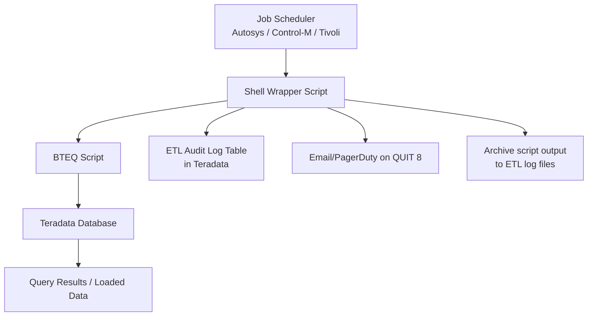

# BTEQ — Real World

## Enterprise BTEQ ETL Architecture

At large enterprises (banks, insurers, retailers), BTEQ scripts form the backbone of nightly ETL pipelines:



**Production pipeline pattern:**
1. Scheduler kicks off shell wrapper at 11 PM
2. Shell wrapper sets environment variables (host, user, date parameters)
3. BTEQ script runs SQL: validate → extract → transform → load → stats
4. BTEQ exits with 0 (success) or 8 (failure)
5. Shell wrapper interprets exit code: alerts on failure, archives logs
6. Scheduler marks job status (success/failure), triggers dependent jobs

---

## Real Pattern: A Bank's Overnight Risk Pipeline

At a major investment bank, the overnight risk calculation ran via BTEQ:

```bteq
-- risk_pipeline.bteq (executed nightly at 11:30 PM)
.LOGON ${TD_RISK_HOST}/${ETL_USER},${ETL_PASS};
.SET SESSION TRANSACTION ANSI;

-- Step 1: Snapshot positions from trading system (loaded separately)
.REMARK "Step 1: Validate position data";
SEL COUNT(*) FROM risk.positions_today WHERE trade_date = ${TRADE_DATE};
.IF ACTIVITYCOUNT = 0 THEN .GOTO NO_POSITIONS;
.IF ERRORCODE <> 0 THEN .GOTO ABORT;

-- Step 2: Apply scenario shocks
.REMARK "Step 2: Calculate scenario P&L";
DELETE FROM risk.scenario_pnl WHERE trade_date = ${TRADE_DATE} ALL;
.IF ERRORCODE <> 0 THEN .GOTO ABORT;

INSERT INTO risk.scenario_pnl
SELECT
    p.position_id,
    p.desk,
    s.scenario_id,
    p.notional * s.rate_shock AS pnl,
    ${TRADE_DATE} AS trade_date
FROM risk.positions_today p
CROSS JOIN risk.scenarios s
WHERE p.trade_date = ${TRADE_DATE}
  AND s.scenario_set = 'OVERNIGHT';

.IF ERRORCODE <> 0 THEN .GOTO ABORT;

-- Step 3: Aggregate to desk level
CALL risk.sp_aggregate_desk_var(${TRADE_DATE});
.IF ERRORCODE <> 0 THEN .GOTO ABORT;

-- Step 4: Validate outputs
SEL COUNT(*) FROM risk.desk_var_report WHERE trade_date = ${TRADE_DATE};
.IF ACTIVITYCOUNT = 0 THEN .GOTO ABORT;

.REMARK "Pipeline completed successfully";
.LOGOFF;
.QUIT 0;

.LABEL NO_POSITIONS
.REMARK "WARNING: No positions for trade date ${TRADE_DATE}";
.LOGOFF;
.QUIT 4;  -- Warning exit code (not hard failure)

.LABEL ABORT
.REMARK "FATAL: Pipeline failed at step - ERRORCODE = ${ERRORCODE}";
.LOGOFF;
.QUIT 8;
```

**The risk report must be ready by 6 AM** — traders need it before market open. The pipeline has a 6.5-hour window.

---

## War Story: The 3 AM BTEQ Failure

**Setting:** A major insurer's month-end reserve calculation.

**The incident:** A BTEQ script that had run reliably for 3 years suddenly failed at 3 AM with `QUIT 8`. The actuarial team needed the results for a board meeting at 9 AM.

**Root cause:** The script connected using a service account whose password had expired (corporate password policy had been updated). The `.LOGON` command returned ERRORCODE 8017 (session limit/password error), and the script correctly exited with code 8.

**What the script did right:**
- Audit log entry with error code was written before the pipeline failed (because logging was in a separate connection block)
- `QUIT 8` triggered the PagerDuty alert correctly
- The on-call engineer was paged within 2 minutes

**What needed improvement:**
- Password expiry wasn't monitored — the alert was reactive, not proactive
- The script didn't log the specific `ERRORCODE` value to the audit table (just 'FAILED')

**Fix applied:**
```bteq
.LABEL ABORT
-- Log the specific error code for faster diagnosis
INSERT INTO etl.pipeline_log VALUES (
    CURRENT_TIMESTAMP, 'reserve_calc', 'FAILED',
    USER,
    CAST(ERRORCODE AS VARCHAR(10)),  -- Always log this!
    CURRENT_TIMESTAMP
);
.LOGOFF;
.QUIT 8;
```

And added a monitoring job to check service account password expiry dates 30 days in advance.

---

## BTEQ Script Standards at Enterprise Scale

A large retailer maintained 200+ BTEQ scripts. Their standards:

**Naming convention:**
```
{domain}_{pipeline}_{step}.bteq
Example: sales_daily_load_staging.bteq
         sales_daily_transform_aggregation.bteq
         sales_daily_load_fact.bteq
```

**Mandatory header block:**
```bteq
-- ===================================================
-- Script  : sales_daily_load_staging.bteq
-- Domain  : Sales
-- Purpose : Load daily sales delta to staging
-- Author  : Data Engineering Team
-- Created : 2023-01-15
-- Modified: 2024-06-01 - Added PPI partition stats step
-- Schedule: Daily at 22:00
-- Depends : src.orders_delta (loaded by upstream ETL)
-- Outputs : stg.sales (truncated and reloaded)
-- On fail : QUIT 8 -> PagerDuty alert -> manual review
-- ===================================================
```

**Version control:** All BTEQ scripts stored in Git, deployed via CI/CD pipeline. Changes require peer review and regression test against dev Teradata.

---

## Migrating from BTEQ to TPT

When volume outgrows BTEQ, the migration path:

| BTEQ Pattern | TPT Replacement |
|---|---|
| `.IMPORT DATA FILE = large.dat; INSERT ...` | TPT Load operator (parallel) |
| `SELECT * ... EXPORT REPORT FILE = out.txt` | TPT Export operator (parallel) |
| Complex conditional logic | Shell wrapper calling TPT jobs |
| DDL scripts, admin tasks | Keep as BTEQ |
| Small lookups and one-off queries | Keep as BTEQ |

**Hybrid approach used by most enterprises:** Keep BTEQ for orchestration, conditional logic, and DDL. Use TPT/FastLoad/MultiLoad for the data movement steps. BTEQ calls TPT scripts via `.OS tpt_load_script.sh`.

---

## Interview Tips

> **Tip 1:** "How is BTEQ used in a production pipeline at an enterprise?" — "BTEQ scripts are orchestrated by schedulers like Autosys or Control-M. Shell wrappers set environment variables, invoke BTEQ with a here-doc or script file, and interpret the exit code (0 = success, non-zero = failure). The exit code triggers downstream job dependencies or alerts."

> **Tip 2:** "What monitoring do you put around BTEQ pipelines?" — "An ETL audit log table in Teradata captures pipeline start/end times, row counts, status, and error codes. Exit code 8 triggers immediate alerting (PagerDuty/email). We also monitor service account password expiry, scheduled job run times, and row count anomalies (loaded 0 rows when expecting millions)."

> **Tip 3:** "How do you version-control and deploy BTEQ scripts?" — "Store in Git with mandatory header blocks documenting purpose, dependencies, and schedule. Changes require peer review. Deploy via CI/CD pipeline that runs scripts against a dev/test Teradata environment first. Never deploy directly to production from local workstations."

> **Tip 4:** "When would you migrate from BTEQ to TPT?" — "When nightly load volumes exceed BTEQ's single-threaded throughput and the pipeline can't complete within its time window. Also when restart/checkpoint capability is needed for reliability, or when parallel export throughput is required. Keep BTEQ for orchestration, DDL, and complex conditional logic."
