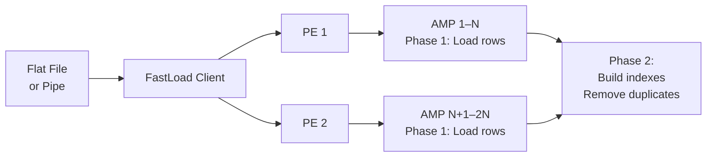

# FastLoad and MultiLoad — Fundamentals

## Why Bulk Load Tools?

Standard SQL `INSERT` statements in BTEQ process one row at a time, triggering all table maintenance (index updates, constraint checks) for every row. For loading millions or billions of rows, this is impractically slow.

Teradata provides specialized **bulk load utilities** that bypass normal row-by-row processing:

| Tool | Purpose | Table State | DML Type |
|---|---|---|---|
| **FastLoad** | Bulk load into empty tables | Must be empty | INSERT only |
| **MultiLoad** | DML on existing tables | Can have data | INSERT, UPDATE, DELETE, UPSERT |
| **FastExport** | Bulk export to flat files | Read-only | SELECT |
| **TPT** | Modern parallel transport | Both | All DML + Export |

---

## FastLoad: Loading Empty Tables Fast

### How FastLoad Works



**FastLoad operates in two phases:**

**Phase 1 (Acquisition):**
- Reads data from input file
- Distributes rows to AMPs based on the Primary Index hash
- No index maintenance yet — just raw row storage
- Table is locked exclusively (no reads during load)

**Phase 2 (Application):**
- Builds secondary indexes (if any)
- Removes duplicate rows for UPI tables
- Releases the table lock
- Table becomes available for queries

### FastLoad Requirements
- **Table must be empty** at the start
- **No secondary indexes** during load (drop them, reload, rebuild)
- **No triggers** on the target table
- No referential integrity constraints enforced during load

---

## FastLoad Script Example

```fastload
-- fastload_orders.fl

SESSIONS 8;               -- Number of parallel sessions (tune to AMP count)
ERRLIMIT 100;             -- Abort if more than 100 errors

LOGON myserver/etl_user,password;

DATABASE sales;
BEGIN LOADING orders ERRORFILES orders_et, orders_uv;

SET RECORD VARTEXT '|';   -- Field delimiter is pipe

DEFINE
    order_id     (INTEGER),
    customer_id  (INTEGER),
    order_date   (DATE FORMAT 'YYYY-MM-DD'),
    amount       (DECIMAL(10,2)),
    status       (VARCHAR(20));

FILE = /data/orders_20240115.dat;

INSERT INTO orders VALUES (
    :order_id,
    :customer_id,
    :order_date,
    :amount,
    :status
);

END LOADING;
LOGOFF;
```

---

## FastLoad Error Tables

FastLoad creates two **error tables** automatically:
- **ET table (Error Table):** Rows that violated constraints or had conversion errors
- **UV table (Uniqueness Violation):** Rows that would create duplicate UPI values

```sql
-- After FastLoad, check error counts
SELECT COUNT(*) FROM orders_et;  -- Constraint/conversion errors
SELECT COUNT(*) FROM orders_uv;  -- Duplicate PI errors

-- Review errors
SELECT * FROM orders_et;
SELECT * FROM orders_uv;

-- Drop error tables after reviewing
DROP TABLE orders_et;
DROP TABLE orders_uv;
```

If error tables exist from a previous FastLoad, the next FastLoad will fail — you must drop them first.

---

## MultiLoad: DML on Existing Tables

### How MultiLoad Differs from FastLoad

| Feature | FastLoad | MultiLoad |
|---|---|---|
| Table state | Must be empty | Can have existing data |
| DML types | INSERT only | INSERT, UPDATE, DELETE, UPSERT |
| Tables per job | 1 | Up to 5 simultaneously |
| Secondary indexes | Must be absent | Maintained automatically |
| Restart | Two-phase protocol | Full restart log |
| Throughput | Highest (bulk insert) | Lower than FastLoad |

### MultiLoad Script Example

```multiload
-- multiload_upsert_orders.ml

LOGON myserver/etl_user,password;

BEGIN MLOAD INTO orders
    WORKTABLES orders_wt1, orders_wt2
    ERRORTABLES orders_et1, orders_et2;

LAYOUT order_layout;

FIELD order_id      * INTEGER;
FIELD customer_id   * INTEGER;
FIELD order_date    * DATE FORMAT 'YYYY-MM-DD';
FIELD amount        * DECIMAL(10,2);
FIELD status        * VARCHAR(20);

TABLE orders;

DML LABEL upsert_order;
-- UPSERT: Update if exists, Insert if not
INSERT INTO orders VALUES (:order_id, :customer_id, :order_date, :amount, :status)
  WHERE order_id NOT IN (SELECT order_id FROM orders);

UPDATE orders
SET customer_id = :customer_id,
    amount = :amount,
    status = :status
WHERE order_id = :order_id;

IMPORT INFILE /data/orders_delta.dat
LAYOUT order_layout
APPLY upsert_order;

END MLOAD;
LOGOFF;
```

---

## TPT: The Modern Replacement

**Teradata Parallel Transporter (TPT)** is the current standard bulk load tool:
- Replaces FastLoad, MultiLoad, FastExport, and BTEQ import/export
- **Parallel:** Multiple sessions, multiple streams
- **Operator-based:** Mix Load, Update, Stream, Export operators
- **Checkpointed:** Built-in restart without full reload
- **Platform-independent:** Same syntax on Linux, Windows, mainframe

```tpt
-- Simple TPT load example
DEFINE JOB load_orders
DESCRIPTION 'Load orders from CSV'
(
    DEFINE OPERATOR FILE_READER TYPE DATACONNECTOR PRODUCER
    ATTRIBUTES (
        DirectoryPath = '/data/',
        FileName = 'orders_20240115.csv',
        Format = 'Delimited',
        OpenMode = 'Read',
        TextDelimiter = ','
    );

    DEFINE OPERATOR TD_LOADER TYPE LOAD
    ATTRIBUTES (
        TdpId = 'myserver',
        UserName = 'etl_user',
        UserPassword = 'password',
        TargetTable = 'sales.orders',
        ErrorTable1 = 'sales.orders_et1',
        ErrorTable2 = 'sales.orders_et2'
    );

    APPLY TO OPERATOR (TD_LOADER)
    SELECT * FROM OPERATOR (FILE_READER);
);
```

---

## Interview Tips

> **Tip 1:** "What is the difference between FastLoad and MultiLoad?" — "FastLoad bulk-inserts into empty tables using a two-phase protocol — fastest throughput but requires an empty table and no secondary indexes. MultiLoad supports DML (INSERT/UPDATE/DELETE/UPSERT) on existing tables with data, up to 5 tables simultaneously, with automatic restart capability."

> **Tip 2:** "Why does FastLoad require an empty table?" — "FastLoad bypasses row-level processing and writes raw row blocks directly to AMP storage. It builds indexes in a batch phase at the end (Phase 2). If the table had existing rows, the Phase 2 index build would corrupt index integrity. The table must be empty so Phase 2 starts with a clean state."

> **Tip 3:** "What are FastLoad error tables?" — "FastLoad creates two error tables: the ET table (rows with constraint violations or type conversion errors) and the UV table (rows that would create duplicate values in a UPI table). You must review and drop these after each load — the next FastLoad will fail if they exist."

> **Tip 4:** "What is TPT and why was it created?" — "Teradata Parallel Transporter is the modern replacement for FastLoad, MultiLoad, FastExport, and BTEQ import/export. It's operator-based (compose Load + Export operators), parallel by design, platform-independent, and has built-in restart/checkpoint capability. Teradata recommends TPT for all new development."
