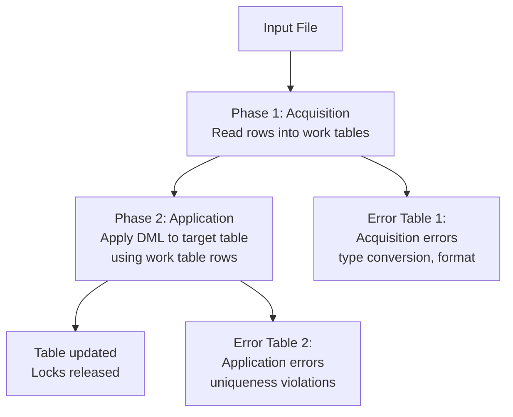

# FastLoad and MultiLoad — Intermediate

## FastLoad: Two-Phase Protocol Deep Dive

### Phase 1 (Acquisition/Loading)

During Phase 1, FastLoad:
1. Opens multiple parallel sessions (SESSIONS parameter)
2. Reads input file blocks and distributes to sessions
3. Each session sends rows to the appropriate AMPs (hash on PI)
4. AMPs write rows to a **loading table** (transient internal structure)
5. No indexes maintained, no uniqueness checks, no triggers

**Phase 1 checkpoint:** If Phase 1 fails (e.g., network outage), FastLoad can **restart** from the last checkpoint. The restart log tracks progress.

### Phase 2 (Application)

During Phase 2, FastLoad:
1. Locks the table exclusively
2. Moves rows from loading table to permanent storage
3. Builds secondary indexes (if any)
4. Performs UPI uniqueness check (violators → UV error table)
5. Releases lock — table is now queryable

**Phase 2 restart:** If Phase 2 fails, you can restart. FastLoad determines from the log which phase to resume.

---

## FastLoad Tuning Parameters

```fastload
SESSIONS 16;        -- Number of parallel sessions
                    -- Rule of thumb: 1-2 per AMP, max 120
ERRLIMIT 500;       -- Max errors before abort (0 = unlimited)

PACK 2000;          -- Rows packed per request to Teradata
                    -- Higher = fewer round-trips = faster
                    -- Default: 20, Max: 2048

TENACITY 4;         -- Retry hours if system busy
SLEEP 6;            -- Minutes between retries

NOTIFY HIGH         -- Send OS notification at key events
    FILE = /var/log/fastload_notify.log;
```

**Session tuning:**
- Too few sessions: underutilizes AMPs (bottleneck at the client)
- Too many sessions: overwhelms Teradata (session management overhead)
- Rule of thumb: `SESSIONS = number_of_AMPs / 2` for most workloads

---

## FastLoad with Preprocessing

Often you can't load directly from source format — use a **Pipe** to transform on the fly:

```bash
#!/bin/bash
# Uncompress, filter, and pipe directly to FastLoad
gunzip -c /data/orders_20240115.dat.gz \
  | grep -v '^#' \          # Remove comment lines
  | awk -F'|' '$5 != ""' \  # Remove rows with empty status
  | fastload < load_orders.fl
```

Or use TPT's DataConnector operator to transform inline:

```tpt
DEFINE OPERATOR FILE_READER TYPE DATACONNECTOR PRODUCER
ATTRIBUTES (
    Format = 'Delimited',
    TextDelimiter = ',',
    FileName = 'orders_*.csv',     -- Wildcard: loads multiple files
    DateForm = 'ANSIDATE'
);
```

---

## MultiLoad: Detailed Protocol

MultiLoad uses a more complex protocol to handle DML on live tables:



**Work tables:** MultiLoad uses work tables (specified in WORKTABLES clause) to stage the DML operations before applying them. This allows restartability.

**Lock behavior:** MultiLoad acquires a **Table-level Write lock** during Phase 2 — this blocks all reads and writes on the target table. For high-availability tables, MultiLoad windows must be carefully scheduled.

---

## MultiLoad: UPSERT Pattern

```multiload
LOGON server/user,pass;

BEGIN MLOAD INTO target_table
    WORKTABLES target_wt1
    ERRORTABLES target_et1, target_et2;

LAYOUT order_updates;
FIELD order_id   * INTEGER;
FIELD new_status * VARCHAR(20);
FIELD updated_ts * TIMESTAMP(0);

TABLE target_table;

DML LABEL do_upsert TYPE UPDATE ELSE INSERT;

UPDATE target_table
SET status = :new_status, updated_at = :updated_ts
WHERE order_id = :order_id;

INSERT INTO target_table (order_id, status, updated_at)
VALUES (:order_id, :new_status, :updated_ts);

IMPORT INFILE /data/order_updates.dat
LAYOUT order_updates
APPLY do_upsert;

END MLOAD;
LOGOFF;
```

**TYPE UPDATE ELSE INSERT** is the MultiLoad equivalent of MERGE/UPSERT — try UPDATE first; if no matching row, INSERT.

---

## TPT Operators: Choosing the Right One

| TPT Operator | Type | Equivalent Old Tool | Use Case |
|---|---|---|---|
| **LOAD** | Consumer | FastLoad | Bulk insert into empty tables |
| **UPDATE** | Consumer | MultiLoad | DML (INSERT/UPDATE/DELETE) on existing tables |
| **STREAM** | Consumer | BTEQ INSERT | Real-time/micro-batch inserts, smaller volumes |
| **EXPORT** | Consumer | FastExport | Parallel export to files |
| **DataConnector** | Producer | File I/O | Read/write flat files (CSV, fixed-width) |
| **ODBC** | Producer | BTEQ SELECT | Read from external databases |
| **Kafka** | Producer | - | Real-time streaming from Kafka topics |

### TPT Multi-Operator Pipeline

```tpt
DEFINE JOB transform_and_load
(
    -- Producer: read from source file
    DEFINE OPERATOR src_reader TYPE DATACONNECTOR PRODUCER
    ATTRIBUTES (FileName = 'input.csv', Format = 'Delimited');

    -- Filter/transform (SQL in SELECT)
    DEFINE SCHEMA filtered_schema (
        order_id INTEGER, customer_id INTEGER, amount DECIMAL(12,2)
    );

    -- Consumer: load into Teradata
    DEFINE OPERATOR td_load TYPE LOAD
    ATTRIBUTES (TargetTable = 'sales.fact_orders', ...);

    -- Wire them together
    APPLY TO OPERATOR (td_load)
    SELECT order_id, customer_id, amount
    FROM OPERATOR (src_reader [filtered_schema])
    WHERE amount > 0;   -- Filter rows inline
);
```

---

## Throughput Benchmarks

Approximate throughput on a 100-AMP system (varies greatly by hardware, network, row size):

| Tool | Rows/Hour | GB/Hour | Notes |
|---|---|---|---|
| BTEQ INSERT | 50K–500K | < 1 GB | Row-by-row, single session |
| FastLoad | 50M–200M | 10–50 GB | 2-phase, empty table only |
| MultiLoad | 5M–20M | 1–5 GB | DML overhead, lock contention |
| TPT Load | 50M–200M | 10–50 GB | Parallel FastLoad equivalent |
| TPT Stream | 1M–10M | 0.5–2 GB | Micro-batch, lower latency |

---

## FastExport: Bulk Export

```fastexport
LOGON server/user,pass;
DATABASE sales;

BEGIN EXPORT OUTFILE /data/orders_export_${DATE}.dat
MODE FASTEXPORT
FORMAT TEXT;

SELECT order_id, customer_id, order_date, amount
FROM orders
WHERE order_date BETWEEN '2024-01-01' AND '2024-12-31';

END EXPORT;
LOGOFF;
```

**FastExport advantages over BTEQ export:**
- Parallel across AMPs (BTEQ is single-session)
- Can export billions of rows in hours, not days
- Supports blocking/spooling to manage memory

---

## Interview Tips

> **Tip 1:** "How does FastLoad handle failures during Phase 1 vs Phase 2?" — "FastLoad maintains a restart log. A Phase 1 failure can be restarted from the last checkpoint — already-loaded rows don't need to be reloaded. A Phase 2 failure also restarts, but Phase 2 must complete entirely (it's not incrementally restartable within the phase)."

> **Tip 2:** "What is the difference between MultiLoad's two error tables?" — "Error Table 1 captures acquisition errors — rows that failed during the read/stage phase (type conversion errors, format errors). Error Table 2 captures application errors — rows that caused issues when applied to the target table (uniqueness violations on UPI columns)."

> **Tip 3:** "When would you use TPT Stream instead of TPT Load?" — "TPT Stream (equivalent to BTEQ INSERT) is for micro-batch or near-real-time loading where rows arrive continuously and you can't wait for a full two-phase bulk load. It's slower than TPT Load but maintains secondary indexes on every insert and doesn't require an empty table."

> **Tip 4:** "What is the performance difference between FastLoad and MultiLoad?" — "FastLoad is 5-10× faster for pure inserts into empty tables because it bypasses index maintenance until Phase 2. MultiLoad must maintain all indexes on every DML operation and acquires table-level locks during application phase. For a 100M-row initial load, use FastLoad; for incremental updates, use MultiLoad or TPT Update."
