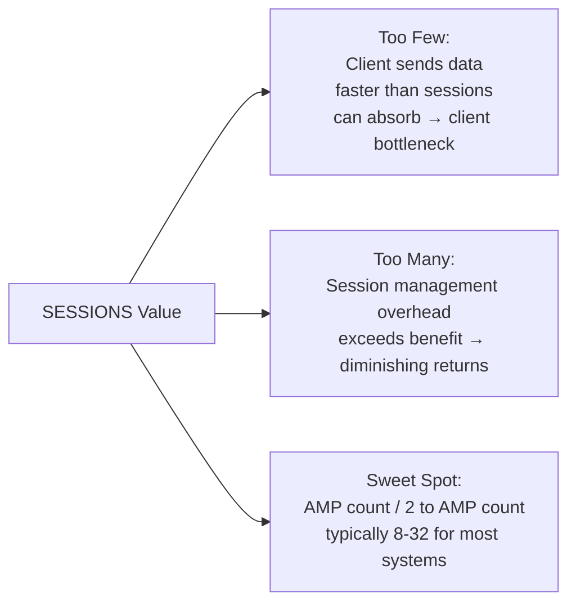
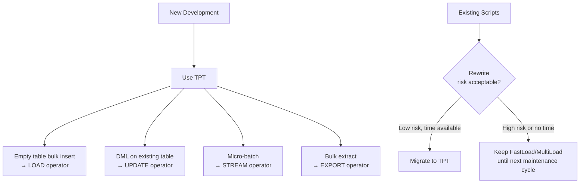

# FastLoad and MultiLoad — Senior Deep Dive

## FastLoad Internals: The Acquisition Protocol

FastLoad uses Teradata's **Message Passing Interface (MPI)** to achieve parallelism:

1. **Session establishment:** FastLoad opens N sessions simultaneously (SESSIONS parameter). Each session gets assigned to a different PE.

2. **Block blocking:** Input data is read in blocks (not rows). Each block is sent to the session with the least pending work (load-balanced across sessions).

3. **Hash distribution:** Within each session, rows are hashed on the PI column and routed to the target AMP. Each AMP accumulates rows without ordering.

4. **Transient journal bypass:** FastLoad bypasses Teradata's transient journal (the normal undo log). This is why it can't co-exist with other DML during load — there's no rollback capability during Phase 1.

5. **End marker:** After all input is consumed, FastLoad sends end markers to all AMPs. AMPs signal completion, triggering Phase 2.

**Key insight:** The journal bypass is why FastLoad is so fast — no undo logging overhead. But it also means if Phase 1 fails mid-stream, the table may be in a partially loaded state that requires the restart log to recover correctly.

---

## Session Count Optimization

Finding the optimal SESSIONS value:



**Empirical tuning approach:**
1. Start with SESSIONS = AMP_count / 4
2. Monitor FastLoad throughput (rows/second)
3. Increase SESSIONS by 50% and compare
4. Stop increasing when throughput plateaus or decreases

**Constraint:** Total FastLoad sessions across all concurrent jobs should not exceed ~120 (Teradata session limit varies by license).

---

## MultiLoad Lock Strategy

MultiLoad's locking behavior in detail:

**Phase 1 (Acquisition):** Table is accessible for reads (no lock). MultiLoad writes rows to work tables — the target table continues serving queries normally.

**Phase 2 (Application):** 
- MultiLoad acquires a **Write lock** on the target table
- This blocks ALL reads and writes on the target
- Phase 2 duration = time to apply all DML rows from work tables
- For 100M row updates: Phase 2 may take 30-60 minutes

**Minimizing Phase 2 lock duration:**
1. **Reduce work table size:** Filter input data to only actual changes
2. **Split into smaller jobs:** Instead of one 100M-row MultiLoad, run 10× 10M-row jobs with smaller lock windows
3. **Off-hours scheduling:** Schedule Phase 2 during maintenance windows
4. **Use row-hash locks:** For targeted updates, consider BTEQ UPDATE with specific PI values (row-hash lock instead of table lock)

---

## TPT Advanced: Multi-Instance Parallelism

TPT jobs can run as multiple instances simultaneously for maximum throughput:

```bash
# Run 4 parallel TPT instances, each loading a portion of the data
for i in 1 2 3 4; do
    tbuild -f load_job.tpt -v "JobPartNum=${i}" \
           -v "TotalParts=4" \
           &
done
wait

# Each instance loads 1/4 of the file using partition filtering
# Combined throughput approaches 4× single-instance speed
```

**In the TPT script:**
```tpt
DEFINE OPERATOR file_reader TYPE DATACONNECTOR PRODUCER
ATTRIBUTES (
    FileName = 'orders_part_$(JobPartNum)_of_$(TotalParts).csv'
);
```

**Alternative:** Use TPT's built-in multi-instance support:
```bash
tbuild -f load_job.tpt -j load_orders -Jm 4   # -Jm = Job multiplicity = 4 instances
```

---

## Error Handling and Recovery Strategies

### FastLoad Recovery

```bash
# Check FastLoad restart log status
fastload < check_restart.fl

# restart.fl contents:
LOGON server/user,pass;
-- FastLoad will automatically detect incomplete job from log
-- and restart from last checkpoint
BEGIN LOADING orders ERRORFILES orders_et, orders_uv
CHECKPOINT 10000;  -- Checkpoint every 10,000 rows
...
```

**If error tables exist from previous failed run:**
```sql
-- Must drop error tables before restart
DROP TABLE orders_et;
DROP TABLE orders_uv;
-- Then restart FastLoad
```

### MultiLoad Recovery

MultiLoad maintains a more sophisticated **restart log** in work tables:

```multiload
-- Restart a failed MultiLoad job
LOGON server/user,pass;
BEGIN MLOAD INTO orders
    WORKTABLES orders_wt1   -- Work tables must still exist from failed run
    ERRORTABLES orders_et1, orders_et2;
-- MultiLoad reads from work tables and determines phase/checkpoint
-- Resumes from last committed checkpoint automatically
```

**Key:** Don't drop work tables after a failure — they contain the state needed for restart.

---

## TPT vs Legacy Tools: When to Use Each



**TPT advantages over legacy tools:**
1. **Single tool** — no need to choose FastLoad vs MultiLoad vs FastExport
2. **Declarative, composable** — chain operators in a job definition
3. **Built-in parallelism** — multi-instance, multi-stream by design
4. **Kafka integration** — consume from Kafka topics directly
5. **Cloud native** — supported in Teradata Vantage on AWS/Azure/GCP

---

## Performance Anti-Patterns

### Anti-Pattern 1: BTEQ INSERT for Large Loads
```bteq
-- BAD: Loading 10M rows via BTEQ INSERT
.IMPORT DATA FILE = large_file.dat
USING (col1 INTEGER, col2 VARCHAR(100))
INSERT INTO target VALUES (:col1, :col2);
-- 10M single-row inserts = hours of runtime
```
**Fix:** Use FastLoad or TPT Load operator.

### Anti-Pattern 2: Running MultiLoad During Business Hours
**Problem:** Phase 2 acquires table-level write lock — analysts can't query the table for 30-60 minutes.
**Fix:** Schedule MultiLoad Phase 2 during maintenance windows. Or use smaller incremental jobs with shorter lock duration.

### Anti-Pattern 3: Ignoring Error Tables
**Problem:** FastLoad runs "successfully" but error tables have millions of rows — data quality issues silently ignored.
**Fix:** After every FastLoad, check `SELECT COUNT(*) FROM table_et` and fail the pipeline if count > threshold.

### Anti-Pattern 4: Too Many Sessions
**Problem:** 200 concurrent FastLoad sessions on a 100-AMP system — session management overhead degrades throughput.
**Fix:** Limit to AMP count / 2 sessions, test empirically.

---

## Interview Tips

> **Tip 1:** "How does FastLoad bypass normal Teradata processing to achieve high throughput?" — "FastLoad bypasses the transient journal (undo log) — there's no per-row logging overhead. It also bypasses secondary index maintenance during Phase 1 (indexes are built in batch during Phase 2). These two bypasses eliminate the biggest overhead factors in normal row-by-row INSERT."

> **Tip 2:** "How do you minimize the impact of MultiLoad's write lock on production tables?" — "Split large MultiLoad jobs into smaller incremental jobs with shorter Phase 2 windows. Schedule Phase 2 during low-traffic periods. Filter the input to only actual changes (don't include unchanged rows). For very high availability tables, consider TPT Stream for micro-batch updates that use row-hash locks instead of table locks."

> **Tip 3:** "What happens to work tables if a MultiLoad job fails?" — "Work tables are preserved — they're essential for restart. MultiLoad reads its restart state from the work tables to determine where Phase 2 was interrupted. Never drop work tables after a failure; let MultiLoad restart use them. Only drop them after a successful completion."

> **Tip 4:** "What is TPT's advantage in cloud/Vantage environments?" — "TPT is the only bulk load tool that works natively in Teradata Vantage cloud environments. It supports loading from cloud object stores (S3, Azure Blob) and streaming from Kafka. The legacy tools (FastLoad, MultiLoad, FastExport) are client-side and not available in all Vantage deployment modes."

## ⚡ Cheat Sheet

**Teradata architecture**
```
AMPs (Access Module Processors): parallel processing units; each owns a data slice
PE (Parsing Engine):             parses SQL, optimizes, dispatches to AMPs
BYNET:                           high-speed interconnect between PEs and AMPs
Vproc (Virtual Processor):       logical unit (AMP or PE) within a node
```

**Primary Index (PI) — critical concept**
```sql
-- Unique Primary Index (UPI): distribute rows by hashing PI column(s)
CREATE TABLE orders (
    order_id INTEGER NOT NULL,
    amount DECIMAL(15,2),
    PRIMARY INDEX (order_id)  -- UPI by default if unique
);

-- Non-Unique Primary Index (NUPI): all rows with same PI hash to same AMP
-- Good for join performance; bad if low cardinality → hot AMP (data skew)

-- NOPI (No Primary Index): load-balanced by row number — best for staging
CREATE SET TABLE staging_orders ... NO PRIMARY INDEX;
```

**Skew and performance**
```sql
-- Check for data skew
SELECT hashamp(hashbucket(hashrow(order_id))) AS amp_no, COUNT(*) AS row_count
FROM orders GROUP BY 1 ORDER BY 2 DESC;
-- Even distribution = good PI; skewed = bad PI choice

-- Skew factor: (max_amp_rows / avg_amp_rows - 1) * 100
-- >10% skew = investigate PI selection
```

**BTEQ essentials**
```bteq
.LOGON server/username,password;
.SET SESSIONS 4;
.SET SEPARATOR '|';

SELECT TOP 10 * FROM orders;

.EXPORT REPORT FILE = /data/output.txt
SELECT * FROM orders WHERE order_date = '2024-01-15';
.EXPORT RESET

.QUIT;
```

**FastLoad / MultiLoad**
```
FastLoad:   empty table only; bypass transient journal; fastest for initial loads
MultiLoad:  supports INSERT/UPDATE/DELETE on existing table; uses work tables
TPT (Teradata Parallel Transporter): modern replacement; stream-based; supports both
FastExport: parallel export to flat files; most efficient for large exports
```

**Statistics**
```sql
-- Collect statistics for optimizer (like ANALYZE TABLE in other DBs)
COLLECT STATISTICS ON orders COLUMN (order_date);
COLLECT STATISTICS ON orders INDEX (order_id);
-- View statistics
HELP STATISTICS orders;
-- Check if stale (>24h old or >10% row count change)
SELECT * FROM dbc.columnstatsv WHERE tablename='orders';
```

**Workload Management (TASM/TWM)**
```
TASM: Teradata Active System Management — rule-based WLM
Priority: use workload definitions to assign CPU priority per user/query type
Throttling: limit concurrent queries per user or workload class
AMP usage limits: cap AMPs for low-priority queries to protect prod workloads
```

**Temporal tables (ANSI SQL time-period)**
```sql
-- Bi-temporal: valid time (business period) + transaction time (DB period)
CREATE TABLE price_history (
    product_id INTEGER,
    price DECIMAL(10,2),
    valid_period PERIOD(DATE) NOT NULL AS VALIDTIME,
    trans_period PERIOD(TIMESTAMP(6) WITH TIME ZONE) NOT NULL AS TRANSACTIONTIME,
    PRIMARY INDEX (product_id)
);
-- Query as of a specific business date
VALIDTIME AS OF DATE '2024-01-15' SELECT * FROM price_history WHERE product_id = 100;
```

**Query optimization tips**
```sql
-- Use EXPLAIN to see query plan
EXPLAIN SELECT * FROM orders WHERE order_date = '2024-01-15';
-- Look for: full AMP scans, product joins (bad), merge joins (good)

-- Join hints
-- Prefer hash join (default for large tables); avoid nested join (one-row-at-a-time)
-- Force partition elimination with PARTITION BY RANGE + filter on partition column

-- PI match for joins: if join key = PI of both tables → row hash match → no redistribution
```

**Key interview points**
- PI = hash-based distribution; UPI vs NUPI vs NOPI vs PI with partitioning
- Data skew on NUPI = hot AMP = performance bottleneck
- Teradata's optimizer is cost-based; fresh statistics are critical
- TPT replaces FastLoad/MultiLoad/FastExport for modern pipelines
- Teradata still dominant in large financial/telco data warehouses (often alongside cloud DW)
