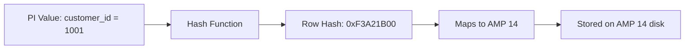

# Primary Index — Fundamentals

## What Is a Primary Index?

The **Primary Index (PI)** is the single most important design decision in Teradata. It determines **which AMP stores each row** by hashing the PI column value(s) to produce a row hash, which maps to an AMP.

**Every Teradata table (except NoPI tables) must have a Primary Index.**

```sql
-- Creating a table with a Primary Index
CREATE TABLE customer (
    customer_id   INTEGER NOT NULL,
    customer_name VARCHAR(100),
    region        VARCHAR(50)
) PRIMARY INDEX (customer_id);
```

---

## Two Types of Primary Index

### UPI — Unique Primary Index
- Teradata **enforces uniqueness** of PI values globally
- Each PI value maps to exactly one row
- Guarantees even data distribution (assuming high-cardinality PI)
- Extra overhead: uniqueness check on every INSERT/UPDATE

```sql
CREATE TABLE orders (
    order_id    BIGINT NOT NULL,
    customer_id INTEGER,
    order_date  DATE
) UNIQUE PRIMARY INDEX (order_id);
```

### NUPI — Non-Unique Primary Index
- Teradata **does not enforce uniqueness**
- Multiple rows can share the same PI value — they land on the same AMP
- Risk: PI skew if certain values appear far more often than others
- Faster inserts (no uniqueness check)

```sql
CREATE TABLE order_line_items (
    order_id    BIGINT NOT NULL,
    line_num    INTEGER NOT NULL,
    product_id  INTEGER,
    quantity    INTEGER
) PRIMARY INDEX (order_id);   -- NUPI: many line items per order
```

---

## How Row Hashing Works



1. PI column value(s) → **hash function** → 32-bit row hash
2. Upper bits of row hash → **hash map** → AMP number
3. Row stored on that AMP's disk

**Same PI value = same AMP, always.** This is deterministic and consistent.

---

## Why PI Matters for Performance

### Case 1: Query filters on PI column
```sql
SELECT * FROM customer WHERE customer_id = 1001;
```
Teradata hashes 1001 → finds AMP 14 → queries only AMP 14. **Single-AMP operation.**

### Case 2: Query filters on non-PI column
```sql
SELECT * FROM customer WHERE region = 'West';
```
Teradata doesn't know which AMPs have 'West' rows → **full table scan across all AMPs.**

### Case 3: JOIN on PI columns (both tables)
```sql
SELECT o.*, c.customer_name
FROM orders o
JOIN customer c ON o.customer_id = c.customer_id;
```
Both tables have `customer_id` as PI → rows with the same `customer_id` are on the same AMP → **AMP-local merge join. No redistribution needed.**

---

## Choosing a Good Primary Index

| Criteria | Why It Matters |
|---|---|
| **High cardinality** | More unique values = better distribution across AMPs |
| **Frequently used in JOINs** | AMP-local joins avoid BYNET redistribution |
| **Frequently used in WHERE** | Single-AMP or few-AMP access |
| **Not skewed** | No single value dominates row count |
| **Stable** | PI updates cause row migration to different AMP (expensive) |

**Rule of thumb:** The PI should be the column(s) you JOIN on most frequently, as long as those columns have high cardinality.

---

## Composite Primary Index

You can include up to **16 columns** in a Primary Index:

```sql
CREATE TABLE sales_fact (
    sale_id     BIGINT,
    store_id    INTEGER,
    product_id  INTEGER,
    sale_date   DATE,
    amount      DECIMAL(10,2)
) PRIMARY INDEX (sale_id, store_id);
```

The **combined hash** of all PI columns determines AMP placement. Useful when no single column has both high cardinality and query relevance.

---

## Comparison: UPI vs NUPI

| Feature | UPI | NUPI |
|---|---|---|
| Uniqueness enforced | Yes | No |
| Insert speed | Slower (uniqueness check) | Faster |
| Distribution guarantee | Best (1 row per hash) | Depends on cardinality |
| Use case | Natural keys, IDs | Foreign keys, category columns |

---

## Interview Tips

> **Tip 1:** "What is a Primary Index in Teradata?" — "The PI is a column (or set of columns) whose hash value determines which AMP stores each row. It's the most important table design decision — it controls data distribution, join performance, and single-row access speed."

> **Tip 2:** "What's the difference between UPI and NUPI?" — "UPI enforces global uniqueness (like a PK) — each PI value maps to exactly one row. NUPI allows duplicates — multiple rows with the same PI land on the same AMP. NUPI inserts are faster but can cause skew."

> **Tip 3:** "What makes a good Primary Index?" — "High cardinality (even distribution), frequently used in JOINs and WHERE clauses, not frequently updated. The goal is AMP-local operations and even data spread."
