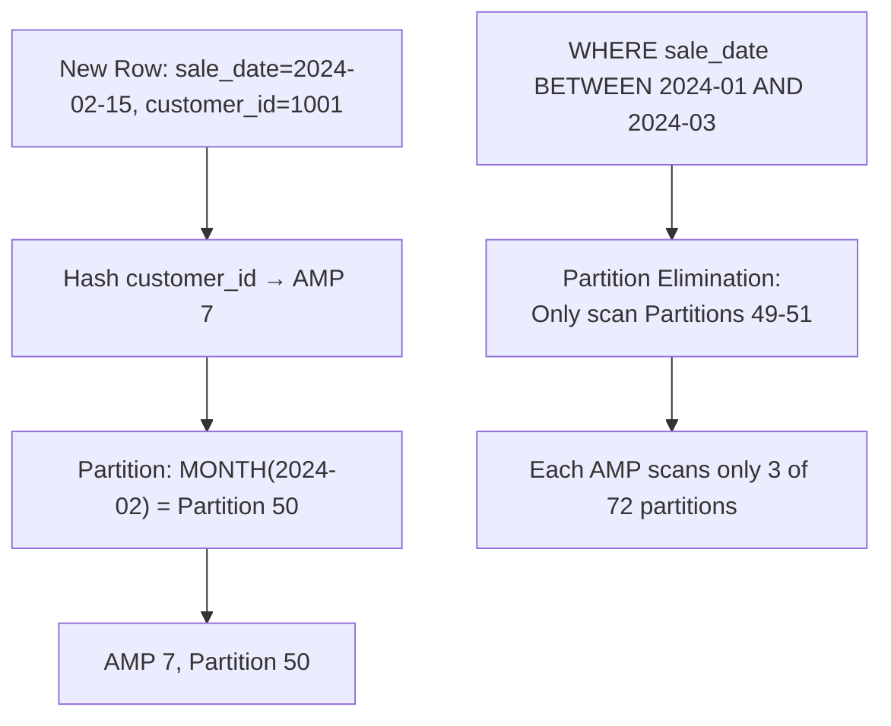

# Primary Index — Intermediate

## PI Skew: The Silent Performance Killer

**Skew** occurs when PI values are unevenly distributed — some AMPs get far more rows than others. A few AMPs become "hot" while others sit idle.

### Detecting Skew

```sql
-- Check row count per AMP for a table
SELECT Hashamp(HashRow(customer_id)) AS AmpNum,
       COUNT(*) AS RowCount
FROM customer
GROUP BY AmpNum
ORDER BY RowCount DESC;
```

**Skew factor** = `(MaxAMP rows - AvgAMP rows) / AvgAMP rows × 100`

- < 10%: Good
- 10–50%: Moderate concern
- > 50%: Significant performance impact
- > 90%: Critical — effectively serialized

### Common Causes of Skew

| Cause | Example |
|---|---|
| Low cardinality PI | `status_code` with values 'A', 'I', 'P' |
| Nullable PI | NULLs all hash to the same row hash |
| Temporal PI | `load_date` if most data loaded same day |
| Business key skew | Heavy hitters: one customer has 80% of orders |

### Remediation Strategies

1. **Change the PI** — choose a higher-cardinality column
2. **Composite PI** — add a second column to spread the hash
3. **Partition Primary Index (PPI)** — partition by date, let optimizer eliminate partitions
4. **NUPI + application logic** — accept skew, work around it with filters

---

## Secondary Indexes

Secondary indexes provide alternate access paths without changing data distribution.

### USI — Unique Secondary Index

```sql
CREATE UNIQUE INDEX (email_address) ON customer;
```

- Enforces uniqueness on the indexed column
- Creates a **subtable** on every AMP containing (index value → row hash → AMP pointer)
- A query filtering on `email_address` does a 2-AMP operation: lookup subtable → fetch row
- Overhead: doubled storage (subtable), slower inserts/updates

### NUSI — Non-Unique Secondary Index

```sql
CREATE INDEX (region) ON customer;
```

- No uniqueness enforcement
- Subtable contains (index value → set of row hashes)
- Queries on `region` scan the NUSI subtable (much smaller than full table scan)
- Useful for medium-cardinality columns that appear frequently in WHERE clauses


### Secondary Index Trade-offs

| | USI | NUSI |
|---|---|---|
| Storage | 2× | 2× |
| Insert overhead | High (global uniqueness + subtable update) | Medium (subtable update) |
| Access pattern | 2-AMP lookup | All-AMP NUSI scan |
| When to use | Alternate unique access path | Medium-cardinality WHERE columns |

---

## NoPI Tables

**NoPI (No Primary Index)** tables have no PI — rows are assigned to AMPs in a **round-robin** fashion.

```sql
CREATE TABLE staging_load (
    record_id   BIGINT,
    raw_data    VARCHAR(1000)
) NO PRIMARY INDEX;
```

**When to use NoPI:**
- Staging/landing tables for bulk loads (FastLoad works better with NoPI)
- Tables that are immediately INSERT/SELECT'd into a proper table
- Columnar (column-partitioned) tables
- When you genuinely don't know the access pattern yet

**When NOT to use NoPI:**
- Any table queried with WHERE or JOIN on its columns
- Any table that needs single-row access

---

## Partition Primary Index (PPI)

PPI adds **partition elimination** on top of the standard PI distribution:

```sql
CREATE TABLE sales_fact (
    sale_id     BIGINT,
    sale_date   DATE,
    customer_id INTEGER,
    amount      DECIMAL(10,2)
)
PRIMARY INDEX (customer_id)
PARTITION BY RANGE_N(sale_date BETWEEN DATE '2020-01-01'
                     AND DATE '2025-12-31' EACH INTERVAL '1' MONTH);
```

**How it works:**
1. Rows are first distributed by PI hash (customer_id → AMP)
2. Within each AMP, rows are further organized by partition (sale_date month)
3. A query with `WHERE sale_date BETWEEN '2024-01-01' AND '2024-03-31'` eliminates all other partitions



**PPI performance gain:** A 6-year table with monthly partitions has 72 partitions. A 1-month query scans 1/72nd of the data — roughly 70× reduction in I/O.

---

## Updating the Primary Index

Updating a PI column is **extremely expensive**:
1. Teradata must DELETE the row from the current AMP
2. Re-hash the new PI value
3. INSERT to the new AMP

```sql
-- Avoid this if PI = customer_id
UPDATE orders SET customer_id = 9999 WHERE order_id = 12345;
```

If PI updates are common in your workload, consider choosing a different PI or using a surrogate key.

---

## Interview Tips

> **Tip 1:** "How do you detect and fix PI skew?" — "Query the row count per AMP using Hashamp(HashRow(pi_col)). Skew > 50% warrants action. Fixes include choosing a higher-cardinality PI, using a composite PI, or adding PPI to leverage partition elimination alongside the PI."

> **Tip 2:** "When would you use a NoPI table?" — "For staging/landing tables in bulk load pipelines where data is immediately redistributed into a properly indexed table. FastLoad works well with NoPI since it bypasses the AMP hash step and loads in round-robin fashion."

> **Tip 3:** "What is a NUSI and when is it useful?" — "A Non-Unique Secondary Index creates a subtable on every AMP with (index_value → row_hash) pairs. It helps when you frequently filter on a medium-cardinality column that isn't the PI. The NUSI scan is much cheaper than a full table scan."

> **Tip 4:** "What is PPI and how does partition elimination work?" — "Partition Primary Index adds date (or other range) partitioning on top of PI distribution. Queries with partition-column filters only scan matching partitions — reducing I/O proportional to the partition ratio selected."
