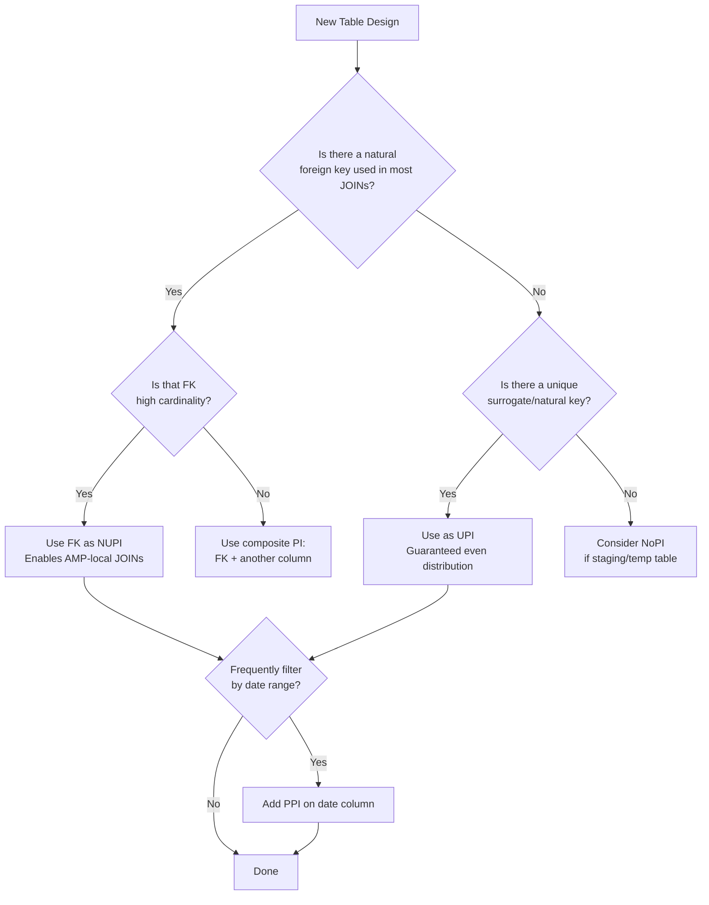

# Primary Index — Senior Deep Dive

## Row Hash Internals

The Teradata row hash is a **32-bit value** derived from the PI column(s). Understanding its structure explains many behaviors:

```
Row Hash (32 bits):
  Bits 31–16: AMP selector (maps to hash map bucket → AMP)
  Bits 15–0:  Row position within AMP (used in conjunction with uniqueness value)
```

The **uniqueness value** is a 32-bit counter appended to distinguish rows with identical row hashes (hash synonyms). For UPI tables, the uniqueness value is always 0 (guaranteed unique). For NUPI tables, it increments.

**Full Row ID = Row Hash (32 bits) + Uniqueness Value (32 bits) = 64-bit identifier**

All secondary index subtables, join indexes, and internal pointers use the full Row ID.

---

## Hash Map Mechanics and Redistribution

The hash map is a **65,536-entry array** where each entry maps a hash bucket to an AMP:
- `hash_map[bucket_number] = AMP_number`
- With 100 AMPs: each AMP owns ~655 buckets
- With 200 AMPs: each AMP owns ~327 buckets

**When AMPs are added:**
1. The hash map is recalculated
2. Some rows on existing AMPs now "belong" to new AMPs
3. Background process migrates rows (this is the redistribution)
4. During migration, queries use the old map; post-migration, new map activates atomically

**Teradata's incremental redistribution** (newer versions): moves only the rows that changed AMP ownership, not all rows — reducing redistribution time significantly.

---

## Multi-Level PPI (MLPPI)

Standard PPI has one partition dimension. **MLPPI** supports up to 3 levels:

```sql
CREATE TABLE sales_fact (
    sale_id     BIGINT,
    sale_date   DATE,
    region_code CHAR(2),
    product_id  INTEGER,
    amount      DECIMAL(12,2)
)
PRIMARY INDEX (sale_id)
PARTITION BY (
    RANGE_N(sale_date BETWEEN DATE '2020-01-01' AND DATE '2025-12-31' EACH INTERVAL '1' MONTH),
    RANGE_N(region_code BETWEEN 'AA' AND 'ZZ' EACH 'A')
);
```

**Use case:** A query like `WHERE sale_date BETWEEN '2024-Q1' AND region_code = 'US'` eliminates on both dimensions.

**Warning:** MLPPI increases metadata overhead and can complicate partition maintenance. Use only when 2D elimination provides clear benefit.

---

## Join Index: A Specialized Access Path

A **Join Index** is a materialized view that can have its own PI, different from the base table:

```sql
CREATE JOIN INDEX sales_by_customer AS
SELECT c.customer_name, s.sale_id, s.amount, s.sale_date
FROM sales_fact s
JOIN customer c ON s.customer_id = c.customer_id
PRIMARY INDEX (customer_name);
```

The optimizer may use the join index instead of the base tables when:
- The query accesses the join index's columns
- The join index's PI matches the query's access pattern better

**Join index is automatically maintained by Teradata** on DML changes — adding write overhead. Use selectively for read-heavy workloads.

---

## Skew Analysis: Deep Metrics

```sql
-- Detailed skew analysis using system tables
SELECT
    TableName,
    AMPNo,
    CurrentPerm / 1e9 AS PermGB,
    100.0 * (CurrentPerm - AVG(CurrentPerm) OVER (PARTITION BY TableName))
            / NULLIFZERO(AVG(CurrentPerm) OVER (PARTITION BY TableName)) AS SkewPct
FROM DBC.TableSizeV
WHERE DatabaseName = 'SALES_DB'
ORDER BY SkewPct DESC;

-- Row-level skew by PI value (sample)
SELECT TOP 20 customer_id, COUNT(*) AS RowCount
FROM orders
GROUP BY customer_id
ORDER BY RowCount DESC;
```

**Skew interpretation:**
- **Table-level skew** (from DBC.TableSizeV) shows storage imbalance
- **Row-level skew** (from the table itself) shows value distribution
- A table can have storage skew (some AMPs have more data) without obvious value skew (many values, but one AMP's hash buckets are unlucky)

---

## Choosing PI: A Decision Framework



---

## The Nullable PI Problem

When the PI column allows NULLs, all NULL rows hash to the same value → same AMP → **catastrophic skew**:

```sql
-- BAD: customer_id allows nulls, many orphan records
CREATE TABLE orders (order_id BIGINT, customer_id INTEGER)
PRIMARY INDEX (customer_id);  -- NULL customer_ids all go to 1 AMP!

-- FIX 1: NOT NULL constraint
CREATE TABLE orders (order_id BIGINT, customer_id INTEGER NOT NULL)
PRIMARY INDEX (customer_id);

-- FIX 2: Use order_id as PI instead (always populated)
CREATE TABLE orders (order_id BIGINT NOT NULL, customer_id INTEGER)
PRIMARY INDEX (order_id);
```

---

## PI Change: ALTER TABLE vs. Rebuild

You cannot `ALTER TABLE ... PRIMARY INDEX` in Teradata. To change a PI:

```sql
-- Method 1: CREATE and INSERT/SELECT
CREATE TABLE orders_new (
    order_id BIGINT, customer_id INTEGER, amount DECIMAL(10,2)
) PRIMARY INDEX (order_id);

INSERT INTO orders_new SELECT * FROM orders;
RENAME TABLE orders TO orders_old;
RENAME TABLE orders_new TO orders;

-- Method 2: CREATE TABLE AS (preserves data, changes PI)
CREATE TABLE orders_new AS orders WITH DATA PRIMARY INDEX (order_id);
```

Both methods require **full table scan + full rewrite** — plan for 1–3× table-size in spool space.

---

## Interview Tips

> **Tip 1:** "How does Teradata handle hash collisions?" — "Two different PI values may produce the same 32-bit row hash — these are hash synonyms. They're stored on the same AMP and differentiated by a uniqueness value appended to form the full 64-bit Row ID. The optimizer handles this transparently."

> **Tip 2:** "How do you change a table's Primary Index in Teradata?" — "You can't ALTER a PI in place. You must CREATE a new table with the desired PI, INSERT/SELECT the data, then rename tables. This requires spool space equal to the table size and causes temporary double-storage."

> **Tip 3:** "When would you use a Join Index?" — "When a critical query joins two large tables on non-PI columns and performance is unacceptable even with statistics. The join index materializes the join result with a different PI, letting the optimizer avoid redistribution. The trade-off is write overhead on both base tables."

> **Tip 4:** "What happens when PI columns contain NULLs?" — "All NULLs hash to the same row hash → same AMP. If 30% of rows have NULL PI values, one AMP gets 30% of the data — severe skew. Always define PI columns as NOT NULL, or choose a different PI column that's always populated."

## ⚡ Cheat Sheet

**Teradata architecture**
```
AMPs (Access Module Processors): parallel processing units; each owns a data slice
PE (Parsing Engine):             parses SQL, optimizes, dispatches to AMPs
BYNET:                           high-speed interconnect between PEs and AMPs
Vproc (Virtual Processor):       logical unit (AMP or PE) within a node
```

**Primary Index (PI) — critical concept**
```sql
-- Unique Primary Index (UPI): distribute rows by hashing PI column(s)
CREATE TABLE orders (
    order_id INTEGER NOT NULL,
    amount DECIMAL(15,2),
    PRIMARY INDEX (order_id)  -- UPI by default if unique
);

-- Non-Unique Primary Index (NUPI): all rows with same PI hash to same AMP
-- Good for join performance; bad if low cardinality → hot AMP (data skew)

-- NOPI (No Primary Index): load-balanced by row number — best for staging
CREATE SET TABLE staging_orders ... NO PRIMARY INDEX;
```

**Skew and performance**
```sql
-- Check for data skew
SELECT hashamp(hashbucket(hashrow(order_id))) AS amp_no, COUNT(*) AS row_count
FROM orders GROUP BY 1 ORDER BY 2 DESC;
-- Even distribution = good PI; skewed = bad PI choice

-- Skew factor: (max_amp_rows / avg_amp_rows - 1) * 100
-- >10% skew = investigate PI selection
```

**BTEQ essentials**
```bteq
.LOGON server/username,password;
.SET SESSIONS 4;
.SET SEPARATOR '|';

SELECT TOP 10 * FROM orders;

.EXPORT REPORT FILE = /data/output.txt
SELECT * FROM orders WHERE order_date = '2024-01-15';
.EXPORT RESET

.QUIT;
```

**FastLoad / MultiLoad**
```
FastLoad:   empty table only; bypass transient journal; fastest for initial loads
MultiLoad:  supports INSERT/UPDATE/DELETE on existing table; uses work tables
TPT (Teradata Parallel Transporter): modern replacement; stream-based; supports both
FastExport: parallel export to flat files; most efficient for large exports
```

**Statistics**
```sql
-- Collect statistics for optimizer (like ANALYZE TABLE in other DBs)
COLLECT STATISTICS ON orders COLUMN (order_date);
COLLECT STATISTICS ON orders INDEX (order_id);
-- View statistics
HELP STATISTICS orders;
-- Check if stale (>24h old or >10% row count change)
SELECT * FROM dbc.columnstatsv WHERE tablename='orders';
```

**Workload Management (TASM/TWM)**
```
TASM: Teradata Active System Management — rule-based WLM
Priority: use workload definitions to assign CPU priority per user/query type
Throttling: limit concurrent queries per user or workload class
AMP usage limits: cap AMPs for low-priority queries to protect prod workloads
```

**Temporal tables (ANSI SQL time-period)**
```sql
-- Bi-temporal: valid time (business period) + transaction time (DB period)
CREATE TABLE price_history (
    product_id INTEGER,
    price DECIMAL(10,2),
    valid_period PERIOD(DATE) NOT NULL AS VALIDTIME,
    trans_period PERIOD(TIMESTAMP(6) WITH TIME ZONE) NOT NULL AS TRANSACTIONTIME,
    PRIMARY INDEX (product_id)
);
-- Query as of a specific business date
VALIDTIME AS OF DATE '2024-01-15' SELECT * FROM price_history WHERE product_id = 100;
```

**Query optimization tips**
```sql
-- Use EXPLAIN to see query plan
EXPLAIN SELECT * FROM orders WHERE order_date = '2024-01-15';
-- Look for: full AMP scans, product joins (bad), merge joins (good)

-- Join hints
-- Prefer hash join (default for large tables); avoid nested join (one-row-at-a-time)
-- Force partition elimination with PARTITION BY RANGE + filter on partition column

-- PI match for joins: if join key = PI of both tables → row hash match → no redistribution
```

**Key interview points**
- PI = hash-based distribution; UPI vs NUPI vs NOPI vs PI with partitioning
- Data skew on NUPI = hot AMP = performance bottleneck
- Teradata's optimizer is cost-based; fresh statistics are critical
- TPT replaces FastLoad/MultiLoad/FastExport for modern pipelines
- Teradata still dominant in large financial/telco data warehouses (often alongside cloud DW)
