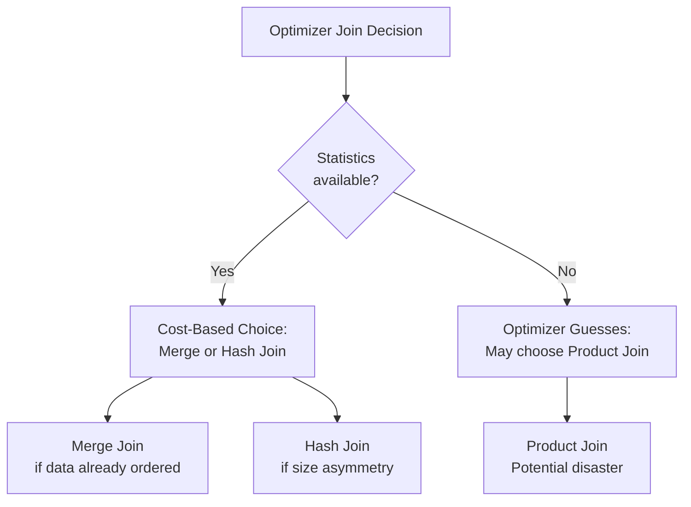

# Query Optimization — Fundamentals


## 🎯 Analogy

Think of Teradata query optimization like a relay race: each AMP runs its leg in parallel. Redistribute steps (moving rows between AMPs) are the handoffs — minimize them by choosing Primary Indexes that co-locate frequently joined data.

---
## The Teradata Optimizer

Teradata uses a **cost-based optimizer (CBO)** that generates multiple execution plan candidates and chooses the lowest-cost one based on:
- Table statistics (row counts, data distribution)
- Available indexes (PI, secondary indexes, join indexes)
- System resources (AMP count, memory)
- Join type options (merge join, hash join, product join)

Unlike pure rule-based optimizers, Teradata's CBO adapts its plan based on actual table statistics. **Without statistics, the optimizer makes assumptions that are often wrong.**

---

## Reading an EXPLAIN Plan

`EXPLAIN` shows you exactly how Teradata plans to execute your query — before it runs.

```sql
EXPLAIN
SELECT c.customer_name, SUM(o.total_amount) AS revenue
FROM orders o
JOIN customer c ON o.customer_id = c.customer_id
WHERE o.order_date >= '2024-01-01'
GROUP BY c.customer_name;
```

**Sample EXPLAIN output (simplified):**
```
1) First, we lock SALES.orders for read.
   We lock SALES.customer for read.
2) Next, we do an all-AMPs RETRIEVE step from SALES.orders
   with a condition of ("orders.order_date >= DATE '2024-01-01'")
   extracting rows into spool 1 (all AMPs), ...
3) We do an all-AMPs JOIN step from spool 1 (all AMPs)
   by way of a MERGE JOIN operator, matched by rowkey only.
   The result goes into spool 2 (all AMPs).
4) Finally, we do an all-AMPs SUM step ...
   The result is sent back to the user.
```

---

## Key EXPLAIN Terms

| Term | Meaning |
|---|---|
| **all-AMPs RETRIEVE** | Full table scan across all AMPs |
| **single-AMP RETRIEVE** | Single-AMP lookup (PI filter present) |
| **MERGE JOIN** | Sort-merge join (requires matching row order) |
| **HASH JOIN** | Hash-based join |
| **PRODUCT JOIN** | Nested-loop / Cartesian — usually a bad sign |
| **Redistribute rows** | Moving rows across AMPs via BYNET (expensive) |
| **Duplicate rows** | Broadcasting small table to all AMPs |
| **spool** | Intermediate result set stored on AMP disk |
| **Confidence: [none/low/medium/high]** | How much the optimizer trusts its row count estimate |

---

## Join Strategies

### Merge Join
- Both inputs are sorted by join key
- Rows are merged like a zipper
- **Best for:** Large tables where both sides have matching data sorted/indexed on join key
- **Requires:** Data is on the same AMP or gets redistributed first

### Hash Join
- Build a hash table from the smaller input
- Probe with the larger input
- **Best for:** Joining a large table to a smaller one
- **Requires:** Sufficient spool/memory for hash table

### Product Join (avoid!)
- Every row from table A joined to every row from table B
- **Cost:** O(A×B) — extremely expensive
- **Cause:** Missing statistics, incorrect join conditions, or optimizer confusion
- **Fix:** Collect statistics, verify join conditions are correct



---

## Row Redistribution vs Duplication

When two tables' data isn't co-located (different PIs), Teradata must move data before joining:

**Redistribution:** Rows from one table are re-hashed and sent to AMPs based on the join key.
- Used when: Large tables, join on non-PI column
- Cost: BYNET traffic proportional to table size

**Duplication (broadcast):** The entire smaller table is copied to every AMP.
- Used when: One table is small enough to fit in memory per AMP
- Cost: Small table size × number of AMPs
- Threshold: Teradata defaults to duplicate tables < ~3–5% of large table

```sql
-- EXPLAIN will show which is happening:
-- "Redistribute rows in spool X ..." → redistribution
-- "Duplicate rows of table X to all AMPs ..." → duplication
```

---

## The Impact of Missing Statistics

Without statistics, the optimizer uses default estimates:
- Table has 1,000 rows (when it actually has 1 billion)
- All values are equally distributed (when there's extreme skew)
- JOIN selectivity is 10% (when it's actually 0.001%)

These wrong estimates lead to:
- Wrong join order (joining large to small before filtering)
- Product joins (when merge join is appropriate)
- Spool blowout (underestimating intermediate result sizes)

```sql
-- Always collect statistics on new tables before querying
COLLECT STATISTICS ON orders COLUMN (customer_id);
COLLECT STATISTICS ON orders COLUMN (order_date);
COLLECT STATISTICS ON orders INDEX (customer_id); -- PI stats
```

---


## ▶️ Try It Yourself

```sql
-- EXPLAIN: see the query plan before running
EXPLAIN
SELECT c.region, SUM(o.amount) revenue
FROM orders o JOIN customers c ON o.customer_id = c.customer_id
WHERE o.order_date >= '2024-01-01'
GROUP BY c.region;

-- Look for in EXPLAIN output:
-- "no redistribution required" = good (co-located join)
-- "redistributed by hash" = extra network step (check PI)

-- Collect statistics (must be done manually in Teradata)
COLLECT STATISTICS COLUMN (customer_id) ON orders;
COLLECT STATISTICS COLUMN (order_date)  ON orders;

-- Check stale statistics
SELECT DatabaseName, TableName, ColumnName, LastCollectTimeStamp
FROM DBC.ColumnStatsV
WHERE TableName = 'orders'
ORDER BY LastCollectTimeStamp;
```

> **Run it:** Copy the snippet into a REPL or file — no external services needed for the basic example.

---
## Interview Tips

> **Tip 1:** "How do you troubleshoot a slow Teradata query?" — "First, run EXPLAIN to see the execution plan. Look for product joins (catastrophic), all-AMP scans on large tables (expected but tunable), and confidence levels. If confidence is 'none', missing statistics is likely the cause. Then COLLECT STATISTICS on the relevant columns."

> **Tip 2:** "What is a product join and why is it bad?" — "A product join (nested loop) joins every row of table A with every row of table B — O(A×B) complexity. On a million-row table, that's a trillion comparisons. It usually happens when statistics are missing, causing the optimizer to massively underestimate table sizes."

> **Tip 3:** "What does 'Redistribute rows' mean in an EXPLAIN?" — "It means rows from one table need to be moved across AMPs via BYNET to co-locate them with matching rows from the other table for a join. This is expensive for large tables and indicates the join is on non-PI columns."
