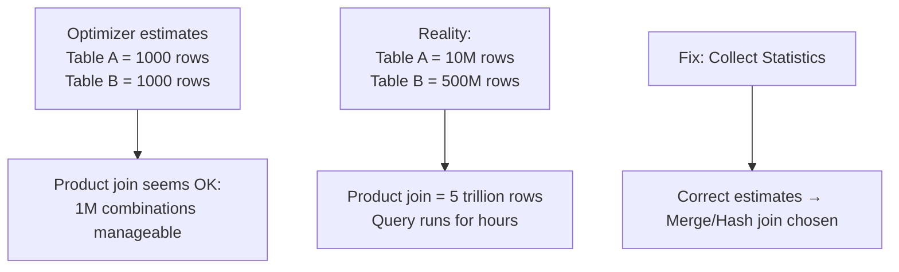
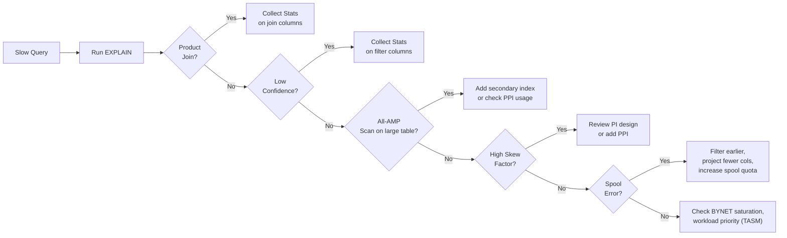

# Query Optimization — Senior Deep Dive

## Optimizer Architecture: Two-Phase Planning

Teradata's optimizer is a **two-phase cost-based optimizer**:

**Phase 1 — Logical Optimization:**
- Predicate pushdown (filters applied as early as possible)
- Subquery unnesting (correlated subqueries → joins)
- Join reordering (try multiple join sequences)
- View/macro expansion

**Phase 2 — Physical Optimization:**
- For each logical plan: evaluate physical implementations
- Choose join method (merge, hash, product)
- Decide row routing strategy (redistribute vs duplicate)
- Estimate cost using statistics and system catalog

The optimizer explores up to **N!** join orderings (limited by heuristics for large queries). For a 10-table join, it may evaluate thousands of plans.

---

## Join Strategies: Deep Analysis

### Merge Join
**Prerequisites:** Both inputs sorted on join key (or already stored that way)
**Steps:**
1. Both spools are sorted/redistribured by join key
2. Rows are merged in a single pass — O(A+B)
**Best when:** Both tables are large, data is already on same AMPs (PI join)

### Hash Join
**Steps:**
1. Build phase: hash smaller table into in-memory hash table
2. Probe phase: stream larger table, probe hash table
**Cost:** O(A) build + O(B) probe
**Best when:** Size asymmetry (one table much smaller than other)
**Risk:** If the "small" table is larger than estimated, hash table spills to spool → performance degrades

### Nested Join (Limited form)
**Prerequisites:** Outer table row set is tiny (single row or small set)
**Steps:** For each row in outer, do a PI lookup in inner
**Best when:** Highly selective filter on outer table first

### Product Join (Cartesian)
- All rows × all rows
- Only legitimate use: tables with no join condition (cross join intentional)
- **Optimizer trigger:** Missing or stale stats cause optimizer to underestimate table sizes, leading to incorrect merge/hash → product fallback



---

## Partition Elimination: Internals

When a query has a PPI table and filters on the partition column, the optimizer does **partition elimination** at plan time:

```sql
-- Table has monthly partitions (72 total for 6 years)
SELECT * FROM sales_fact
WHERE sale_date BETWEEN '2024-01-01' AND '2024-03-31';
```

**EXPLAIN output:**
```
We do an all-AMPs RETRIEVE step from SALES.sales_fact
  with a condition of (sale_date BETWEEN DATE '2024-01-01' AND DATE '2024-03-31')
  using 3 of 72 partitions.
```

**What's eliminated:** Each AMP only scans 3 partition segments instead of 72 → 95.8% I/O reduction.

**Partition elimination failure cases:**
- Function applied to partition column: `YEAR(sale_date) = 2024` → no elimination
- Implicit type cast: `WHERE sale_date = '2024-01-01'` (string vs DATE mismatch) → may prevent elimination
- CAST in WHERE: `WHERE CAST(sale_date AS CHAR(7)) = '2024-01'` → no elimination

**Solution:** Always use native DATE literals with range predicates:
```sql
WHERE sale_date BETWEEN DATE '2024-01-01' AND DATE '2024-03-31'
```

---

## Join Index for Optimization

Join indexes can completely change optimizer behavior for critical queries:

```sql
-- Create a join index that pre-joins two large tables
CREATE JOIN INDEX ji_sales_customer AS
SELECT
    s.sale_id, s.sale_date, s.amount,
    c.customer_name, c.region
FROM sales_fact s
JOIN customer c ON s.customer_id = c.customer_id
PRIMARY INDEX (s.customer_id)
PARTITION BY RANGE_N(s.sale_date BETWEEN DATE '2020-01-01'
                     AND DATE '2025-12-31' EACH INTERVAL '1' MONTH);
```

The optimizer will use this join index when:
- Query accesses a subset of its columns
- The join index's PI matches the query's access pattern

**Trade-offs:**
- Automatic maintenance on every DML to base tables (write amplification)
- Additional permanent space (pre-joined rows are stored)
- Only beneficial if the join is run extremely frequently and the join is expensive

---

## Query Rewriting: Advanced Patterns

### Eliminating Correlated Subqueries

```sql
-- BAD: Correlated subquery executed once per row
SELECT order_id, total_amount
FROM orders o
WHERE total_amount > (
    SELECT AVG(total_amount)
    FROM orders
    WHERE customer_id = o.customer_id
);

-- GOOD: Window function — single pass
SELECT order_id, total_amount
FROM (
    SELECT order_id, total_amount,
           AVG(total_amount) OVER (PARTITION BY customer_id) AS avg_amount
    FROM orders
) t
WHERE total_amount > avg_amount;
```

### Avoiding Implicit Type Conversions

```sql
-- BAD: customer_id is INTEGER, '1001' is VARCHAR → implicit cast on every row
WHERE customer_id = '1001'

-- GOOD: Match types exactly
WHERE customer_id = 1001
```

Implicit casts prevent PI-based routing: the hash is computed on the original type, but the cast changes the comparison domain, potentially forcing full scans.

---

## Optimizer Hints and Workarounds

Teradata supports limited optimizer hints via session-level settings:

```sql
-- Force hash join (prevent product join)
SET SESSION OVERRIDE JOINPLAN = 'HASHJOIN';

-- Check optimizer confidence levels
DIAGNOSTIC HELPSTATS ON FOR SESSION;

-- Force statistics refresh using actual row count
COLLECT STATISTICS USING SAMPLE 100 PERCENT ON orders COLUMN (customer_id);

-- EXPLAIN with more detail (shows confidence per step)
EXPLAIN IN XML
SELECT ...;
```

**DIAGNOSTIC HELPSTATS:**
```sql
DIAGNOSTIC HELPSTATS ON FOR SESSION;
SELECT COUNT(*) FROM large_table;
-- After the query, run:
SHOW STATISTICS ON large_table;
-- Check if HELPSTATS suggests new statistics to collect
```

---

## Performance Pathways Summary



---

## Interview Tips

> **Tip 1:** "Walk me through how you'd optimize a 10-minute query in Teradata." — "1) EXPLAIN to identify the plan. 2) Check for product joins (fix with stats). 3) Check confidence levels (fix with COLLECT STATS). 4) Check partition elimination (ensure WHERE uses native date types). 5) Check skew factor (review PI or use PPI). 6) Check spool usage (filter/project earlier). 7) DBQL for historical performance patterns."

> **Tip 2:** "How does the Teradata optimizer decide between merge join and hash join?" — "It estimates the cost of each based on statistics. Merge join is preferred when data is already sorted/distributed on the join key (PI join). Hash join is preferred when one input is significantly smaller. Product join is a fallback when estimates are wrong."

> **Tip 3:** "What is DIAGNOSTIC HELPSTATS?" — "A session-level setting that makes Teradata recommend which statistics to collect based on the queries you run. After enabling it, run your slow queries, then check the recommendations — it tells you exactly which column/index statistics would help the optimizer most."

> **Tip 4:** "Why does applying a function to a PPI column break partition elimination?" — "Partition elimination works at the storage level — the optimizer maps date range predicates to partition numbers at plan time. When you wrap the column in a function (like YEAR() or CAST()), the optimizer can't statically map the predicate to partition numbers, so it falls back to scanning all partitions."
