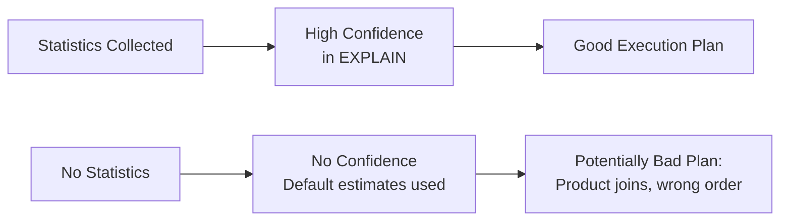

# Statistics — Fundamentals


## 🎯 Analogy

Think of statistics in Teradata like a GPS map: without up-to-date statistics, the optimizer makes guesses about row counts and distributions. Wrong guesses lead to bad join strategies — always collect stats after large data loads.

---
## Why Statistics Matter

Teradata's optimizer is **cost-based** — it chooses query plans based on estimated costs. Those estimates come from statistics. Without accurate statistics, the optimizer makes wrong decisions that can turn a 2-minute query into a 2-hour disaster.

**What the optimizer needs to know:**
- How many rows does each table have?
- How many distinct values does each column have?
- How are values distributed across AMPs (skew)?
- What's the selectivity of each predicate?

Without statistics, the optimizer uses default estimates: 1,000 rows per table, uniform distribution, 10% selectivity. These are almost always wrong.

---

## COLLECT STATISTICS Syntax

```sql
-- Collect statistics on a single column
COLLECT STATISTICS ON orders COLUMN (customer_id);

-- Collect statistics on the Primary Index
COLLECT STATISTICS ON orders INDEX (customer_id);

-- Collect statistics on multiple columns (multi-column stats)
COLLECT STATISTICS ON orders COLUMN (customer_id, order_date);

-- Collect statistics on all columns (rarely used — expensive)
COLLECT STATISTICS ON orders ALL;
```

---

## What Statistics Capture

For each collected column/index, Teradata stores:
- **Total row count**
- **Distinct value count** (cardinality)
- **Null count**
- **Min/max values**
- **Value frequency histogram** (distribution of values)
- **Collection timestamp**

This metadata is stored in the **Data Dictionary** (DBC tables) and used by the optimizer at query parse time.

---

## Viewing Statistics

```sql
-- Show all statistics on a table
SHOW STATISTICS ON orders;

-- Check when statistics were last collected
SELECT DatabaseName, TableName, ColumnName, LastCollectDate, RowCount
FROM DBC.StatsV
WHERE TableName = 'orders'
ORDER BY LastCollectDate DESC;
```

---

## Statistics and Optimizer Confidence

The optimizer communicates its confidence in row estimates in the EXPLAIN plan:

| Confidence Level | Meaning |
|---|---|
| **High** | Fresh statistics, optimizer trusts estimates |
| **Medium** | Statistics exist but may be somewhat stale |
| **Low** | Statistics exist but are significantly stale or sampled |
| **None** | No statistics collected — optimizer uses defaults |



---

## When to Collect Statistics

| Situation | Action |
|---|---|
| New table created | Collect stats before first production query |
| After bulk load (FastLoad/MultiLoad) | Collect stats on loaded columns |
| Significant data change (> 10%) | Refresh stats on affected columns |
| Queries suddenly slow | Check for stale stats first |
| After PI redesign / PPI added | Collect PARTITION stats |

---

## Random AMP Sampling vs Full Scan

Teradata can collect statistics two ways:

**Full scan:** Reads every row on every AMP. Most accurate but expensive.
```sql
COLLECT STATISTICS ON large_table COLUMN (region);
```

**Random AMP sampling:** Reads a sample of AMPs and extrapolates. Faster but less accurate.
```sql
COLLECT STATISTICS USING SAMPLE 10 PERCENT ON large_table COLUMN (region);
```

**When to use sampling:**
- Tables > 10 billion rows where full scan takes hours
- Columns with uniform or near-uniform distribution
- Non-critical columns where approximate stats are sufficient

**Never use sampling for:**
- PI columns (optimizer relies on exact distribution for join decisions)
- Heavily skewed columns (sampling will miss the skew pattern)
- Partition columns (PARTITION stats need full accuracy)

---


## ▶️ Try It Yourself

```sql
-- Collect statistics on frequently filtered/joined columns
COLLECT STATISTICS
    COLUMN (customer_id)                  -- Join column
  , COLUMN (order_date)                   -- Filter column
  , COLUMN (region)                       -- Group-by column
  , INDEX (order_id)                      -- Primary index
ON raw.orders;

-- Check when statistics were last collected and how many rows they saw
SELECT ColumnName, LastCollectTimeStamp, SampleSize, RowCount
FROM DBC.ColumnStatsV
WHERE DatabaseName = 'raw' AND TableName = 'orders'
ORDER BY LastCollectTimeStamp;

-- Auto-stats: let Teradata decide when to re-collect
COLLECT STATISTICS USING THRESHOLD 10 PERCENT
ON raw.orders COLUMN (order_date);
```

> **Run it:** Copy the snippet into a REPL or file — no external services needed for the basic example.

---
## Interview Tips

> **Tip 1:** "Why do we collect statistics in Teradata?" — "The cost-based optimizer uses statistics to estimate row counts and data distribution for every step in the execution plan. Without statistics, it falls back to wrong defaults (1,000 rows, uniform distribution), leading to product joins, wrong join order, and spool explosions."

> **Tip 2:** "What columns should you prioritize for statistics collection?" — "Primary Index columns (optimizer uses these for PI access decisions), join columns, WHERE filter columns, and partition columns (COLUMN (PARTITION) for PPI tables). Also collect on columns with known skew."

> **Tip 3:** "What does 'no confidence' in an EXPLAIN mean?" — "It means no statistics have been collected on the relevant columns. The optimizer is using its default assumptions. First action: COLLECT STATISTICS on the columns referenced in the slow query, then re-run EXPLAIN."
