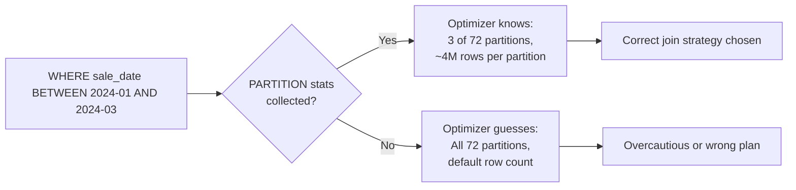

# Statistics — Intermediate

## Multi-Column Statistics

Single-column statistics tell the optimizer about each column independently. **Multi-column statistics** capture the correlation between columns:

```sql
-- Single column stats (independent)
COLLECT STATISTICS ON orders COLUMN (customer_id);
COLLECT STATISTICS ON orders COLUMN (order_date);

-- Multi-column stats (captures correlation)
COLLECT STATISTICS ON orders COLUMN (customer_id, order_date);
```

**Why multi-column stats matter:**
```sql
-- Query with compound predicate
WHERE customer_id = 12345 AND order_date = '2024-01-15'
```

- With single-column stats: optimizer estimates selectivity independently and multiplies (10% × 5% = 0.5%)
- With multi-column stats: optimizer has the actual distribution for the combination
- If `customer_id=12345` always has orders on every date, the optimizer knows the compound selectivity is ~5%, not 0.5%

**Collect multi-column stats on:**
- Column pairs commonly used together in WHERE clauses
- Columns in compound join conditions
- Date + another column for time-partitioned analytical queries

---

## Partition Statistics

PPI tables require a special **PARTITION** statistics collection:

```sql
-- Critical: collect partition-level stats on PPI tables
COLLECT STATISTICS ON sales_fact COLUMN (PARTITION);

-- Also collect on the partition column itself
COLLECT STATISTICS ON sales_fact COLUMN (sale_date);
```

Without PARTITION statistics, the optimizer cannot accurately estimate:
- How many partitions will be scanned
- Row count per partition (critical for join planning)
- Whether partition elimination reduces the result set significantly



---

## DIAGNOSTIC HELPSTATS

`HELPSTATS` is Teradata's built-in statistics advisor. Enable it for a session, run your queries, then ask for recommendations:

```sql
-- Enable HELPSTATS
DIAGNOSTIC HELPSTATS ON FOR SESSION;

-- Run your slow query
SELECT c.customer_name, SUM(o.amount)
FROM orders o JOIN customer c ON o.customer_id = c.customer_id
WHERE o.order_date >= '2024-01-01'
GROUP BY c.customer_name;

-- Get recommendations
DIAGNOSTIC HELPSTATS OFF FOR SESSION;

-- Then check what HELPSTATS suggests (check EXPLAIN output for HELPSTATS section)
-- Or check DBC.StatsCols for suggestions
```

**HELPSTATS output example:**
```
HELPSTATS recommends:
  COLLECT STATISTICS ON orders COLUMN (order_date)
  COLLECT STATISTICS ON orders COLUMN (customer_id, order_date)
  COLLECT STATISTICS ON customer INDEX (customer_id)
```

---

## Staleness Detection

Statistics become stale when data changes significantly. Identify stale stats:

```sql
-- Find tables with old statistics
SELECT
    t.DatabaseName,
    t.TableName,
    s.ColumnName,
    s.LastCollectDate,
    CURRENT_DATE - s.LastCollectDate AS DaysOld,
    s.RowCount AS StatsRows,
    -- Estimate current rows from storage size
    CAST(ts.CurrentPerm / 200 AS BIGINT) AS EstCurrentRows  -- rough: 200 bytes/row
FROM DBC.StatsV s
JOIN DBC.TablesV t ON s.DatabaseName = t.DatabaseName AND s.TableName = t.TableName
JOIN DBC.TableSizeV ts ON t.DatabaseName = ts.DatabaseName AND t.TableName = ts.TableName
WHERE s.LastCollectDate < CURRENT_DATE - 7   -- older than 1 week
  AND t.DatabaseName = 'SALES_DB'
ORDER BY DaysOld DESC;
```

**Staleness indicators:**
- Row count in stats is < 80% or > 120% of actual current row count
- Stats older than the last significant data load
- Queries that used to run fast are now slow (sudden regression)

---

## Statistics on Skewed Columns

For highly skewed columns, standard histogram statistics may not capture enough detail:

```sql
-- For a skewed column (e.g., 70% of rows have status='CLOSED')
COLLECT STATISTICS ON orders COLUMN (status);

-- Check what was captured
SHOW STATISTICS ON orders;
```

The histogram Teradata stores uses **"most-common values"** tracking — it explicitly records the top N most frequent values and their counts, providing accurate selectivity for common predicates.

**When skew isn't captured well:**
```sql
-- Force re-collect with SAMPLE 100 PERCENT for accuracy
COLLECT STATISTICS USING SAMPLE 100 PERCENT ON orders COLUMN (status);
```

---

## Auto-Collection: Teradata's Automatic Statistics

In newer Teradata versions (TD 14+), **Automated Statistics Management** can:
- Detect when statistics become stale (> threshold of data change)
- Queue automatic stats collection during maintenance windows
- Prioritize based on query impact

```sql
-- Check if AUTOSTATS is enabled
SELECT * FROM DBC.AutoStatsV;

-- Configure auto-stats threshold (DBA task)
-- Typically set via Teradata Viewpoint or DBMS parameters
```

Even with auto-stats, critical production tables should have explicitly scheduled COLLECT STATISTICS in ETL pipelines — don't rely solely on automation for SLA-bound queries.

---

## Statistics Collection Checklist

```
New Table Deployment:
□ PI column(s) → COLLECT STATISTICS ... INDEX (pi_cols)
□ Frequent JOIN columns → COLLECT STATISTICS ... COLUMN (join_col)
□ Frequent WHERE columns → COLLECT STATISTICS ... COLUMN (filter_col)
□ PPI tables → COLLECT STATISTICS ... COLUMN (PARTITION)
□ Compound predicates → COLLECT STATISTICS ... COLUMN (col1, col2)

After Each Significant Load:
□ All columns listed above, refreshed
□ If row count changed > 10%, mandatory refresh

Weekly:
□ Full stats refresh for all production schema tables
□ Review DBC.StatsV for tables with LastCollectDate > 7 days
```

---

## Interview Tips

> **Tip 1:** "When should you use multi-column statistics?" — "When queries frequently filter on two or more columns together (compound predicates) or join on multiple columns. Multi-column stats capture correlation between columns — without them, the optimizer multiplies individual selectivities and underestimates the result set size."

> **Tip 2:** "What is DIAGNOSTIC HELPSTATS?" — "A session-level advisor that observes your queries and recommends which statistics to collect. Enable it, run your slow query, then check the recommendations. It's the fastest way to identify missing statistics without manually analyzing every column."

> **Tip 3:** "How do you handle statistics on a PPI table?" — "You must collect COLUMN (PARTITION) statistics — this tells the optimizer the row count per partition and enables accurate estimation of how many partitions a date-range query will scan. Without partition stats, the optimizer may assume all partitions are scanned."

> **Tip 4:** "How do you prevent statistics from going stale?" — "Integrate COLLECT STATISTICS calls into ETL pipelines (run after significant loads), set up a weekly automated refresh job for all production tables, and monitor DBC.StatsV for tables where LastCollectDate is old or where estimated vs actual row counts diverge."
