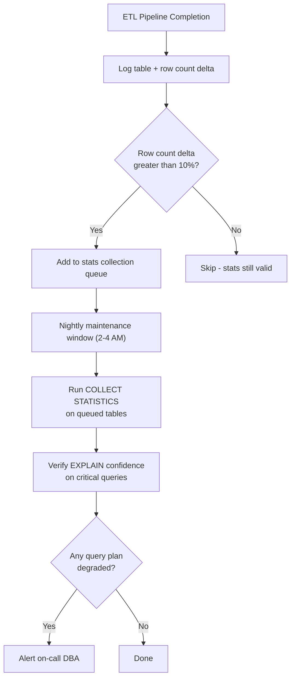

# Statistics — Real World

## Production Statistics Maintenance at Scale

At a large financial services firm with 200+ Teradata tables in production, the DBA team built an automated statistics maintenance framework:

### Architecture



### Implementation

```sql
-- Central tracking table
CREATE TABLE stats_maintenance_log (
    table_name      VARCHAR(128),
    last_stats_dt   DATE,
    last_load_rows  BIGINT,
    current_rows    BIGINT,
    delta_pct       DECIMAL(5,2),
    status          CHAR(20)  -- 'PENDING', 'COLLECTED', 'SKIPPED'
) PRIMARY INDEX (table_name);

-- ETL pipeline calls this procedure after each load
REPLACE PROCEDURE sp_flag_stale_stats(IN p_table VARCHAR(128))
BEGIN
    DECLARE v_stats_rows BIGINT;
    DECLARE v_current_rows BIGINT;

    SELECT RowCount INTO v_stats_rows
    FROM DBC.StatsV
    WHERE TableName = p_table AND ColumnName = 'primary_key';

    SELECT COUNT(*) INTO v_current_rows
    FROM :p_table;

    IF ABS(v_current_rows - v_stats_rows) * 100.0 / NULLIFZERO(v_stats_rows) > 10 THEN
        UPDATE stats_maintenance_log
        SET status = 'PENDING', current_rows = v_current_rows
        WHERE table_name = p_table;
    END IF;
END;
```

---

## Case Study: Stale Statistics Causing Month-End Failure

**Company:** A US bank's credit card analytics platform  
**Symptom:** Month-end revenue reconciliation query regressed from 45 minutes to 6 hours

**Root cause investigation:**
```sql
-- DBQL showed the exact date the regression started
SELECT LogDate, AVG(AMPCPUTime) AS AvgCPU
FROM DBC.QryLogV
WHERE QueryText LIKE '%revenue_reconciliation%'
GROUP BY LogDate
ORDER BY LogDate;
-- Output showed CPU spiked on the 3rd of the month
```

```sql
-- Statistics check: when were stats last collected?
SELECT TableName, ColumnName, LastCollectDate, RowCount
FROM DBC.StatsV
WHERE TableName IN ('fact_transactions', 'dim_merchant')
ORDER BY TableName, ColumnName;
-- Result: dim_merchant stats from 45 days ago
-- 45 days ago: 50,000 merchants
-- Current: 180,000 merchants (new merchants onboarded)
```

**What happened:** The optimizer thought `dim_merchant` was 50K rows → chose it as the "small" table in a hash join → hash table didn't fit in memory → product join fallback → 6 hours.

**Fix applied:**
```sql
COLLECT STATISTICS ON dim_merchant COLUMN (merchant_id);
COLLECT STATISTICS ON dim_merchant INDEX (merchant_id);
```

**Result:** Query returned to 40 minutes (even slightly faster than before due to optimizer now knowing the table size accurately).

**Process improvement:** Added `COLLECT STATISTICS` to the merchant onboarding pipeline — any batch that adds > 1,000 new merchants now triggers automatic stats refresh.

---

## Real Pattern: Statistics in an ETL Pipeline

A major retail analytics pipeline (Snowflake → Teradata migration era) standardized this pattern:

```bash
#!/bin/bash
# ETL pipeline step: load and collect stats

# 1. Load data via FastLoad or BTEQ
bteq < load_daily_sales.bteq

# 2. Immediately collect statistics
bteq <<EOF
.LOGON $TERADATA_HOST/$USER,$PASSWORD;

-- Collect stats on the loaded table
COLLECT STATISTICS ON sales_fact COLUMN (sale_date);
COLLECT STATISTICS ON sales_fact COLUMN (customer_id);
COLLECT STATISTICS ON sales_fact COLUMN (product_id);
COLLECT STATISTICS ON sales_fact COLUMN (PARTITION);  -- PPI table
COLLECT STATISTICS ON sales_fact INDEX (customer_id);

-- Verify row count matches expected
SELECT COUNT(*) AS loaded_rows FROM sales_fact
WHERE sale_date = CURRENT_DATE - 1;

.LOGOFF;
EOF

# 3. Alert if stats collection fails
if [ $? -ne 0 ]; then
    echo "Statistics collection failed for sales_fact" | mail -s "ALERT: Stats Failure" dba-team@company.com
fi
```

**Pipeline rule:** Statistics collection is a **mandatory step** after every load, not optional cleanup. If stats collection fails, the pipeline is considered failed.

---

## Statistics Monitoring Dashboard Queries

```sql
-- Weekly report: tables with potentially stale statistics
SELECT
    s.DatabaseName,
    s.TableName,
    s.ColumnName,
    s.LastCollectDate,
    CURRENT_DATE - s.LastCollectDate AS DaysOld,
    s.RowCount AS StatsRowCount,
    ZEROIFNULL(ts.CurrentPerm) / 1e9 AS TableSizeGB,
    CASE
        WHEN CURRENT_DATE - s.LastCollectDate > 30 THEN 'CRITICAL'
        WHEN CURRENT_DATE - s.LastCollectDate > 14 THEN 'WARNING'
        ELSE 'OK'
    END AS StaleStatus
FROM DBC.StatsV s
LEFT JOIN DBC.TableSizeV ts
    ON s.DatabaseName = ts.DatabaseName AND s.TableName = ts.TableName
WHERE s.DatabaseName = 'PROD_DB'
ORDER BY DaysOld DESC;
```

---

## Interview Tips

> **Tip 1:** "How do you integrate statistics collection into an ETL pipeline?" — "Statistics collection is a mandatory pipeline step, not optional maintenance. After every significant load, run COLLECT STATISTICS on all join columns, filter columns, PI, and PARTITION columns. If stats collection fails, mark the pipeline as failed — running queries with stale stats is worse than delaying the pipeline."

> **Tip 2:** "How do you monitor statistics health in a production Teradata environment?" — "Build a weekly report from DBC.StatsV comparing LastCollectDate against expected refresh frequency. Flag tables where DaysOld exceeds thresholds (e.g., 7 days for heavily loaded tables, 30 days for stable dimensions). Also compare StatsRowCount against DBC.TableSizeV estimates to detect growth."

> **Tip 3:** "Tell me about a statistics-related production incident." — "Describe the pattern: dimension table grew significantly, stats weren't refreshed, optimizer chose wrong join strategy (product join or hash join overflow), query performance collapsed. Root cause was insufficient post-load automation. Fix included both immediate stats refresh and pipeline modification to collect stats automatically."

> **Tip 4:** "What's your strategy for statistics on a 10-billion-row fact table?" — "Use SAMPLE collection for non-critical columns to keep collection time manageable. Always full-scan collect on PI columns, join columns, and PARTITION. Schedule full collection weekly during low-traffic windows. Trigger immediate refresh if row count increases > 10% since last collection."
