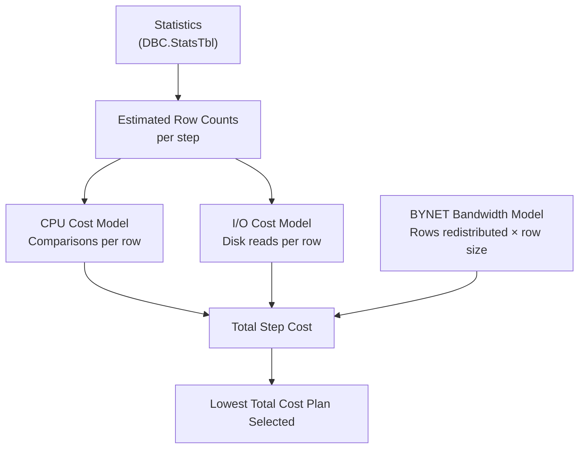

# Statistics — Senior Deep Dive

## How Teradata Stores Statistics Internally

Statistics are stored in **DBC.StatsTbl** (internal) and surfaced through DBC.StatsV. Each statistics object contains:

1. **Summary data:** Row count, distinct count, null count, min, max
2. **Histogram:** A set of intervals (buckets) representing the value distribution
3. **Most-common values (MCV) list:** Top N values by frequency, with exact counts

The optimizer uses the MCV list for equality predicates (`WHERE col = value`) and the histogram for range predicates (`WHERE col BETWEEN x AND y`).

**Histogram accuracy degrades when:**
- Data has high skew (a few values dominate)
- Collected via SAMPLE and the sample missed extreme values
- Data distribution changes significantly post-collection

---

## Sampling Mechanics

When you use `USING SAMPLE PERCENT N`:

1. Teradata selects N% of AMPs at random
2. On each selected AMP, reads a random N% of rows
3. Extrapolates from the sample to estimate full-table statistics

**Limitations of sampling:**
- Rare values (appearing in < 1% of rows) may not appear in a 10% sample
- High-skew columns: the sample may over/underrepresent extreme values
- Partition statistics: sampling less reliable — may miss sparsely populated partitions

```sql
-- Full scan stats (expensive but accurate)
COLLECT STATISTICS ON fact_table COLUMN (customer_id);

-- 10% sample (fast, less accurate)
COLLECT STATISTICS USING SAMPLE 10 PERCENT ON fact_table COLUMN (region);

-- Adaptive sampling (Teradata decides sample size based on cardinality)
COLLECT STATISTICS USING SAMPLE ON fact_table COLUMN (customer_id);
```

---

## Statistics and Join Planning: The Optimizer's Internal Math

Given two tables, the optimizer estimates the cost of each join strategy:

**Merge join cost:**
```
Cost = Sort(A) + Sort(B) + Merge(A,B)
     ≈ A×log(A) + B×log(B) + (A+B)
```

**Hash join cost:**
```
Cost = Build(smaller) + Probe(larger)
     ≈ min(A,B) + max(A,B)
```

**Product join cost:**
```
Cost = A × B  (catastrophically expensive for large tables)
```

The optimizer computes these costs using **row count estimates from statistics**. If stats say A=1,000 rows when A=1,000,000,000 rows, the cost model is off by 6 orders of magnitude — any plan choice could be made.

---

## Teradata Optimizer Cost Model Components



The optimizer also considers:
- **AMP count** (more AMPs = lower cost per step for parallel operations)
- **Available memory per AMP** (hash join feasibility)
- **BYNET bandwidth** (redistribution cost)
- **Spool I/O** (cost of materializing intermediate results)

---

## Statistics on Derived Columns and Expressions

The optimizer cannot use column statistics for derived expressions:

```sql
-- No statistics available for this expression
WHERE EXTRACT(YEAR FROM order_date) = 2024

-- Statistics available (if collected on order_date)
WHERE order_date BETWEEN '2024-01-01' AND '2024-12-31'
```

**Generated columns (Teradata):** If you frequently filter on a derived expression, consider adding a computed/generated column and collecting statistics on it:

```sql
-- Add generated column
ALTER TABLE orders ADD order_year AS CAST(EXTRACT(YEAR FROM order_date) AS SMALLINT);

-- Collect statistics on derived column
COLLECT STATISTICS ON orders COLUMN (order_year);
```

---

## Statistics Versioning and History

Teradata stores only the **most recent** statistics collection — there's no built-in history of how statistics changed over time. For auditing and regression analysis, build your own history table:

```sql
-- Create a stats history table
CREATE TABLE stats_history (
    collect_ts      TIMESTAMP(0) DEFAULT CURRENT_TIMESTAMP,
    database_name   VARCHAR(128),
    table_name      VARCHAR(128),
    column_name     VARCHAR(128),
    row_count       BIGINT,
    distinct_count  BIGINT,
    last_collect_dt DATE
) PRIMARY INDEX (table_name, collect_ts);

-- Populate nightly
INSERT INTO stats_history
SELECT CURRENT_TIMESTAMP, DatabaseName, TableName, ColumnName, RowCount, DistinctCount, LastCollectDate
FROM DBC.StatsV
WHERE DatabaseName = 'SALES_DB';
```

This history lets you answer: "Were statistics stale when the query regressed?"

---

## SHOW STATISTICS Output Interpretation

```sql
SHOW STATISTICS ON orders;
```

**Output fields to understand:**
- `UNIQUE VALUES`: distinct value count — low = risk of skew
- `NULL VALUES`: null count — high = watch for NULL skew
- `SAMPLE SIZE`: how many rows the histogram was built from
- `MEAN INTERVAL SIZE`: average bucket width in the histogram
- `LAST COLLECTED`: timestamp — check against last data load

**Red flags:**
- `UNIQUE VALUES = 1` for a column used in WHERE (optimizer knows this is useless as a filter)
- Large gap between `SAMPLE SIZE` and table row count (stats collected on very small sample)
- Old timestamp on a frequently loaded table

---

## Interview Tips

> **Tip 1:** "How does Teradata's optimizer use statistics internally?" — "The optimizer builds a cost model combining CPU cost, I/O cost, and BYNET redistribution cost. It uses statistics to estimate row counts at each step, then computes the total cost for each candidate plan (different join orders, join strategies). The lowest-cost plan wins."

> **Tip 2:** "What's the risk of always using SAMPLE statistics?" — "Sampling can miss rare values, misrepresent skewed distributions, and underestimate partition-level row counts. For PI columns, join columns, and partition columns, always use full-scan statistics. Reserve sampling for non-critical columns on very large tables where full collection is prohibitively expensive."

> **Tip 3:** "How would you design a statistics maintenance system for a 50-table production schema?" — "Tier the tables by criticality and data velocity. Critical fact tables: post-load stats collection in ETL, plus weekly full refresh. Dimension tables: stats on every load. Staging tables: stats after each load, dropped with the table. Monitor DBC.StatsV for staleness and compare row count estimates to actual via DBC.TableSizeV."

> **Tip 4:** "What is the most-common values list in statistics?" — "When collecting statistics, Teradata records the top N most frequent column values with their exact counts (not just histogram buckets). This lets the optimizer accurately estimate selectivity for equality predicates on skewed columns — e.g., knowing that 'CLOSED' = 70% of status values lets it correctly estimate a WHERE status = 'CLOSED' filter."
