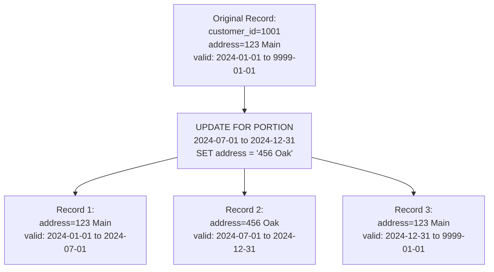

# Temporal Tables — Intermediate

## Sequenced vs Non-Sequenced Semantics

Temporal queries can use two modes:

### Sequenced Semantics
Operations are applied **within** the time dimension — they "see" only the history of valid records at each point in time. Most natural for business queries.

```sql
-- Sequenced UPDATE: Applies within the valid-time history
UPDATE customer_address
FOR PORTION OF VALID_TIME FROM DATE '2024-03-01' TO DATE '2024-09-01'
SET state = 'CA'
WHERE customer_id = 1001;
-- Result: Only the portion March–September 2024 gets state='CA'
-- Records before March and after September retain original state
```

### Non-Sequenced Semantics
Operations treat temporal columns as regular columns, ignoring the time dimension logic. Less common but sometimes needed for administrative corrections.

```sql
-- Non-sequenced: Directly modify the temporal column itself
UPDATE customer_address
SET valid_end = DATE '2024-06-30'
WHERE customer_id = 1001 AND valid_start = DATE '2024-01-01';
-- No temporal logic applied — direct column update
```

---

## PERIOD Overlap and Contained-In Operations

Teradata supports temporal predicates for period comparisons:

```sql
-- Find all address records that overlap with 2024
SELECT * FROM customer_address
WHERE valid_time OVERLAPS PERIOD(DATE) '(2024-01-01, 2025-01-01)';

-- Find records fully contained within Q1 2024
SELECT * FROM customer_address
WHERE PERIOD(DATE) '(2024-01-01, 2024-04-01)' CONTAINS valid_time;

-- Find records where the period equals a specific range exactly
SELECT * FROM customer_address
WHERE valid_time = PERIOD(DATE) '(2024-01-01, 2024-12-31)';
```

---

## Temporal DML: Split and Merge Behavior

When you UPDATE or DELETE a portion of a valid-time record, Teradata automatically splits or merges records:



**Splitting:** One row becomes up to three rows — before, during, and after the updated portion.

**Merging:** If adjacent records have identical values, Teradata can merge them:

```sql
-- After deleting a period, adjacent identical records may be merged
-- automatically if schema is set up for merge-on-update
```

---

## Slowly Changing Dimensions with Temporal Tables

Traditional SCD Type 2 requires manual date management. Teradata temporal tables automate this:

**Traditional SCD Type 2 (manual, error-prone):**
```sql
-- Close old record manually
UPDATE dim_customer
SET eff_end_date = CURRENT_DATE - 1, is_current = 'N'
WHERE customer_id = 1001 AND is_current = 'Y';

-- Insert new record manually
INSERT INTO dim_customer VALUES (1001, 'New Name', CURRENT_DATE, DATE '9999-12-31', 'Y');
```

**Teradata Temporal SCD Type 2 (automatic):**
```sql
-- Simple UPDATE — Teradata handles the history automatically
UPDATE customer_dim
FOR VALID_TIME AS OF CURRENT_DATE
SET customer_name = 'New Name'
WHERE customer_id = 1001;
-- Old record closed, new record created — all managed by Teradata
```

**Benefits:** No risk of not closing old records. No risk of gap/overlap in validity periods. Automatic handling of backdated changes.

---

## Transaction Time: Audit Queries

Transaction-time tables let you see historical database states:

```sql
-- Create transaction-time table
CREATE TABLE product_price (
    product_id  INTEGER NOT NULL,
    list_price  DECIMAL(10,2),
    sys_start   TIMESTAMP(6) GENERATED ALWAYS AS ROW START,
    sys_end     TIMESTAMP(6) GENERATED ALWAYS AS ROW END,
    PERIOD FOR SYSTEM_TIME (sys_start, sys_end)
) WITH SYSTEM VERSIONING;

-- What prices were visible at 9 AM on Jan 1?
SELECT product_id, list_price
FROM product_price
FOR SYSTEM_TIME AS OF TIMESTAMP '2024-01-01 09:00:00';

-- Full history of price changes
SELECT product_id, list_price, sys_start, sys_end
FROM product_price
FOR SYSTEM_TIME ALL
WHERE product_id = 42
ORDER BY sys_start;
```

---

## Bitemporal Queries: The Full Picture

```sql
-- Bitemporal query: What was the policy coverage on June 15, 2023,
-- and what did we know about it as of Jan 1, 2024?
SELECT policy_id, coverage_type, coverage_amount
FROM policy_coverage
FOR VALID_TIME AS OF DATE '2023-06-15'
FOR SYSTEM_TIME AS OF TIMESTAMP '2024-01-01 00:00:00'
WHERE policy_id = 9999;
```

This query answers: "On June 15, 2023 (valid time), what coverage did policy 9999 have — and what would we have seen if we queried the database at the start of 2024 (transaction time)?"

This is critical for financial and insurance firms — "what did we know, when did we know it?"

---

## Performance Considerations

Temporal tables add rows (not columns) for history — **storage increases** proportional to the rate of change:

| Table Type | Storage vs Non-Temporal |
|---|---|
| Slow-changing (< 5% annual change) | ~1.05× |
| Moderate-changing | 2–5× |
| Frequently corrected data | 10× or more |

**Index strategies for temporal tables:**
```sql
-- PI on business key + valid_start for time-based queries
CREATE TABLE customer_address (...)
PRIMARY INDEX (customer_id)
PARTITION BY RANGE_N(valid_start BETWEEN DATE '2020-01-01'
                     AND DATE '2030-12-31' EACH INTERVAL '1' YEAR);

-- Secondary index for AS OF queries
CREATE INDEX (customer_id, valid_end) ON customer_address;
```

---

## Interview Tips

> **Tip 1:** "How does a temporal UPDATE work in Teradata?" — "A temporal UPDATE on a valid-time table splits the original record into up to three pieces: the portion before the update, the updated portion, and the portion after. Teradata manages the period boundaries automatically — you just specify what to change and for which period."

> **Tip 2:** "How can temporal tables replace SCD Type 2?" — "Instead of manually closing old records (setting end dates, flipping flags), you issue a standard UPDATE with a valid-time qualifier. Teradata automatically closes the old record and creates the new one. This eliminates the most common SCD Type 2 bugs: forgetting to close old rows or creating gaps in validity periods."

> **Tip 3:** "What is the difference between sequenced and non-sequenced semantics?" — "Sequenced semantics apply operations within the time dimension — an UPDATE on a portion of time only changes that period. Non-sequenced semantics treat temporal columns as regular data — you can directly set the begin/end dates. Non-sequenced is needed for administrative corrections that bypass business logic."

> **Tip 4:** "What is a bitemporal query used for?" — "Bitemporal queries combine both valid time (when something was true in the world) and transaction time (when the database recorded it). This lets you answer regulatory questions like 'What coverage did this policy have on day X, as it was understood at time Y?' — critical for financial reporting and compliance."
