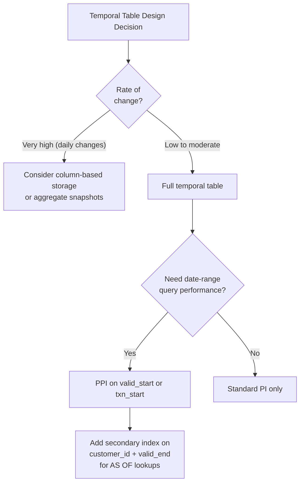

# Temporal Tables — Senior Deep Dive

## ANSI SQL:2011 Temporal Standard

Teradata was one of the first major databases to implement **ANSI SQL:2011 temporal features**. The standard defines:

1. **Application-time period tables** (valid time) — `PERIOD FOR period_name`
2. **System-versioned temporal tables** (transaction time) — `WITH SYSTEM VERSIONING`
3. **Bitemporal tables** — both dimensions
4. **Temporal predicates:** OVERLAPS, CONTAINS, EQUALS, PRECEDES, SUCCEEDS, IMMEDIATELY PRECEDES/SUCCEEDS

Teradata extends the standard with additional operators and optimizations.

---

## Period Normalization

**Period normalization** ensures that for a given entity, valid-time periods are:
- **Non-overlapping:** No two records cover the same moment in time
- **Contiguous:** No gaps in coverage (if required by business)

Teradata enforces **PERIOD FOR primary key** uniqueness — similar to a unique constraint but respecting time:

```sql
CREATE TABLE customer_address (
    customer_id     INTEGER NOT NULL,
    street_address  VARCHAR(200),
    valid_start     DATE NOT NULL,
    valid_end       DATE NOT NULL,
    PERIOD FOR valid_time (valid_start, valid_end)
) PRIMARY INDEX (customer_id);

-- Declare temporal primary key (prevents overlapping periods for same customer_id)
ALTER TABLE customer_address
    ADD PRIMARY KEY (customer_id) FOR PERIOD valid_time;
```

With this constraint, Teradata rejects any INSERT/UPDATE that would create overlapping validity periods for the same `customer_id`.

---

## Derived Period Columns

In some designs, you want to derive the valid-time period from existing columns rather than creating explicit PERIOD columns:

```sql
-- Table with natural begin/end columns
CREATE TABLE employee_salary (
    emp_id          INTEGER NOT NULL,
    salary          DECIMAL(12,2),
    effective_date  DATE NOT NULL,   -- begin
    end_date        DATE NOT NULL,   -- end
    PERIOD FOR employment_period (effective_date, end_date)
) PRIMARY INDEX (emp_id);
```

The `PERIOD FOR` declaration doesn't add columns — it just tells Teradata which existing date/timestamp columns form the period.

---

## Temporal Joins

Temporal tables enable powerful **period-aware joins** — joining records that were valid at the same time:

```sql
-- Find policy coverage and premium for all periods they were simultaneously valid
SELECT 
    c.policy_id,
    c.coverage_type,
    c.coverage_amount,
    p.premium_amount,
    -- The overlapping valid period
    GREATEST(BEGIN(c.valid_time), BEGIN(p.valid_time)) AS joint_start,
    LEAST(END(c.valid_time), END(p.valid_time)) AS joint_end
FROM policy_coverage c
JOIN policy_premium p
    ON c.policy_id = p.policy_id
    AND c.valid_time OVERLAPS p.valid_time
FOR VALID_TIME ALL;   -- Query all history, not just current
```

This query finds all time periods where both coverage and premium records were simultaneously active — impossible to write correctly without temporal semantics.

---

## Temporal Closed-Open Convention

Teradata uses **closed-open** intervals: [BEGIN, END)
- BEGIN is inclusive
- END is exclusive

**Implications:**
```sql
-- Period: 2024-01-01 to 2024-07-01
-- Covers: Jan 1, Feb 1, ..., Jun 30 (NOT Jul 1)
-- DOES NOT cover: Jul 1 2024

-- AS OF July 1 2024 would NOT match this record:
SELECT * FROM customer_address
FOR VALID_TIME AS OF DATE '2024-07-01'
WHERE customer_id = 1001;
-- Returns no rows if valid_end = 2024-07-01
```

**UNTIL_CHANGED:** The standard open-ended sentinel value. Teradata uses `DATE '9999-01-01'` internally to represent "currently active."

---

## Temporal Table Storage: Design Decisions



**Storage estimation for temporal tables:**

```sql
-- Estimate storage for temporal table given change rate
-- Formula: base_rows × (1 + avg_changes_per_entity) × avg_row_size

-- Example: 10M customers, avg 3 address changes over history
-- Storage = 10M × (1+3) × 200 bytes = ~8 GB
-- Plus PPI index overhead: ~8 × 1.3 = ~10.4 GB total
```

---

## Bitemporal Data Correction Patterns

A common scenario: you discover that data was entered incorrectly 3 months ago. You need to:
1. Record the correction (new transaction time)
2. Apply it retroactively (correct valid time)

```sql
-- Scenario: Coverage amount was $500K but should have been $1M
-- for policy 9999, coverage period Jan–Jun 2024

-- Step 1: Logically delete the incorrect record
-- (transaction time closes on the record as of NOW)
DELETE FROM policy_coverage
FOR PORTION OF VALID_TIME FROM DATE '2024-01-01' TO DATE '2024-07-01'
WHERE policy_id = 9999 AND coverage_type = 'LIABILITY';

-- Step 2: Insert the corrected record with the correct valid time
INSERT INTO policy_coverage (
    policy_id, coverage_type, coverage_amount, valid_from, valid_to
) VALUES (
    9999, 'LIABILITY', 1000000.00, DATE '2024-01-01', DATE '2024-07-01'
);
```

**What happened in transaction time:**
- The $500K record now has `txn_end = CURRENT_TIMESTAMP` (logically deleted)
- The $1M record has `txn_start = CURRENT_TIMESTAMP` (newly inserted)
- An audit query can show BOTH versions — the original incorrect one and the corrected one

```sql
-- Audit: Show the correction history
SELECT coverage_amount, valid_from, valid_to, txn_start, txn_end
FROM policy_coverage
FOR SYSTEM_TIME ALL
WHERE policy_id = 9999
ORDER BY txn_start, valid_from;
```

---

## Regulatory Compliance Use Cases

### Basel III / BCBS 239 (Banking)

Requires financial institutions to report risk exposure with:
- Point-in-time accuracy (what was exposure on date X?)
- Data lineage (when did we know about it?)

Bitemporal tables satisfy both requirements automatically:
```sql
-- Regulatory report: Risk exposure AS OF quarter-end, AS OF reporting date
SELECT risk_type, SUM(exposure_amount) AS total_exposure
FROM risk_exposure
FOR VALID_TIME AS OF DATE '2024-03-31'        -- Business date
FOR SYSTEM_TIME AS OF TIMESTAMP '2024-04-30 17:00:00'  -- When we submitted report
GROUP BY risk_type;
```

### GDPR / Data Retention

Bitemporal tables make it easier to implement data retention:
- Know exactly when data was created (transaction time)
- Know when it was "valid" (valid time)
- Enforce retention policies based on transaction time

---

## Interview Tips

> **Tip 1:** "How does Teradata prevent overlapping valid-time records?" — "By declaring a temporal primary key using `PRIMARY KEY (entity_id) FOR PERIOD valid_time`. This constraint prevents any INSERT or UPDATE that would create overlapping validity periods for the same entity — Teradata rejects the operation with a constraint violation error."

> **Tip 2:** "How do you correct historical data in a bitemporal table?" — "First, logically delete the incorrect record using DELETE FOR PORTION OF VALID_TIME — this closes the transaction-time end to NOW without physically removing the row. Then insert the corrected record. The old record remains in the transaction-time history, providing a complete audit trail of both the original error and the correction."

> **Tip 3:** "Why is Teradata's temporal support considered industry-leading?" — "Teradata was one of the earliest full implementations of ANSI SQL:2011 temporal. It supports both valid-time and transaction-time in a single table (bitemporal), provides temporal primary key constraints to prevent overlaps, handles automatic period splitting on UPDATE, and supports temporal joins (OVERLAPS predicate). Most databases support either valid time or transaction time, not both natively."

> **Tip 4:** "How do temporal tables relate to Slowly Changing Dimensions?" — "Temporal tables automate SCD Type 2 — instead of manually closing old records with end dates and flags, you issue a simple UPDATE and Teradata splits the records automatically. This eliminates the most common SCD bugs (missing record closure, date gaps) and provides built-in AS OF querying without manual date-range filtering."
