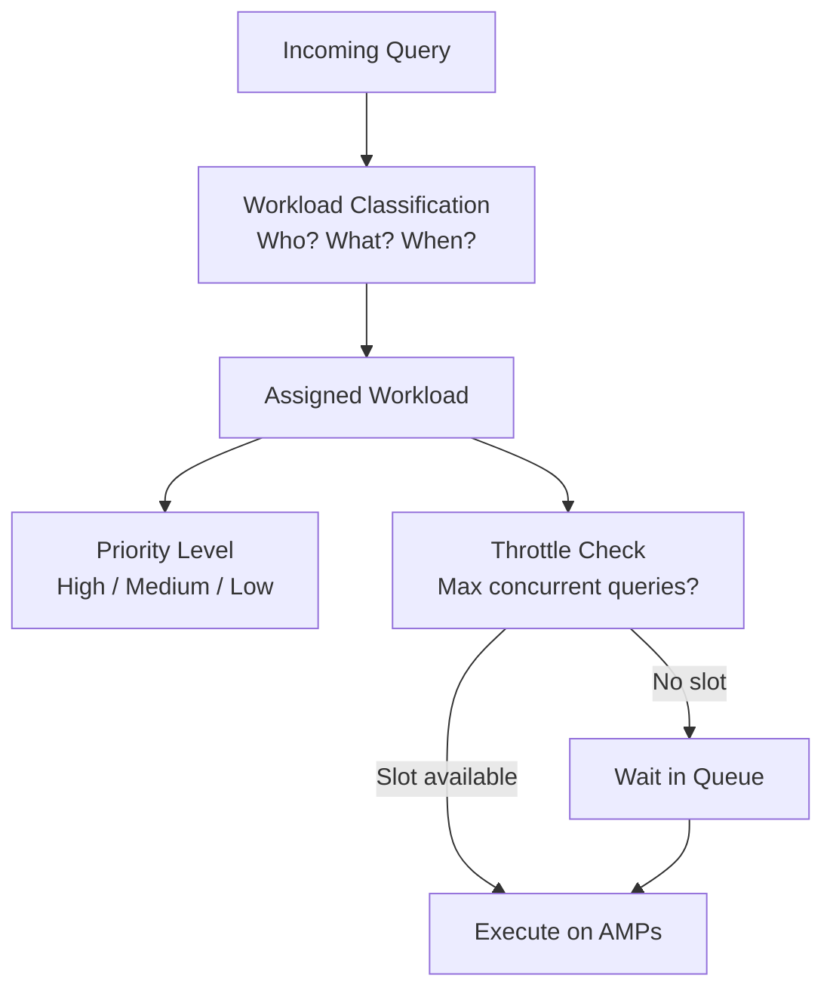

# Workload Management — Fundamentals

## Why Workload Management Matters

In a shared Teradata system, many different users and processes compete for the same AMP CPUs, memory, and I/O:
- Nightly ETL batch jobs loading billions of rows
- Analysts running complex multi-table reports
- Tactical API applications with 2-second SLA requirements
- Data scientists running exploratory queries

Without workload management, a long-running analyst query can starve a critical API call. **TASM (Teradata Active System Management)** controls how resources are allocated and prioritized.

---

## TASM Overview

**TASM** is Teradata's workload management framework. It allows administrators to:
- **Classify** queries into workload groups based on user, session, or request characteristics
- **Prioritize** workloads (tactical queries get CPU before batch)
- **Throttle** workloads (limit concurrent queries per group)
- **Set response goals** (SLA enforcement)
- **Dynamically adjust** priorities based on system state



---

## Workload Classification Criteria

TASM classifies queries based on:

| Classification Basis | Examples |
|---|---|
| **User** | Username: `ETL_USER` → batch workload |
| **Account** | Account string associated with the login |
| **Application** | Application name from session info |
| **Query characteristics** | Estimated CPU > 1000 seconds → batch |
| **Time of day** | Before 8 AM → overnight batch rules |
| **System state** | CPU > 80% → restrict new batch jobs |

---

## Priority Levels

TASM uses a **priority tier system**:

1. **SLG Tier (Service Level Goal):** Highest priority — tactical queries with strict SLA
2. **Premium:** High priority — important interactive queries
3. **High:** Above-normal priority
4. **Medium:** Default for most analyst queries
5. **Low:** Background batch jobs
6. **Rush/Urgent:** Special one-time escalation (used during incidents)

**CPU allocation:** Each priority tier gets a guaranteed CPU allocation. Lower priority tiers only use CPU when higher tiers don't need it.

---

## Basic Workload Classification Example

```
Rule 1: User = ETL_USER → Workload: BATCH
         Priority: LOW, Max concurrent sessions: 5

Rule 2: User = ANALYST_TEAM → Workload: ANALYTICS
         Priority: MEDIUM, Max concurrent: 20

Rule 3: Account = TACTICAL_API → Workload: TACTICAL
         Priority: SLG, Max concurrent: 50
         Response goal: 2 seconds

Rule 4: EstimatedCPU > 3600 → Workload: HEAVY_BATCH
         Priority: LOW, Max concurrent: 2
```

---

## DBQL: Database Query Log

DBQL captures query performance data — the foundation for workload analysis:

```sql
-- Most expensive queries by CPU
SELECT UserName, AMPCPUTime, ElapsedTime, NumResultRows,
       SUBSTR(QueryText, 1, 100) AS QueryPreview
FROM DBC.QryLogV
WHERE LogDate = CURRENT_DATE - 1
ORDER BY AMPCPUTime DESC;

-- Workload distribution by hour
SELECT EXTRACT(HOUR FROM LogTime) AS Hour,
       COUNT(*) AS QueryCount,
       AVG(ElapsedTime) AS AvgElapsed,
       SUM(AMPCPUTime) AS TotalCPU
FROM DBC.QryLogV
WHERE LogDate = CURRENT_DATE - 1
GROUP BY Hour
ORDER BY Hour;
```

---

## ResUsage Tables: System Resource Monitoring

```sql
-- Average AMP CPU utilization by hour
SELECT TheDate, TheTime, AvgAMPCPUSec
FROM DBC.ResSpmaV
WHERE TheDate = CURRENT_DATE - 1
ORDER BY TheDate, TheTime;

-- Track when system is most loaded
SELECT TheDate, MAX(AvgAMPCPUSec) AS PeakCPU
FROM DBC.ResSpmaV
WHERE TheDate BETWEEN CURRENT_DATE - 7 AND CURRENT_DATE - 1
GROUP BY TheDate
ORDER BY TheDate;
```

---

## Key TASM Concepts

| Concept | Definition |
|---|---|
| **Workload** | A named group of queries with shared resource rules |
| **Classification** | Rules that assign queries to workloads |
| **Throttle** | Max number of concurrent queries in a workload |
| **Priority** | CPU scheduling tier — high priority gets CPU first |
| **Response goal** | SLA target (e.g., 95% of queries under 2 seconds) |
| **Active state** | System-wide resource state that can trigger rule changes |
| **IWM** | Intelligent Workload Management — dynamic workload adjustment |

---

## Teradata Viewpoint

**Viewpoint** is Teradata's web-based management console:
- Real-time monitoring of queries, workloads, and system resources
- AMP CPU utilization heat maps
- Query cancellation and priority adjustment
- TASM rule management UI
- DBQL query history and slow query analysis

Most workload management configuration in production is done via Viewpoint rather than direct SQL.

---

## Interview Tips

> **Tip 1:** "What is TASM?" — "TASM (Teradata Active System Management) is Teradata's workload management system. It classifies incoming queries into workload groups based on user, session, or query characteristics, then applies priority and throttle rules to control resource allocation. It ensures tactical queries get CPU before batch jobs."

> **Tip 2:** "How does Teradata prioritize competing queries?" — "TASM uses priority tiers (SLG, Premium, High, Medium, Low). Each tier gets a guaranteed CPU allocation. When the system is busy, higher-priority queries preempt lower-priority ones. Administrators define which workloads get which priority level."

> **Tip 3:** "What is query throttling?" — "A throttle limits how many queries in a workload group can execute concurrently. When the limit is reached, new queries wait in a queue. This prevents a single workload (like a batch ETL) from consuming all AMP resources and starving other users."
