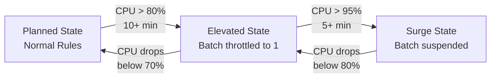

# Workload Management — Intermediate

## Active States: Dynamic Resource Adjustment

TASM uses **Active States** to change workload rules based on system conditions. This allows dynamic adaptation without manual intervention:

| Active State | Trigger Example | Typical Response |
|---|---|---|
| **Planned** | Default state (normal operation) | Normal rules apply |
| **User-defined states** | CPU > 80% for 10 minutes | Throttle batch to 1 concurrent job |
| **Surge** | CPU > 95% sustained | Suspend all Low priority workloads |
| **Emergency** | System approaching capacity | Alert + escalate tactical SLG workloads |



**Configuration example (conceptual):**
```
Active State: ELEVATED
  Trigger: AMP CPU > 80% for 10 minutes
  Rules:
    - Workload BATCH: Throttle reduced from 5 → 1 concurrent
    - Workload ANALYTICS: Priority reduced from MEDIUM → LOW
    - Workload TACTICAL: Priority unchanged (SLG protected)
  Revert: When AMP CPU < 70% for 5 minutes → return to PLANNED
```

---

## AMP CPU Skew in Workload Context

**AMP CPU skew** measures whether work is distributed evenly across AMPs within a query:

```sql
-- Query-level CPU skew from DBQL
SELECT
    QueryID,
    UserName,
    AMPCPUTime,
    MaxAMPCPUTime,
    100.0 * (MaxAMPCPUTime - AMPCPUTime / NULLIFZERO(NumAMPsUsed))
            / NULLIFZERO(AMPCPUTime / NULLIFZERO(NumAMPsUsed)) AS CPUSkewPct
FROM DBC.QryLogV
WHERE LogDate = CURRENT_DATE - 1
  AND AMPCPUTime > 60   -- Only look at non-trivial queries
ORDER BY CPUSkewPct DESC;
```

**High CPU skew** on a query indicates:
- PI skew (some AMPs have much more data for this query's filter)
- Redistribution imbalance (rows redistributed unevenly)
- Product join on an already-skewed intermediate result

**Workload management response to skew:** TASM can't fix PI skew directly, but it can prevent a high-skew query from monopolizing the hot AMP by throttling the workload or demoting priority.

---

## IWM: Intelligent Workload Management

**IWM** dynamically reclassifies queries based on their **runtime behavior** — not just static classification at submission time:

**Example IWM rule:**
```
IF a query has been running for more than 5 minutes AND consuming > 500 CPU seconds
THEN reclassify it from MEDIUM priority to LOW priority
```

This prevents "rogue" analyst queries that looked small at submission time but are actually expensive from monopolizing resources.

```sql
-- IWM reclassification in DBQL: look for priority changes
SELECT QueryID, UserName, AMPCPUTime,
       WorkloadName,       -- Workload at start
       FinalWorkloadName   -- Workload at end (may differ if IWM reclassified)
FROM DBC.QryLogV
WHERE LogDate = CURRENT_DATE - 1
  AND WorkloadName <> FinalWorkloadName
ORDER BY AMPCPUTime DESC;
```

---

## DBQL Configuration and Analysis

DBQL captures different levels of detail based on configuration:

```sql
-- Enable DBQL for all users (DBA task)
BEGIN QUERY LOGGING ALL;

-- Enable with step-level detail (more overhead, more data)
BEGIN QUERY LOGGING WITH STEPINFO ALL;

-- Enable for specific users only (common production practice)
BEGIN QUERY LOGGING ON etl_user, analyst_team;

-- Stop logging for a user
END QUERY LOGGING ON etl_user;
```

**DBQL tables:**
- `DBC.QryLogV`: Summary-level query data (CPU, elapsed, rows)
- `DBC.QryStepsV`: Step-by-step execution data (each AMP step)
- `DBC.QrySQLV`: Full SQL text of each query
- `DBC.QryLogFeatureV`: Feature usage (temporal, analytical functions, etc.)

---

## Workload-Based Query Analysis

```sql
-- Identify workloads consuming the most resources
SELECT
    WorkloadName,
    COUNT(*) AS QueryCount,
    SUM(AMPCPUTime) AS TotalCPU,
    AVG(ElapsedTime) AS AvgElapsed,
    MAX(ElapsedTime) AS MaxElapsed,
    AVG(SpoolUsage) / 1e9 AS AvgSpoolGB
FROM DBC.QryLogV
WHERE LogDate = CURRENT_DATE - 1
GROUP BY WorkloadName
ORDER BY TotalCPU DESC;

-- Throttle wait time analysis (queries that waited in queue)
SELECT WorkloadName, 
       AVG(DelayTime) AS AvgWaitSec,
       MAX(DelayTime) AS MaxWaitSec,
       COUNT(CASE WHEN DelayTime > 0 THEN 1 END) AS QueriesDelayed
FROM DBC.QryLogV
WHERE LogDate = CURRENT_DATE - 1
GROUP BY WorkloadName
ORDER BY AvgWaitSec DESC;
```

---

## Tactical vs Strategic Workload Separation

The most important workload separation in production:

```
TACTICAL workload:
  - API-driven, user-facing queries
  - SLA: < 2 seconds for 95th percentile
  - Classification: Account = 'API' or Application = 'WEB_APP'
  - Priority: SLG (highest)
  - Throttle: High (50–100 concurrent) — these are fast queries
  - Response goal: 2 seconds

STRATEGIC workload:
  - Analyst reports, data science exploration
  - SLA: Best effort, usually < 30 minutes
  - Classification: User = analyst_team
  - Priority: MEDIUM
  - Throttle: 20–30 concurrent
  - No hard response goal

BATCH workload:
  - ETL pipelines, nightly loads
  - SLA: Must complete by 6 AM
  - Classification: User = ETL_USER or Account = BATCH
  - Priority: LOW
  - Throttle: 5–10 concurrent (fewer, larger jobs)
  - No response goal, but completion window enforced
```

---

## Concurrency Management

Setting throttles requires understanding the workload profile:

```sql
-- Analyze peak concurrent query counts by workload
SELECT
    WorkloadName,
    EXTRACT(HOUR FROM LogTime) AS Hour,
    MAX(concurrent_queries) AS PeakConcurrent
FROM (
    SELECT WorkloadName, LogTime,
           COUNT(*) OVER (
               PARTITION BY WorkloadName
               ORDER BY LogTime
               ROWS BETWEEN 60 PRECEDING AND CURRENT ROW
           ) AS concurrent_queries
    FROM DBC.QryLogV
    WHERE LogDate = CURRENT_DATE - 1
) sub
GROUP BY WorkloadName, Hour
ORDER BY WorkloadName, PeakConcurrent DESC;
```

**Throttle sizing rule:**
- Set throttle to `peak_concurrent × 1.2` (20% headroom)
- Too low: queries wait unnecessarily, analyst frustration
- Too high: batch jobs monopolize AMPs, tactical SLA breaches

---

## Interview Tips

> **Tip 1:** "What is an Active State in TASM?" — "Active States allow TASM to dynamically change workload rules based on system conditions. For example, when AMP CPU exceeds 80% for 10 minutes, the system transitions to an 'Elevated' state where batch throttles are reduced and analytics priority is lowered — protecting tactical SLA queries automatically without manual intervention."

> **Tip 2:** "What is IWM in Teradata?" — "Intelligent Workload Management allows TASM to reclassify queries at runtime based on their actual resource consumption. A query submitted to MEDIUM priority may be demoted to LOW if it runs for more than 5 minutes — preventing rogue analyst queries from monopolizing resources that were classified as 'small' at submission time."

> **Tip 3:** "How do you set throttle limits for workloads?" — "Analyze peak concurrent query counts by workload from DBQL, then set throttles at peak × 1.2. Too-low throttles cause unnecessary queueing; too-high throttles allow batch to crowd out tactical. Monitor DelayTime in DBC.QryLogV to see how much time queries spend waiting in queues."

> **Tip 4:** "What information does DBQL provide for workload management?" — "DBQL captures AMPCPUTime, ElapsedTime, SpoolUsage, WorkloadName, DelayTime (queue wait), and NumResultRows for every query. This data is used to identify resource-heavy workloads, throttle wait patterns, SLA compliance rates, and rogue queries that should be reclassified."
