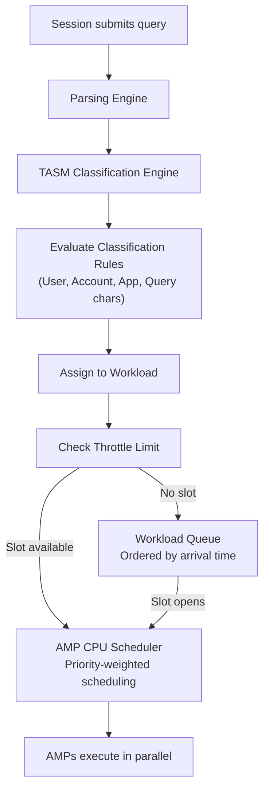

# Workload Management — Senior Deep Dive

## TASM Architecture: Under the Hood

TASM is implemented as a layer between the Parsing Engine and AMP scheduling:



**TASM decision sequence:**
1. Query submitted → PE parses and estimates cost
2. TASM evaluates classification rules in priority order (first match wins)
3. Query assigned to workload with specific priority + throttle
4. If throttle limit reached → query waits in queue
5. AMP scheduler grants CPU time based on priority weights

---

## Priority Scheduling: CPU Weighting

Teradata's AMP CPU scheduler uses **weighted round-robin** within each priority tier:

- SLG tier: Preemptive — can interrupt lower-priority queries
- Non-SLG tiers: Weighted — each tier gets a CPU weight percentage

```
Example CPU weight allocation:
  SLG (Tactical):   50% guaranteed CPU share
  MEDIUM (Analytics): 30% guaranteed
  LOW (Batch):        10% guaranteed
  Unused:             10% best-effort overflow
```

When the system is at 100% utilization:
- Batch jobs can only use 10% of total AMP CPU
- Analytics can use 30%
- Tactical can use up to 50% (and can steal from others if they need it)

When the system is underutilized (50% CPU):
- All workloads run freely — no starvation
- Priority only matters when demand exceeds supply

---

## Response Time Goals: SLG Enforcement

**SLG (Service Level Goal)** is the highest TASM priority tier — reserved for queries with strict SLA requirements. SLG enforcement:

1. **Delay limit:** Maximum time an SLG query can wait in queue before escalating
2. **Priority guarantee:** SLG queries preempt lower-priority running queries if needed (via abort or CPU yield)
3. **Monitoring:** Viewpoint alerts when SLG response goals are being missed

```sql
-- Monitor SLG compliance rate
SELECT
    WorkloadName,
    COUNT(*) AS TotalQueries,
    COUNT(CASE WHEN ElapsedTime <= 2 THEN 1 END) AS UnderSLA,
    100.0 * COUNT(CASE WHEN ElapsedTime <= 2 THEN 1 END) / COUNT(*) AS SLACompliancePct
FROM DBC.QryLogV
WHERE LogDate = CURRENT_DATE - 1
  AND WorkloadName = 'TACTICAL_SLG'
GROUP BY WorkloadName;
```

**If SLA compliance drops below threshold:**
1. Check if a rogue batch query is consuming excessive AMP CPU (DBQL analysis)
2. Check AMP CPU skew — one AMP overwhelmed by a different workload
3. Check if throttle limits are too high for MEDIUM workloads
4. Check for new/changed queries that grew unexpectedly

---

## Query Banding for Fine-Grained Classification

**Query bands** allow applications to identify themselves to TASM with key-value metadata:

```sql
-- Application sets a query band before submitting queries
SET QUERY_BAND = 'App=TacticalAPI;Module=PositionLookup;Priority=URGENT;' FOR SESSION;

-- Or per-transaction
SET QUERY_BAND = 'RequestType=BatchReport;MaxCPU=3600;' FOR TRANSACTION;
```

TASM classification rules can use query band values:

```
Classification Rule:
  IF QueryBand LIKE '%App=TacticalAPI%'
  THEN → Workload TACTICAL_SLG

  IF QueryBand LIKE '%RequestType=BatchReport%' AND AMPCPUEstimate > 3600
  THEN → Workload HEAVY_BATCH
```

**Query banding enables:**
- Application-specific workloads without separate database accounts
- Dynamic priority hints from the application layer
- Detailed workload attribution in DBQL (which microservice submitted this query)

---

## DBQL Advanced Analysis Patterns

### Finding Workload Interaction (When Batch Kills Tactical SLA)

```sql
-- Correlate batch CPU spikes with tactical SLA breaches
WITH batch_load AS (
    SELECT
        CAST(LogDate AS TIMESTAMP(0)) + (EXTRACT(HOUR FROM LogTime) * INTERVAL '1' HOUR) AS Hour,
        SUM(AMPCPUTime) AS BatchCPU
    FROM DBC.QryLogV
    WHERE LogDate = CURRENT_DATE - 1
      AND WorkloadName = 'BATCH'
    GROUP BY 1
),
tactical_perf AS (
    SELECT
        CAST(LogDate AS TIMESTAMP(0)) + (EXTRACT(HOUR FROM LogTime) * INTERVAL '1' HOUR) AS Hour,
        AVG(ElapsedTime) AS AvgTacticalElapsed,
        COUNT(CASE WHEN ElapsedTime > 2 THEN 1 END) AS SLABreaches
    FROM DBC.QryLogV
    WHERE LogDate = CURRENT_DATE - 1
      AND WorkloadName = 'TACTICAL_SLG'
    GROUP BY 1
)
SELECT b.Hour, b.BatchCPU, t.AvgTacticalElapsed, t.SLABreaches
FROM batch_load b
JOIN tactical_perf t ON b.Hour = t.Hour
ORDER BY SLABreaches DESC;
-- High BatchCPU correlated with SLABreaches = TASM tuning opportunity
```

### Identifying Heavy Hitter Users

```sql
-- Users whose queries are most impactful on system resources
SELECT
    UserName,
    COUNT(*) AS QueryCount,
    SUM(AMPCPUTime) / 3600 AS TotalCPUHours,
    AVG(SpoolUsage) / 1e9 AS AvgSpoolGB,
    MAX(ElapsedTime) / 60 AS MaxElapsedMin,
    SUM(CASE WHEN ElapsedTime > 300 THEN 1 ELSE 0 END) AS QueriesOver5Min
FROM DBC.QryLogV
WHERE LogDate BETWEEN CURRENT_DATE - 7 AND CURRENT_DATE - 1
GROUP BY UserName
ORDER BY TotalCPUHours DESC;
```

---

## Concurrency Limits: System-Level Analysis

```sql
-- Find the maximum concurrent queries the system handled in the last week
SELECT
    LogDate,
    EXTRACT(HOUR FROM LogTime) AS Hour,
    MAX(ConcurrentCount) AS PeakConcurrent
FROM (
    SELECT LogDate, LogTime,
           COUNT(*) OVER (
               PARTITION BY LogDate
               ORDER BY LogTime
               ROWS BETWEEN UNBOUNDED PRECEDING AND CURRENT ROW
           ) - COUNT(CASE WHEN state = 'COMPLETE' THEN 1 END) OVER (
               PARTITION BY LogDate
               ORDER BY LogTime
               ROWS BETWEEN UNBOUNDED PRECEDING AND CURRENT ROW
           ) AS ConcurrentCount
    FROM DBC.QryLogV
    WHERE LogDate BETWEEN CURRENT_DATE - 7 AND CURRENT_DATE - 1
) sub
GROUP BY LogDate, Hour
ORDER BY PeakConcurrent DESC;
```

---

## TASM Tuning Anti-Patterns

### Anti-Pattern 1: No SLG for Tactical Workload
Setting tactical queries at MEDIUM instead of SLG. Result: during periods of high batch load, tactical queries miss SLA.

**Fix:** Always use SLG priority for API-serving queries with SLA requirements.

### Anti-Pattern 2: Throttle Too High for Batch
Setting batch throttle to 50 concurrent jobs. Result: 50 batch jobs each consuming 50 AMP CPU seconds/second = 2,500 CPU seconds/second total → AMPs saturated, tactical SLA breached.

**Fix:** Batch throttle should be 5–10 concurrent. Batch jobs are large and slow — parallel benefit plateaus quickly.

### Anti-Pattern 3: No IWM Rules
No rules to reclassify long-running analyst queries. Result: An analyst runs a 4-hour report classified as MEDIUM — blocks resources for all other analysts.

**Fix:** IWM rule: "If MEDIUM query runs > 30 minutes, demote to LOW priority."

### Anti-Pattern 4: Static Rules, No Active States
Rules never change regardless of system load. Result: At peak load, batch and analytics compete with tactical equally.

**Fix:** Define Active States that reduce batch throttle and analytics priority when AMP CPU > 80%.

---

## Interview Tips

> **Tip 1:** "How does TASM enforce SLA for tactical queries?" — "TASM assigns tactical queries to the SLG priority tier, which has preemptive CPU scheduling. SLG queries can preempt lower-priority running queries if needed. Additionally, delay limits ensure SLG queries don't wait too long in queue — the queue position is escalated if the wait threshold is approached."

> **Tip 2:** "How do you use DBQL to tune TASM rules?" — "Analyze DBQL to find: which workloads consume the most CPU (candidates for throttle reduction), how often queries wait in queues (throttle too low?), when SLA breaches occur (correlate with batch CPU peaks), and which users or applications are outliers. These findings drive specific TASM rule changes."

> **Tip 3:** "What is query banding and how does it help workload management?" — "Query bands are key-value metadata that applications attach to their sessions/transactions. TASM classification rules can use query band values to route queries to the right workload — for example, `App=TacticalAPI` gets SLG priority regardless of the database user. This enables fine-grained workload control without creating separate database accounts."

> **Tip 4:** "How do you tune TASM throttle limits?" — "Analyze DBQL peak concurrent queries by workload. Set throttle at peak × 1.2. Monitor DelayTime in DBQL — if queries frequently wait (DelayTime > 5 seconds), throttle may be too low. If tactical SLA is being breached during batch peaks, batch throttle is too high. Active States should auto-reduce batch throttle when CPU is constrained."
